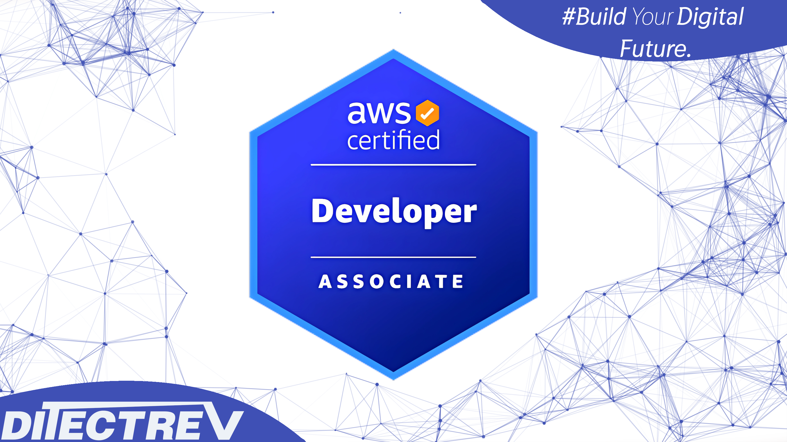

# ⬆️ Amazon Web Services Certified (AWS Certified) Developer Associate (DVA-C02) Practice Tests Exams Questions & Answers

### Which of the following are good use cases for how Amazon ElastiCache can help an application? (Select TWO.)

- [ ] Improve the performance of S3 PUT operations.
- [ ] Improve the latency of deployments performed by AWS CodeDeploy.
- [x] Improve latency and throughput for read-heavy application workloads.
- [ ] Reduce the time required to merge AWS CodeCommit branchesImprove performance of compute-intensive applications.
- [x] Improve performance of compute-intensive applications.

### Which of the following services are key/value stores? Choose 3 answers

- [x] Amazon ElastiCache.
- [ ] Simple Notification Service.
- [x] DynamoDB.
- [ ] Simple Workflow Service.
- [x] Simple Storage Service.

### A developer wants to send multi-value headers to an AWS Lambda function that is registered as a target with an Application Load Balancer (ALB). What should the developer do to achieve this?

- [ ] Place the Lambda function and target group in the same account.
- [ ] Send the request body to the Lambda function with a size less than 1 MB 0.
- [ ] Include the Base64 encoding status status code, status description, and headers in the Lambda function.
- [x] Enable the multi-value headers on the ALB.

### A company's ecommerce website is experiencing massive traffic spikes, which are causing performance problems in the company database. Users are reporting that accessing the website takes a long time. A developer wants to implement a caching layer using Amazon ElastiCache. The website is required to be responsive no matter which product a user views, and the updates to product information and prices must be strongly consistent

- [ ] Which cache writing policy will satisfy these requirements?.
- [ ] Write to the cache directly and sync the backend at a later time.
- [ ] Write to the backend first and wait for the cache to expire.
- [ ] Write to the cache and the backend at the same timeWrite to the backend first and invalidate the cache.
- [x] Write to the backend first and invalidate the cache.

### A Developer wants to upload data to Amazon S3 and must encrypt the data in transit. Which of the following solutions will accomplish this task? (Choose two.)

- [ ] Set up hardware VPN tunnels to a VPC and access S3 through a VPC endpoint.
- [x] Set up Client-Side Encryption with an AWS KMS-Managed Customer Master Key.
- [ ] Set up Server-Side Encryption with AWS KMS-Managed Keys.
- [x] Transfer the data over an SSL connectionSet up Server-Side Encryption with S3-Managed Keys.
- [ ] Set up Server-Side Encryption with S3-Managed Keys.

### A Developer wants to encrypt new objects that are being uploaded to an Amazon S3 bucket by an application. There must be an audit trail of who has used the key during this process. There should be no change to the performance of the application. Which type of encryption meets these requirements?

- [ ] Server-side encryption using S3-managed keys.
- [x] Server-side encryption with AWS KMS-managed keys.
- [ ] Client-side encryption with a client-side symmetric master key.
- [ ] Client-side encryption with AWS KMS-managed keys.

### An application is being developed to audit several AWS accounts. The application will run in Account A and must access AWS services in Accounts B and C. What is the MOST secure way to allow the application to call AWS services in each audited account?

- [x] Configure cross-account roles in each audited account. Write code in Account A that assumes those roles.
- [ ] Use S3 cross-region replication to communicate among accounts, with Amazon S3 event notifications to trigger Lambda functions.
- [ ] Deploy an application in each audited account with its own role. Have Account A authenticate with the application.
- [ ] Create an IAM user with an access key in each audited account. Write code in Account A that uses those access keys.

### A Developer wants to use AWS X-Ray to trace a user request end-to-end throughput the software stack. The Developer made the necessary changes in the application tested it, and found that the application is able to send the traces to AWS X-Ray. However, when the application is deployed to an EC2 instance, the traces are not available. Which of the following could create this situation? (Select two.)

- [ ] The traces are reaching X-Ray, but the Developer does not have access to view the records.
- [x] The X-Ray daemon is not installed on the EC2 instance.
- [ ] The X-Ray endpoint specified in the application configuration is incorrect.
- [ ] The instance role does not have 'xray:BatchGetTraces' and 'xray:GetTraceGraph' permissions.The instance role does not have 'xray:PutTraceSegments' and 'xray:PutTelemetryRecords' permissions.
- [x] The instance role does not have 'xray:PutTraceSegments' and 'xray:PutTelemetryRecords' permissions.

### A company uses a third-party tool to build, bundle, and package rts applications on-premises. and store them locally. The company uses Amazon EC2 instances to run its front-end applications. How can an application be deployed from the source control system onto the EC2 instances?

- [ ] Use AWS CodeDeploy and point it to the local storage to directly deploy a bundle m a zip. tar. or tar.gz format.
- [x] Upload the bundle to an Amazon S3 bucket and specify the S3 location when doing a deployment using AWS CodeDeploy.
- [ ] Create a repository using AWS CodeCommit to automatically trigger a deployment to the EC2 instances.
- [ ] Use AWS CodeBuild to automatically deploy the latest build to the latest EC2 instances.

### A developer is writing a web application that must share secure documents with end users. The documents are stored in a private Amazon S3 bucket. The application must allow only authenticated users to download specific documents when requested, and only for a duration of 15 minutes. How can the developer meet these requirements?

- [ ] Copy the documents to a separate S3 bucket that has a lifecycle policy for deletion after 15 minutes.
- [x] Create a presigned S3 URL using the AWS SDK with an expiration time of 15 minutes.
- [ ] Use server-side encryption with AWS KMS managed keys (SSE-KMS) and download the documents using HTTPS.
- [ ] Modify the S3 bucket policy to only allow specific users to download the documents Revert the change after 15 minutes.

### A Developer has developed a web application and wants to deploy it quickly on a Tomcat server on AWS. The Developer wants to avoid having to manage the underlying infrastructure. What is the easiest way to deploy the application, based on these requirements?

- [ ] AWS CloudFormation.
- [x] AWS Elastic Beanstalk.
- [ ] Amazon S3.
- [ ] AWS CodePipeline.

### A company is building a compute-intensive application that will run on a fleet of Amazon EC2 instances. The application uses attached Amazon EBS disks for storing data. The application will process sensitive information and all the data must be encrypted. What should a developer do to ensure the data is encrypted on disk without impacting performance?

- [x] Configure the Amazon EC2 instance fleet to use encrypted EBS volumes for storing data.
- [ ] Add logic to write all data to an encrypted Amazon S3 bucket.
- [ ] Add a custom encryption algorithm to the application that will encrypt and decrypt all data.
- [ ] Create a new Amazon Machine Image (AMI) with an encrypted root volume and store the data to ephemeral disks.

### A global company has an application running on Amazon EC2 instances that serves image files from Amazon S3. User requests from the browser are causing high traffic, which results in degraded performance. Which optimization solution should a Developer implement to increase application performance?

- [ ] Create multiple prefix in the S3 bucket to increase the request rate.
- [x] Create an Amazon ElastiCache cluster to cache and serve frequently accessed items.
- [ ] Use Amazon CloudFront to serve the content of images stored in Amazon S3.
- [ ] Submit a ticket to AWS support to request a rate limit increase for the S3 bucket.

### A Developer has setup an Amazon Kinesis Stream with 4 shards to ingest a maximum of 2500 records per second. A Lambda function has been configured to process these records. In which order will these records be processed?

- [ ] Lambda will receive each record in the reverse order it was placed into the stream following a LIFO (last-in, first-out) method.
- [ ] Lambda will receive each record in the exact order it was placed into the stream following a FIFO (first-in, first-out) method.
- [x] Lambda will receive each record in the exact order it was placed into the shard following a FIFO (first-in, first-out) method. There is no guarantee of order across shards.
- [ ] The Developer can select FIFO, (first-in, first-out), LIFO (last-in, last-out), random, or request specific record using the getRecords AP.

### An AWS Lambda function generates a 3MB JSON file and then uploads it to an Amazon S3 bucket daily. The file contains sensitive information, so the Developer must ensure that it is encrypted before uploading to the bucket. Which of the following modifications should the Developer make to ensure that the data is encrypted before uploading it to the bucket?

- [ ] Use the default AWS KMS customer master key for S3 in the Lambda function code.
- [ ] Use the S3 managed key and call the GenerateDataKey API to encrypt the file.
- [x] Use the GenerateDateKey API, then use that data key to encrypt the file in the Lambda function code.
- [ ] Use a custom KMS customer master key created for S3 in the Lambda function code.

### Company D is running their corporate website on Amazon S3 accessed from http//www.companyd.com. Their marketing team has published new web fonts to a separate S3 bucket accessed by the S3 endpoint https://s3-us-west-1.amazonaws.com/cdfonts. While testing the new web fonts, Company D recognized the web fonts are being blocked by the browser. What should Company D do to prevent the web fonts from being blocked by the browser?

- [ ] Enable versioning on the cdfonts bucket for each web font.
- [ ] Create a policy on the cdfonts bucket to enable access to everyone.
- [ ] Add the Content-MD5 header to the request for webfonts in the cdfonts bucket from the website.
- [x] Configure the cdfonts bucket to allow cross-origin requests by creating a CORS configuration.

### A developer must extend an existing application that is based on the AWS Services Application Model (AWS SAM). The developer has used the AWS SAM CLI to create the project. The project contains different AWS Lambda functions. Which combination of commands must the developer use to redeploy the AWS SAM application? (Select TWO.)

- [x] Sam init.
- [ ] Sam validate.
- [ ] Sam build.
- [x] Sam deploySam publish.
- [ ] Sam publish.

### An application deployed on AWS Elastic Beanstalk experiences increased error rates during deployments of new application versions, resulting in service degradation for users. The Development team believes that this is because of the reduction in capacity during the deployment steps. The team would like to change the deployment policy configuration of the environment to an option that maintains full capacity during deployment while using the existing instances. Which deployment policy will meet these requirements while using the existing instances?

- [ ] All at once.
- [ ] Rolling.
- [ ] Rolling with additional batch.
- [x] Immutable.

### A Developer is creating an application that needs to locate the public IPv4 address of the Amazon EC2 instance on which it runs . How can the application locate this information?

- [x] Get the instance metadata by retrieving http://169.254.169.254/latest/metadata/.
- [ ] Get the instance user data by retrieving http://169.254.169.254/latest/userdata/.
- [ ] Get the application to run IFCONFIG to get the public IP address.
- [ ] Get the application to run IPCONFIG to get the public IP address.

### The development team is working on an API that will be served from Amazon API gateway. The API will be served from three environments: development, test, and production. The API Gateway is configured to use 237 GB of cache in all three stages. Which is the MOST cost-efficient deployment strategy?

- [ ] Create a single API Gateway with all three stages.
- [ ] Create three API Gateways, one for each stage in a single AWS account.
- [ ] Create an API Gateway in three separate AWS accounts.
- [x] Enable the cache for development and test environments only when needed.

### A company is migrating its on-premises database to Amazon RDS for MySQL. The company has read-heavy workloads, and wants to make sure it re-factors its code to achieve optimum read performance for its queries. How can this objective be met?

- [ ] Add database retries to effectively use RDS with vertical scaling.
- [ ] Use RDS with multi-AZ deployment.
- [x] Add a connection string to use an RDS read replica for read queries.
- [ ] Add a connection string to use a read replica on an EC2 instance.

### A developer needs to modify an application architecture to meet new functional requirements. Application data is stored in Amazon DynamoDB and processed for analysis in a rightly batch. The system analysts do not want to wait unit the next day to view the processed data and have asked to have it available in near-real time. Which application architect pattern would enables the data to be processed as it is received?

- [x] Evert driven.
- [ ] Client served driven.
- [ ] Fan-out driven.
- [ ] Schedule driven.

### You are developing an HTTP API hosted on a Compute Engine virtual machine instance that needs to be invoked by multiple clients within the same Virtual Private Cloud (VPC). You want clients to be able to get the IP address of the service. What should you do?

- [ ] Reserve a static external IP address and assign it to an HTTP(S) load balancing service's forwarding rule. Clients should use this IP address to connect to the service.
- [ ] Reserve a static external IP address and assign it to an HTTP(S) load balancing service's forwarding rule. Then, define an A record in Cloud DN.
- [ ] Clients should use the name of the A record to connect to the service.
- [x] Ensure that clients use Compute Engine internal DNS by connecting to the instance name with the url https://[INSTANCE_NAME].[ZONE].c.[PROJECT_ID].internal/.Ensure that clients use Compute Engine internal DNS by connecting to the instance name with the url https://[API_NAME]/[API_VERSION]/.
- [ ] Ensure that clients use Compute Engine internal DNS by connecting to the instance name with the url https://[API_NAME]/[API_VERSION]/.

### A legacy service has an XML-based SOAP interface. The Developer wants to expose the functionality of the service to external clients with the Amazon API Gateway. Which technique will accomplish this?

- [x] Create a RESTful API with the API Gateway; transform the incoming JSON into a valid XML message for the SOAP interface using mapping templates.
- [ ] Create a RESTful API with the API Gateway; pass the incoming JSON to the SOAP interface through an Application Load Balancer.
- [ ] Create a RESTful API with the API Gateway; pass the incoming XML to the SOAP interface through an Application Load Balancer.
- [ ] Create a RESTful API with the API Gateway; transform the incoming XML into a valid message for the SOAP interface using mapping templates.

### A software company needs to make sure user-uploaded documents are securely stored in Amazon S3. The documents must be encrypted at rest in Amazon S3. The company does not want to manage the security infrastructure in-house, but the company still needs extra protection to ensure it has control over its encryption keys due to industry regulations. Which encryption strategy should a developer use to meet these requirements?

- [ ] Server-side encryption with Amazon S3 managed keys (SSE-S3).
- [ ] Server-side encryption with customer-provided encryption keys (SSE-C).
- [ ] Server-side encryption with AWS KMS managed keys (SSE-KMS).
- [x] Client-side encryption.

### A Developer is testing a Docker-based application that uses the AWS SDK to interact with AmazonDynamoDB. In the local development environment, the application has used IAM access keys. The application is now ready for deployment onto an ECS cluster. How should the application authenticate with AWS services in production?

- [x] Configure an ECS task IAM role for the application to use.
- [ ] Refactor the application to call AWS STS AssumeRole based on an instance role.
- [ ] Configure AWS access key/secret access key environment variables with new credentials.
- [ ] Configure the credentials file with a new access key/secret access key.

### An application uses Amazon Kinesis Data Streams to ingest and process large streams of data records in real time. Amazon EC2 instances consume and process the data from the shards of the Kinesis data stream by using Amazon Kinesis Client Library (KCL). The application handles the failure scenarios and does not require standby workers. The application reports that a specific shard is receiving more data than expected. To adapt to the chnages in the rate of data flow, the “hot” shard is resharded. Assuming that the initial number of shards in the Kinesis data stream is 4, and after resharding the number of shards increased to 6, what is the maximum number of EC2 instances that can be deployed to process data from all the shards?

- [ ] 12.
- [x] 6.
- [ ] 4.
- [ ] 1.

### An ecommerce startup is preparing for an annual sales event As the traffic to the company’s application increases, the development team wants to be notified when the Amazon EC2 instance’s CPU utilization exceeds 80%. Which solution will meet this requirement?

- [ ] Create a custom Amazon CloudWatch alarm that sends a notification to an Amazon SNS topic when the CPU utilization exceeds 80%.
- [ ] Create a custom AWS CloudTrail alarm that sends a notification to an Amazon SNS topic when the CPU utilization exceeds 80%.
- [x] Create a cron job on the EC2 instance that executes the –describe-instance-information command on the host instance every 15 minutes and sends the results to an Amazon SNS topic.
- [ ] Create an AWS Lambda function that queries the AWS CloudTrail logs for the CPU Utihzation metric every 15 minutes and sends a notification to an Amazon SNS topic when the CPU utilization exceeds 80%.

### A gaming company is developing a mobile game application for iOS® and Android® platforms. This mobile game securely stores user data locally on the device. The company wants to allow users to use multiple device for the game, which requires user data synchronization across device.Which service should be used to synchronize user data across devices without the need to create a backend application?

- [ ] AWS Lambda.
- [ ] Amazon S3.
- [ ] Amazon DynamoDB.
- [x] Amazon Cognito.

### A Developer is writing a serverless application that requires that an AWS Lambda function be invoked every 10 minutes. What is an automated and serverless way to trigger the function?

- [ ] Deploy an Amazon EC2 instance based on Linux, and edit its /etc/crontab file by adding a command to periodically invoke the Lambda function.
- [ ] Configure an environment variable named PERIOD for the Lambda function. Set the value to 600.
- [x] Create an Amazon CloudWatch Events rule that triggers on a regular schedule to invoke the Lambda function.
- [ ] Create an Amazon SNS topic that has a subscription to the Lambda function with a 600-second timer.

### A company is using Amazon API Gateway to manage its public-facing API. The CISO requires that the APIs be used by test account users only. What is the MOST secure way to restrict API access to users of this particular AWS account?

- [ ] Client-side SSL certificates for authentication.
- [ ] API Gateway resource policies.
- [ ] Cross-origin resource sharing (CORS).
- [x] Usage plans.

### You are developing an HTTP API hosted on a Compute Engine virtual machine instance that needs to be invoked by multiple clients within the same Virtual Private Cloud (VPC). You want clients to be able to get the IP address of the service. What should you do?

- [ ] Reserve a static external IP address and assign it to an HTTP(S) load balancing service's forwarding rule. Clients should use this IP address to connect to the service.
- [ ] Reserve a static external IP address and assign it to an HTTP(S) load balancing service's forwarding rule. Then, define an A record in Cloud DN.
- [ ] Clients should use the name of the A record to connect to the service.
- [x] Ensure that clients use Compute Engine internal DNS by connecting to the instance name with the url https://[INSTANCE_NAME].[ZONE].c.[PROJECT_ID].internal/.Ensure that clients use Compute Engine internal DNS by connecting to the instance name with the url https://[API_NAME]/[API_VERSION]/.
- [ ] Ensure that clients use Compute Engine internal DNS by connecting to the instance name with the url https://[API_NAME]/[API_VERSION]/.

### Where should the appspec.yml file be placed in order for AWS CodeDeploy to work?

- [x] In the root of the application source code directory structure.
- [ ] In the bin folder along with all the complied code.
- [ ] In an S3 bucket.
- [ ] In the same folder as the application configuration files.

### A Developer is making changes to a custom application that is currently using AWS Elastic Beanstalk. After the Developer completes the changes, what solutions will update the Elastic Beanstalk environment with the new application version? (Choose two.)

- [ ] Package the application code into a .zip file, and upload, then deploy the packaged application from the AWS Management Console.
- [ ] Package the application code into a .tar file, create a new application version from the AWS Management Console, then update the environment by using AWS CLI.
- [x] Package the application code into a .tar file, and upload and deploy the packaged application from the AWS Management Console.
- [x] Package the application code into a .zip file, create a new application version from the packaged application by using AWS CLI, then update the environment by using AWS CLIPackage the application code into a .zip file, create a new application version from the AWS Management Console, then rebuild the environment by using AWS CLI.
- [ ] Package the application code into a .zip file, create a new application version from the AWS Management Console, then rebuild the environment by using AWS CLI.

### A company is running an application built on AWS Lambda functions. One Lambda function has performance issues when it has to download a 50MB file from the Internet in every execution. This function is called multiple times a second. What solution would give the BEST performance increase?

- [x] Cache the file in the /tmp directory.
- [ ] Increase the Lambda maximum execution time.
- [ ] Put an Elastic Load Balancer in front of the Lambda function.
- [ ] Cache the file in Amazon S3.

### A Developer is writing transactions into a DynamoDB table called “SystemUpdates” that has 5 write capacity units. Which option has the highest read throughput?

- [ ] Eventually consistent reads of 5 read capacity units reading items that are 4 KB in size.
- [x] Strongly consistent reads of 5 read capacity units reading items that are 4 KB in size.
- [ ] Eventually consistent reads of 15 read capacity units reading items that are 1 KB in size.
- [ ] Strongly consistent reads of 15 read capacity units reading items that are 1 KB in size.

### Queries to an Amazon DynamoDB table are consuming a large amount of read capacity. The table has a significant number of large attributes. The application does not need all of the attribute data. How can DynamoDB costs be minimized while maximizing application performance?

- [ ] Batch all the writes, and perform the write operations when no or few reads are being performed.
- [ ] Create a global secondary index with a minimum set of projected attributes.
- [x] Implement exponential backoffs in the application.
- [ ] Load balance the reads to the table using an Application Load Balancer.

### A Developer is writing a REST service that will add items to a shopping list. The service is built on Amazon API Gateway with AWS Lambda integrations. The shopping list items are send as query string parameters in the method request. How should the Developer convert the query string parameters to arguments for the Lambda function?

- [ ] Enable request validation.
- [ ] Include the Amazon Resource Name (ARN) of the Lambda function.
- [ ] Change the integration type.
- [x] Create a mapping template.

### A development team is creating a new application designed to run on AWS. While the test and production environments will run on Amazon EC2 instances, developers will each run their own environment on their laptops. Which of the following is the simplest and MOST secure way to access AWS services from the local development machines?

- [x] Use an IAM role to assume a role and execute API calls using the role.
- [ ] Create an IAM user to be shared with the entire development team, provide the development team with the access key.
- [ ] Create an IAM user for each developer on the team: provide each developer with a unique access key.
- [ ] Set up a federation through an Amazon Cognito user pool.

### How is provisioned throughput affected by the chosen consistency model when reading data from a DynamoDB table?

- [ ] Strongly consistent reads use the same amount of throughput as eventually consistent reads.
- [x] Strongly consistent reads use more throughput than eventually consistent reads.
- [ ] Strongly consistent reads use less throughput than eventually consistent reads.
- [ ] Strongly consistent reads use variable throughput depending on read activity.

### A developer needs to deploy a new version to an AWS Elastic Beanstalk application. How can the developer accomplish this task?

- [x] Upload and deploy the new application version in the Elastic Beanstalk console.
- [ ] Use the eb init CLI command to deploy a new version ‘.
- [ ] Terminate the current Elastic Beanstalk environment and create a new one.
- [ ] Modify the ebextensions folder to add a source option to services.

### A gaming application stores scores for players in an Amazon DynamoDB table that has four attributes user_id, user_name, user_score, and user_rank. The users are allowed to update their names only A user is authenticated by web identity federation. Which set of conditions should be added in the policy attached to the role for the dynamodb: PutItem API call? [???]

- [x] Option A.
- [ ] Option B.
- [ ] Option C.
- [ ] Option D.

### A company needs a version control system for collaborative software development.Features of the system must include the following: Support for batches of changes across multiple files. Parallel branching. Version tracking. Which AWS service will meet these requirements?

- [ ] AWS CodePipeline.
- [ ] Amazon S3.
- [ ] AWS Code Build.
- [x] AWS CodeCommit.

### A company is migrating from a monolithic architecture to a microservices-based architecture. The Developers need to refactor the application so that the many microservices can asynchronously communicate with each other without impacting performance. Use of which managed AWS services will enable asynchronous message passing? (Choose two.)

- [x] Amazon SQS.
- [ ] Amazon Cognito.
- [ ] Amazon Kinesis.
- [x] Amazon SNSAmazon ElastiCache.
- [ ] Amazon ElastiCache.

### A Developer must repeatedly and consistently deploy a serverless RESTful API on AWS. Which techniques will work? (Choose two.)

- [ ] Define a Swagger file. Use AWS Elastic Beanstalk to deploy the Swagger file.
- [ ] Define a Swagger file. Use AWS CodeDeploy to deploy the Swagger file.
- [x] Deploy a SAM template with an inline Swagger definition.
- [x] Define a Swagger file. Deploy a SAM template that references the Swagger file.Define an inline Swagger definition in a Lambda function. Invoke the Lambda function.
- [ ] Define an inline Swagger definition in a Lambda function. Invoke the Lambda function.

### You are developing an HTTP API hosted on a Compute Engine virtual machine instance that needs to be invoked by multiple clients within the same Virtual Private Cloud (VPC). You want clients to be able to get the IP address of the service. What should you do?

- [ ] Reserve a static external IP address and assign it to an HTTP(S) load balancing service's forwarding rule. Clients should use this IP address to connect to the service.
- [ ] Reserve a static external IP address and assign it to an HTTP(S) load balancing service's forwarding rule. Then, define an A record in Cloud DN.
- [ ] Clients should use the name of the A record to connect to the service.
- [x] Ensure that clients use Compute Engine internal DNS by connecting to the instance name with the url https://[INSTANCE_NAME].[ZONE].c.[PROJECT_ID].internal/.Ensure that clients use Compute Engine internal DNS by connecting to the instance name with the url https://[API_NAME]/[API_VERSION]/.
- [ ] Ensure that clients use Compute Engine internal DNS by connecting to the instance name with the url https://[API_NAME]/[API_VERSION]/.

### A company is using Amazon API Gateway to manage access to a set of microservices implemented as AWS Lambda functions. Following a bug report, the company makes a minor breaking change to one of the APIs. In order to avoid impacting existing clients when the new API is deployed, the company wants to allow clients six months to migrate from v1 to v2.Which approach should the Developer use to handle this change?

- [ ] Update the underlying Lambda function and provide clients with the new Lambda invocation UR.
- [ ] Use API Gateway to automatically propagate the change to clients, specifying 180 days in the phased deployment parameter.
- [x] Use API Gateway to deploy a new stage named v2 to the API and provide users with its UR.
- [ ] Update the underlying Lambda function, create an Amazon CloudFront distribution with the updated Lambda function as its origin.

### A developer wants the ability to roll back to a previous version of an AWS Lambda function in the event of errors caused by a new deployment. How can the developer achieve this with MINIMAL impact on users?

- [x] Change the application to use an alias that points to the current version Deploy the new version of the code Update the alias to use the newly deployed version. If too many errors are encountered, point the alias back to the previous version.
- [ ] Change the application to use an alias that points to the current version Deploy the new version of the code. Update the alias to direct 10% of users to the newly deployed version. If too many errors are encountered, send 100% of traffic to the previous version.
- [ ] Do not make any changes to the application Deploy the new version of the code. If too many errors are encountered, point the application back to the previous version using the version number in the Amazon Resource Name (ARN).
- [ ] Create three aliases: new, existing, and router Point the existing alias to the current version Have the router alias direct 100% of users to the existing alias Update the application to use the router alias Deploy the new version of the code Point the new alias to this version Update the router alias to direct 10% of users to the new alias If too many errors are encountered, send 100% of traffic to the existing alias.

### You are developing an HTTP API hosted on a Compute Engine virtual machine instance that needs to be invoked by multiple clients within the same Virtual Private Cloud (VPC). You want clients to be able to get the IP address of the service. What should you do?

- [ ] Reserve a static external IP address and assign it to an HTTP(S) load balancing service's forwarding rule. Clients should use this IP address to connect to the service.
- [ ] Reserve a static external IP address and assign it to an HTTP(S) load balancing service's forwarding rule. Then, define an A record in Cloud DN.
- [ ] Clients should use the name of the A record to connect to the service.
- [x] Ensure that clients use Compute Engine internal DNS by connecting to the instance name with the url https://[INSTANCE_NAME].[ZONE].c.[PROJECT_ID].internal/.Ensure that clients use Compute Engine internal DNS by connecting to the instance name with the url https://[API_NAME]/[API_VERSION]/.
- [ ] Ensure that clients use Compute Engine internal DNS by connecting to the instance name with the url https://[API_NAME]/[API_VERSION]/.

### A Developer executed a AWS CLI command and received the error shown below: What action should the Developer perform to make this error human-readable?

- [ ] Make a call to AWS KMS to decode the message.
- [x] Use the AWS STS decode-authorization-message API to decode the message.
- [ ] Use an open source decoding library to decode the message.
- [ ] Use the AWS IAM decode-authorization-message API to decode this message.

### You are developing an HTTP API hosted on a Compute Engine virtual machine instance that needs to be invoked by multiple clients within the same Virtual Private Cloud (VPC). You want clients to be able to get the IP address of the service. What should you do?

- [ ] Reserve a static external IP address and assign it to an HTTP(S) load balancing service’s forwarding rule. Clients should use this IP address to connect to the service.
- [ ] Reserve a static external IP address and assign it to an HTTP(S) load balancing service’s forwarding rule. Then, define an A record in Cloud DN.
- [ ] Clients should use the name of the A record to connect to the service.
- [x] Ensure that clients use Compute Engine internal DNS by connecting to the instance name with the url https://[INSTANCE_NAME].[ZONE].c.[PROJECT_ID].internal/.
- [ ] Ensure that clients use Compute Engine internal DNS by connecting to the instance name with the url https://[API_NAME]/[API_VERSION]/.

### An application contains two components one component to handle HI IP requests, and another component to handle background processing tasks Bach component must scale independently. The developer wants to deploy this application using AWS Elastic Beanstalk. How should this application be deployed, based on these requirements?

- [x] Deploy the application in a single Elastic Beanstalk environment.
- [ ] Deploy each component in a separate Elastic Beanstalk environment.
- [ ] Use multiple Elastic Beanstalk environments for the HTTP component but one environment for the background task component.
- [ ] Use multiple Elastic Beanstalk environments for the background task component but one environment tor the HTTP component.

### A developer is building an application that needs to store date in Amazon S3. Management requires that the data be encrypted before is it sent to Amazon S3 for storage. The encryption keys need to be managed by the security team. Which approach should the developer take to meet these requirements?

- [ ] Implement server-side encryption using customer-provided encryption keys (SSE-C).
- [ ] Implement server-side encryption by using client-side master key.
- [x] Implement client-side encryption using an AWS KMS managed customer master key (CMK).
- [ ] Implement Client-side encryption using Amazon S3 managed keys.

### A company is using AWS CloudFormation templates to deploy AWS resources. The company needs to update one of its AWS CloudFormation stacks. What can the company do to find out how the changes will impact the resources that are running?

- [x] Investigate the change sets.
- [ ] Investigate the stack policies.
- [ ] Investigate the Metadata section.
- [ ] Investigate the Resources section.

### Rebuild the environment with the new load balancer type.
.

### A developer is creating a serverless web application and maintains different branches of code. The developer wants to avoid updating the Amazon API Gateway target endpoint each time a new code push is performed. What solution would allow me developer toPerform a code push efficiently, without the need to update the API Gateway?

- [ ] Associate different AWS Lambda functions to an API Gateway target endpoint.
- [x] Create different stages in API Gateway, then associate API Gateway with aws Lambda.
- [ ] Create aliases and versions In AWS Lambda.
- [ ] Tag the AWS Lambda functions with different names.

### An application running on EC2 instances is storing data in an S3 bucket. Security policy mandates that all data must be encrypted in transit. How can the Developer ensure that all traffic to the S3 bucket is encrypted?

- [ ] Install certificates on the EC2 instances.
- [ ] Create a bucket policy that allows traffic where SecureTransport is true.
- [ ] Create an HTTPS redirect on the EC2 instances.
- [x] Create a bucket policy that denies traffic where SecureTransport is false.

### A supplier is writing a new RESTful API for customers to query the status of orders. The customers requested the following API endpoint.http://www.supplierdomain.com/status/customerID Which of the following application designs meet the requirements? (Select two.)

- [ ] Amazon SQS; Amazon SNS.
- [ ] Elastic Load Balancing; Amazon EC2.
- [ ] Amazon ElastiCache; Amazon Elacticsearch Service.
- [x] Amazon API Gateway; AWS LambdaAmazon S3; Amazon CloudFront.
- [x] Amazon S3; Amazon CloudFront.

### A developer Is designing an AWS Lambda function that create temporary files that are less than 10 MB during execution. The temporary files will be accessed and modified multiple times during execution. The developer has no need to save or retrieve these files in the future. Where should the temporary file be stored?

- [x] the /tmp directory.
- [ ] Amazon EFS.
- [ ] Amazon EBS.
- [ ] Amazon S3.

### A website’s page load times are gradually increasing as more users access the system at the same time. Analysis indicates that a user profile is being loaded from a database in all the web pages being visited by each user and this is increasing the database load and the page load latency. To address this issue the Developer decides to cache the user profile data. Which caching strategy will address this situation MOST efficiently?

- [ ] Create a new Amazon EC2 Instance and run a NoSQL database on it. Cache the profile data within this database using the write-through caching strategy.
- [x] Create an Amazon ElastiCache cluster to cache the user profile data. Use a cache-aside caching strategy.
- [ ] Use a dedicated Amazon RDS instance for caching profile data. Use a write-through caching strategy.
- [ ] Create an ElastiCache cluster to cache the user profile data. Use a write-through caching strategy.

### An advertising company has a dynamic website with heavy traffic. The company wants to migrate the website infrastructure to AWS to handle everything except website development. Which solution BEST meets these requirements?

- [ ] Use AWS VM Import to migrate a web server image to AWS Launch the image on a compute-optimized Amazon EC2 instanceLaunch.
- [ ] Launch multiple Amazon Lighsall instance behind a load balancer. Set up the website on those instances.
- [x] Deploy the website code in an AWS Elastic Beanstalk environment. Use Auto Scaling to scale the numbers of instance.
- [ ] Use Amazon S3 to host the website. Use Amazon CloudFornt to deliver the content at scale.

### A developer is writing an AWS Lambda function. The developer wants to log key events that occur during the Lambda function and include a unique identifier to associate the events with a specific function invocation. Which of the following will help the developer accomplish this objective?

- [x] Obtain the request identifier from the Lambda context object Architect the application to write logs to the console.
- [ ] Obtain the request identifier from the Lambda event object Architect the application to write logs to a file.
- [ ] Obtain the request identifier from the Lambda event object Architect the application to write logs to the console.
- [ ] Obtain the request identifier from the Lambda context object Architect the application to write logs to a file.

### You are developing an HTTP API hosted on a Compute Engine virtual machine instance that needs to be invoked by multiple clients within the same Virtual Private Cloud (VPC). You want clients to be able to get the IP address of the service. What should you do?

- [ ] Reserve a static external IP address and assign it to an HTTP(S) load balancing service's forwarding rule. Clients should use this IP address to connect to the service.
- [ ] Reserve a static external IP address and assign it to an HTTP(S) load balancing service's forwarding rule. Then, define an A record in Cloud DN.
- [ ] Clients should use the name of the A record to connect to the service.
- [x] Ensure that clients use Compute Engine internal DNS by connecting to the instance name with the url https://[INSTANCE_NAME].[ZONE].c.[PROJECT_ID].internal/.Ensure that clients use Compute Engine internal DNS by connecting to the instance name with the url https://[API_NAME]/[API_VERSION]/.
- [ ] Ensure that clients use Compute Engine internal DNS by connecting to the instance name with the url https://[API_NAME]/[API_VERSION]/.

## A company stores all personally identifiable information (PII) in an Amazon DynamoDB table named PII in Account A. An application running on Amazon EC2 instances in Account B requires access to the PII table. An administrators in Account A created an IAM role named AccessPII with privileges to access the PII table, and made account B a trusted entity. Which combination of actional steps should Developers take to access the table? (Select TWO )

- [ ] Ask an Administrator in Account B to allow the EC2 IAM role permission to assume the AccessPII role.
- [x] Ask an Administrator in Account B to allow the EC2 IAM role permission to assume the AccessPll role with predefined service control policies.
- [ ] Ask an Administrator in Account A to allow the EG2 IAM role permission to assume the AccessPII role with predefined service control policies.
- [ ] Include the AssumeRole API in the application code logic to obtain credentials to access the PlI table.
- [x] Include the GetSession token API in the application code logic to obtain credentials to access the Pll table.

### An AWS Lambda function accesses two Amazon DynamoDB tables. A developer wants to improve the performance of the Lambda function by identifying bottlenecks in the function. How can the developer inspect the timing of the DynamoDB API calls?

- [x] Add DynamoDB as an event source to the Lambda function. View the performance with Amazon CloudWatch metrics.
- [ ] Place an Application Load Balancer (ALB) in front of the two DynamoDB tables. Inspect the ALB logs.
- [ ] Limit Lambda to no more than five concurrent invocations Monitor from the Lambda console.
- [ ] Enable AWS X-Ray tracing for the function. View the traces from the X-Ray service.

### An Amazon RDS database instance is used by many applications to look up historical data. The query rate is relatively constant. When the historical data is updated each day, the resulting write traffic slows the read query performance and affects all application users. What can be done to eliminate the performance impact on application users?

- [ ] Make sure Amazon RDS is Multi-AZ so it can better absorb increased traffic.
- [x] Create an RDS Read Replica and direct all read traffic to the replica.
- [ ] Implement Amazon ElastiCache in front of Amazon RDS to buffer the write traffic.
- [ ] Use Amazon DynamoDB instead of Amazon RDS to buffer the read traffic.

### A company is developing a serverless ecommerce web application. The application needs to make coordinated, all-or-nothing changes to multiple items in the company’s inventory table in Amazon DynamoDB. Which solution will meet these requirements?

- [ ] Enable transactions for the DynamoDB table Use the Batch Writeltem operation to update the items.
- [x] Use the Transact Writeitem operation to group the changes Update the items in the table.
- [ ] Set up a FIFO queue using Amazon SQ.
- [ ] Group the changes in the queue. Update the table based on the grouped changesCreate a transaction table in an Amazon Aurora DB cluster to manage the transactions Write a backend process to sync the Aurora DB table and the DynamoDB table.
- [ ] Create a transaction table in an Amazon Aurora DB cluster to manage the transactions Write a backend process to sync the Aurora DB table and the DynamoDB table.

### An application is running on an EC2 instance. The Developer wants to store an application metric in Amazon CloudWatch. What is the best practice for implementing this requirement?

- [ ] Use the PUT Object API call to send data to an S3 bucket. Use an event notification to invoke a Lambda function to publish data to CloudWatch.
- [ ] Publish the metric data to an Amazon Kinesis Stream using a PutRecord API call. Subscribe a Lambda function that publishes data to CloudWatch.
- [ ] Use the CloudWatch PutMetricData API call to submit a custom metric to CloudWatch. Provide the required credentials to enable the API call.
- [x] Use the CloudWatch PutMetricData API call to submit a custom metric to CloudWatch. Launch the EC2 instance with the required IAM role to enable the API call.

### A Developer needs to design an application running on AWS that will be used to consume Amazon SQS messages that range from 1 KB up to 1GB in size. How should the Amazon SQS messages be managed?

- [ ] Use Amazon S3 and the Amazon SQS CL.
- [x] Use Amazon S3 and the Amazon SQS Extended Client Library for Java.
- [ ] Use Amazon EBS and the Amazon SQS CL.
- [ ] Use Amazon EFS and the Amazon SQS CL.

### A developer has written a multi-threaded application that is running on a fleet of Amazon EC2 instances. The operations team has requested a graphical method to monitor the number of running threads over time. What is the MOST efficient way to fulfill this request?

- [ ] Periodically send the thread count to AWS X-Ray segments, then generate a service graph on demand.
- [ ] Create a custom Amazon CloudWatch metric and periodically perform a PutMetricData call with the current thread count.
- [ ] Periodically log thread count data to Amazon S3. Use Amazon Kinesis to process the data into a graph.
- [x] Periodically write the current thread count to a table using Amazon DynarnoDB and use Amazon CloudFront to create a graph.

### You are developing an HTTP API hosted on a Compute Engine virtual machine instance that needs to be invoked by multiple clients within the same Virtual Private Cloud (VPC). You want clients to be able to get the IP address of the service. What should you do?

- [ ] Reserve a static external IP address and assign it to an HTTP(S) load balancing service's forwarding rule. Clients should use this IP address to connect to the service.
- [ ] Reserve a static external IP address and assign it to an HTTP(S) load balancing service's forwarding rule. Then, define an A record in Cloud DN.
- [ ] Clients should use the name of the A record to connect to the service.
- [x] Ensure that clients use Compute Engine internal DNS by connecting to the instance name with the url https://[INSTANCE_NAME].[ZONE].c.[PROJECT_ID].internal/.Ensure that clients use Compute Engine internal DNS by connecting to the instance name with the url https://[API_NAME]/[API_VERSION]/.
- [ ] Ensure that clients use Compute Engine internal DNS by connecting to the instance name with the url https://[API_NAME]/[API_VERSION]/.

### An organization must store thousands of sensitive audio and video files in an Amazon S3 bucket. Organizational security policies require that all data written to this bucket be encrypted. How can compliance with this policy be ensured?

- [ ] Use AWS Lambda to send notifications to the security team if unencrypted objects are pun in the bucket.
- [x] Configure an Amazon S3 bucket policy to prevent the upload of objects that do not contain the x-amzserver-side-encryption header.
- [ ] Create an Amazon CloudWatch event rule to verify that all objects stored in the Amazon S3 bucket are encrypted.
- [ ] Configure an Amazon S3 bucket policy to prevent the upload of objects that contain the x-amz-server-sideencryption header.

### A developer uses Amazon S3 buckets for static website hosting. The developer creates one S3 bucket for the code and another S3 bucket for the assets, such as image and video files. Access is denied when a user attempts to access the assets bucket from the code bucket, with the website application showing a 403 error. How should the developer solve this issue?

- [ ] Create an IAM role and apply it to the assets bucket for the code bucket to be granted access.
- [ ] Edit the bucket policy of the assets bucket to open access to all principals.
- [x] Edit the cross-origin resource sharing (CORS) configuration of the assets bucket to allow any origin to access the assets.
- [ ] Change the code bucket to use AWS Lambda functions instead of static website hosting.

### A Developer has created an S3 bucket s3://mycoolappand has enabled server across logging that points to the folder s3://mycoolapp/logs.The Developer moved 100 KB of Cascading Style Sheets (CSS) documents to the folder s3://mycoolapp/css, and then stopped work. When the developer came back a few days later, the bucket was 50 GB. What is the MOST likely cause of this situation?

- [ ] The CSS files were not compressed and S3 versioning was enabled.
- [x] S3 replication was enabled on the bucket.
- [ ] Logging into the same bucket caused exponential log growth.
- [ ] An S3 lifecycle policy has moved the entire CSS file to S3 Infrequent Access.

### A Developer created a dashboard for an application using Amazon API Gateway, Amazon S3, AWS Lambda, and Amazon RDS. The Developer needs an authentication mechanism allowing a user to sign in and view the dashboard. It must be accessible from mobile applications, desktops, and tablets, and must remember user preferences across platforms. Which AWS service should the Developer use to support this authentication scenario?

- [ ] AWS KMS.
- [x] Amazon Cognito.
- [ ] AWS Directory Service.
- [ ] Amazon IAM.

### A Developer is creating an Auto Scaling group whose instances need to publish a custom metric to Amazon CloudWatch. Which method would be the MOST secure way to authenticate a CloudWatch PUT request?

- [ ] Create an IAM user with PutMetricData permission and put the user credentials in a private repository; have applications pull the credentials as needed.
- [ ] Create an IAM user with PutMetricData permission, and modify the Auto Scaling launch configuration to inject the user credentials into the instance user data.
- [ ] Modify the CloudWatch metric policies to allow the PutMetricData permission to instances from the Auto Scaling group.
- [x] Create an IAM role with PutMetricData permission and modify the Auto Scaling launching configuration to launch instances using that role.
The Lambda function below is being called through an API using Amazon API Gateway. The average execution time for the Lambda function is about 1 second.
The pseudocode for the Lambda function is as shown in the exhibit.
.

### The Lambda function below is being called through an API using Amazon API Gateway. The average execution time for the Lambda function is about 1 second. The pseudocode for the Lambda function is as shown in the exhibit. What two actions can be taken to improve the performance of this Lambda function without increasing the cost of the solution?

- [x] Package only the modules the Lambda function requires.
- [ ] Use Amazon DynamoDB instead of Amazon RDS.
- [ ] Move the initialization of the variable Amazon RDS connection outside of the handler function.
- [ ] Implement custom database connection pooling with the Lambda function.
- [x] Implement local caching of Amazon RDS data so Lambda can re-use the cache.

### An application on AWS is using third-party APIs. The Developer needs to monitor API errors in the code, and wants to receive notifications if failures go above a set threshold value. How can the Developer achieve these requirements?

- [ ] Publish a custom metric on Amazon CloudWatch and use Amazon SES for notification.
- [ ] Use an Amazon CloudWatch API-error metric and use Amazon SNS for notification.
- [ ] Use an Amazon CloudWatch API-error metric and use Amazon SES for notification.
- [x] Publish a custom metric on Amazon CloudWatch and use Amazon SNS for notification.

### The release process workflow of an application requires a manual approval before the code is deployed into the production environment. What is the BEST way to achieve this using AWS CodePipeline?

- [ ] Use multiple pipelines to allow approval.
- [ ] Use an approval action in a stage.
- [ ] Disable the stage transition to allow manual approval.
- [x] Disable a stage just prior the deployment stage.

### A Developer is asked to implement a caching layer in front of Amazon RDS. Cached content is expensive to regenerate in case of service failure. Which implementation below would work while maintaining maximum uptime?

- [x] Implement Amazon ElastiCache Redis in Cluster Mode.
- [ ] Install Redis on an Amazon EC2 instance.
- [ ] Implement Amazon ElastiCache Memcached.
- [ ] Migrate the database to Amazon Redshift.

### How can thumbnail generation be added to the application, meeting user requirements while minimizing changes to existing code?

- [x] Change the existing Lambda function handling the uploads to create thumbnails at the time of upload. Have the function store both the image and thumbnail in Amazon S3.
- [ ] Create a second Lambda function that handles thumbnail generation and storage. Change the existing Lambda function to invoke it asynchronously.
- [ ] Create an S3 event notification with a Lambda function destination. Create a new Lambda function to generate and store thumbnails.
- [ ] Create an S3 event notification to an SQS Queue. Create a scheduled Lambda function that processes the queue, and generates and stores thumbnails.

### A company has written a Java AWS Lambda function to be triggered whenever a user uploads an image to an Amazon S3 bucket. The function converts the original image to several different formats and then copies the resulting images to another Amazon S3 bucket. The Developers find that no images are being copied to the second Amazon S3 bucket. They have tested the code on an Amazon EC2 instance with 1GB of RAM, and it takes an average of 500 seconds to complete. What is the MOST likely cause of the problem?

- [ ] The Lambda function has insufficient memory and needs to be increased to 1 GB to match the Amazon EC2 instance.
- [ ] Files need to be copied to the same Amazon S3 bucket for processing, so the second bucket needs to be deleted.
- [x] Lambda functions have a maximum execution limit of 300 seconds, therefore the function is not completing.
- [ ] There is a problem with the Java runtime for Lambda, and the function needs to be converted to node.js.

### A web application is using Amazon Kinesis Streams for clickstream data that may not be consumed for up to 12 hours. How can the Developer implement encryption at rest for data within the Kinesis Streams?

- [ ] Enable SSL connections to Kinesis.
- [ ] Use Amazon Kinesis Consumer Library.
- [ ] Encrypt the data once it is at rest with a Lambda function.
- [x] Enable server-side encryption in Kinesis Streams.

### A company is using Amazon API Gateway to manage access to a set of microservices implemented as AWS Lambda functions. Following a bug report, the company makes a minor breaking change to one of the APIs. In order to avoid impacting existing clients when the new API is deployed, the company wants to allow clients six months to migrate from v1 to v2. Which approach should the Developer use to handle this change?

- [ ] Update the underlying Lambda function and provide clients with the new Lambda invocation UR.
- [x] Use API Gateway to automatically propagate the change to clients, specifying 180 days in the phased deployment parameter.
- [ ] Use API Gateway to deploy a new stage named v2 to the API and provide users with its UR.
- [ ] Update the underlying Lambda function, create an Amazon CloudFront distribution with the updated Lambda function as its origin.

### A Developer is creating a mobile application with a limited budget. The solution requires a scalable service that will enable customers to sign up and authenticate into the mobile application while using the organization’s current SAML 2.0 identity provider. Which AWS service should be used to meet these requirements?

- [ ] AWS Lambda.
- [x] Amazon Cognito.
- [ ] AWS IAM.
- [ ] Amazon EC2.

### An application running on EC2 instances is storing data in an S3 bucket. Security policy mandates that all data must be encrypted in transit. How can the Developer ensure that all traffic to the S3 bucket is encrypted?

- [ ] Install certificates on the EC2 instances.
- [x] Create a bucket policy that allows traffic where SecureTransport is true.
- [ ] Create an HTTPS redirect on the EC2 instances.
- [ ] Create a bucket policy that denies traffic where SecureTransport is false.

### A company wants to migrate its web application to AWS and leverage Auto Scaling to handle pear workloads. The Solutions Architect determined that the best metric for an Auto Scaling event is the number of concurrent users. Based on this information, what should the Developer use to autoscale based on concurrent users?

- [ ] An Amazon SNS topic to be triggered when a concurrent user threshold is met.
- [ ] An Amazon Cloudwatch Networkin metric.
- [ ] Amazon CloudFront to leverage AWS Edge Locations.
- [x] A Custom Amazon CloudWatch metric for concurrent users.

### A Developer has written a serverless application using multiple AWS services. The business logic is written as a Lambda function which has dependencies on third-party libraries. The Lambda function endpoints will be exposed using Amazon API Gateway. The Lambda function will write the information to Amazon DynamoDB. The Developer is ready to deploy the application but must have the ability to rollback. How can this deployment be automated, based on these requirements?

- [x] Deploy using Amazon Lambda API operations to create the Lambda function by providing a deployment package.
- [ ] Use an AWS CloudFormation template and use CloudFormation syntax to define the Lambda function resource in the template.
- [ ] Use syntax conforming to the Serverless Application Model in the AWS CloudFormation template to define the Lambda function resource.
- [ ] Create a bash script which uses AWS CLI to package and deploy the application.

### A game stores user game data in an Amazon DynamoDB table. Individual users should not have access to other users’ game data. How can this be accomplished?

- [ ] Encrypt the game data with individual user keys.
- [x] Restrict access to specific items based on certain primary key values.
- [ ] Stage data in SQS queues to inject metadata before accessing DynamoD.
- [ ] Read records from DynamoDB and discard irrelevant data client-side.

### A company developed a set of APIs that are being served through the Amazon API Gateway. The API calls need to be authenticated based on OpenID identity providers such as Amazon or Facebook. The APIs should allow access based on a custom authorization model.A company developed a set of APIs that are being served through the Amazon API Gateway. The API calls need to be authenticated based on OpenID identity providers such as Amazon or Facebook. The APIs should allow access based on a custom authorization model. Which is the simplest and MOST secure design to use to build an authentication and authorization model for the APIs?

- [x] Use Amazon Cognito user pools and a custom authorizer to authenticate and authorize users based.on JSON Web Tokens.
- [ ] Build a OpenID token broker with Amazon and Facebook. Users will authenticate with these identify providers and pass the JSON Web Token to the API to authenticate each API call.
- [ ] Store user credentials in Amazon DynamoDB and have the application retrieve temporary credentials from AWS ST.
- [ ] Make API calls by passing user credentials to the APIs for authentication and authorization.
- [ ] Use Amazon RDS to store user credentials and pass them to the APIs for authentications and authorization.

### A Developer is creating a web application that requires authentication, but also needs to support guest access to provide users limited access without having to authenticate. What service can provide support for the application to allow guest access?

- [ ] IAM temporary credentials using AWS ST.
- [x] Amazon Directory Service.
- [ ] Amazon Cognito with unauthenticated access enabled.
- [ ] IAM with SAML integration.

### Given the source code for an AWS Lambda function in the local store.py containing a handler function called get_store and the following AWS CloudFormation template: What should be done to prepare the template so that it can be deployed using the AWS CLI command aws cloudformation deploy?

- [ ] Use aws cloudformation compile to base64 encode and embed the source file into a modified CloudFormation template.
- [ ] Use aws cloudformation package to upload the source code to an Amazon S3 bucket and produce a modified CloudFormation template.
- [ ] Use aws lambda zip to package the source file together with the CloudFormation template and deploy the resulting zip archive.
- [x] Use aws serverless create-package to embed the source file directly into the existing CloudFormation template.

### A Developer has created a large Lambda function, and deployment is failing with the following error:ClientError: An error occurred (InvalidParameterValueException) when callingthe CreateFunction operation: Unzipped size must be smaller than XXXXXXXXX bytes’, where XXXXXXXXX is the current Lambda limit. What can the Developer do to fix this problem?

- [ ] Submit a limit increase request to AWS Support to increase the function to the size needed.
- [ ] Use a compression algorithm that is more efficient than ZI.
- [x] Break the function into multiple smaller Lambda functions.
- [ ] ZIP the ZIP file twice to compress it further.

### A serverless application uses an API Gateway and AWS Lambda. Where should the Lambda function store its session information across function calls?

- [x] In an Amazon DynamoDB table.
- [ ] In an Amazon SQS queue.
- [ ] In the local filesystem.
- [ ] In an SQLite session table using CDSQLITE_ENABLE_SESSION.

### An application reads data from an Amazon DynamoDB table. Several times a day, for a period of 15 seconds, the application receives multiple ProvisionedThroughputExceeded errors. How should this exception be handled?

- [ ] Create a new global secondary index for the table to help with the additional requests.
- [x] Retry the failed read requests with exponential backoff.
- [ ] Immediately retry the failed read requests.
- [ ] Use the DynamoDB 'UpdateItem' API to increase the provisioned throughput capacity of the table.

### A Developer is writing a Linux-based application to run on AWS Elastic Beanstalk. Application requirements state that the application must maintain full capacity during updates while minimizing cost. Which type of Elastic Beanstalk deployment policy should the Developer specify for the environment?

- [x] Immutable.
- [ ] Rolling.
- [ ] All at Once.
- [ ] Rolling with additional batch.

### A company is migrating its on-premises database to Amazon RDS for MySQL. The company has read-heavy workloads, and wants to make sure it re-factors its code to achieve optimum read performance for its queries. How can this objective be met?

- [ ] Add database retries to effectively use RDS with vertical scaling.
- [ ] Use RDS with multi-AZ deployment.
- [x] Add a connection string to use an RDS read replica for read queries.
- [ ] Add a connection string to use a read replica on an EC2 instance.

### When writing a Lambda function, what is the benefit of instantiating AWS clients outside the scope of the handler?

- [ ] Legibility and stylistic convention.
- [x] Taking advantage of connection re-use.
- [ ] Better error handling.
- [ ] Creating a new instance per invocation.

### A current architecture uses many Lambda functions invoking one another as large state machine. The coordination of this state machine is legacy custom code that breaks easily. Which AWS Service can help refactor and manage the state machine?

- [ ] AWS Data Pipeline.
- [ ] AWS SNS with AWS SQS.
- [ ] Amazon Elastic MapReduce.
- [x] AWS Step Functions.

### A company is developing a new online game that will run on top of Amazon ECS. Four distinct Amazon ECS services will be part of the architecture, each requiring specific permissions to various AWS services. The company wants to optimize the use of the underlying Amazon EC2 instances by bin packing the containers based on memory reservation. Which configuration would allow the Development team to meet these requirements MOST securely?

- [ ] Create a new Identity and Access Management (IAM) instance profile containing the required permissions for the various ECS services, then associate that instance role with the underlying EC2 instances.
- [ ] Create four distinct IAM roles, each containing the required permissions for the associated ECS service, then configure each ECS service to reference the associated IAM role.
- [x] Create four distinct IAM roles, each containing the required permissions for the associated ECS service, then, create an IAM group and configure the ECS cluster to reference that group.
- [ ] Create four distinct IAM roles, each containing the required permissions for the associated ECS service, then configure each ECS task definition to referenсe the associated IAM role.

### A Developer must re-implement the business logic for an order fulfilment system. The business logic has to make requests to multiple vendors to decide where to purchase an item. The whole process can take up to a week to complete. What is the MOST efficient and SIMPLEST way to implement a system that meets these requirements?

- [ ] Use AWS Step Functions to execute parallel Lambda functions, and join the results.
- [ ] Create an AWS SQS for each vendor, poll the queue from a worker instance, and joint the results.
- [ ] Use AWS Lambda to asynchronously call a Lambda function for each vendor, and join the results.
- [x] Use Amazon CloudWatch Events to orchestrate the Lambda functions.

### What best practice should first be applied to address this issue?

- [ ] Contact AWS Support for a limit increase.
- [x] Use the AWS CLI to get the metrics.
- [ ] Analyze the applications and remove the API call.
- [ ] Retry the call with exponential backoff.

### A Developer is receiving HTTP 400: ThrottlingException errors intermittently when calling the Amazon CloudWatch API. When a call fails, no data is retrieved. Which techniques will work? (Choose two.)

- [ ] Define a Swagger file. Use AWS Elastic Beanstalk to deploy the Swagger file.
- [ ] Define a Swagger file. Use AWS CodeDeploy to deploy the Swagger file.
- [ ] Deploy a SAM template with an inline Swagger definition.
- [x] Define a Swagger file. Deploy a SAM template that references the Swagger file.
- [x] Define an inline Swagger definition in a Lambda function. Invoke the Lambda function.

### An application is real-time processing millions of events that are received through an API. What service could be used to allow multiple consumers to process the data concurrently and MOST cost-effectively?

- [ ] Amazon SNS with fanout to an SQS queue for each application.
- [ ] Amazon SNS with fanout to an SQS FIFO (first-in, firtst-out) queue for each application.
- [ ] Amazon Kinesis Firehouse.
- [x] Amazon Kinesis Streams.

### Where should the appspec.yml file be placed in order for AWS CodeDeploy to work?

- [x] In the root of the application source code directory structure.
- [ ] In the bin folder along with all the complied code.
- [ ] In an S3 bucket.
- [ ] In the same folder as the application configuration files.

### An application will ingest data at a very high throughput from many sources and must store the data in an Amazon S3 bucket. Which service would BEST accomplish this task?

- [x] Amazon Kinesis Firehose.
- [ ] Amazon S3 Acceleration Transfer.
- [ ] Amazon SQS.
- [ ] Amazon SNS.

### A Developer is creating a Lambda function and will be using external libraries that are not included in the standard Lambda libraries. What action would minimize the Lambda compute time consumed?

- [ ] Install the dependencies and external libraries at the beginning of the Lambda function.
- [ ] Create a Lambda deployment package that includes the external libraries.
- [ ] Copy the external libraries to Amazon S3, and reference the external libraries to the S3 location.
- [x] Install the external libraries in Lambda to be available to all Lambda functions.

### During non-peak hours, a Developer wants to minimize the execution time of a full Amazon DynamoDB table scan without affecting normal workloads. The workloads average half of the strongly consistent read capacity units during non-peak hours. How would the Developer optimize this scan?

- [ ] Use parallel scans while limiting the rate.
- [x] Use sequential scans.
- [ ] Increase read capacity units during the scan operation.
- [ ] Change consistency to eventually consistent during the scan operation.

### A large e-commerce site is being designed to deliver static objects from Amazon S3. The Amazon S3 bucket will server more than 300 GET requests per second. What should be done to optimize performance? (Choose two.)

- [x] Integrate Amazon CloudFront with Amazon S3.
- [x] Enable Amazon S3 cross-region replication.
- [ ] Delete expired Amazon S3 server log files.
- [ ] Configure Amazon S3 lifecycle rules.Randomize Amazon S3 key name prefixes.
- [ ] Randomize Amazon S3 key name prefixes.

### A legacy service has an XML-based SOAP interface. The Developer wants to expose the functionality of the service to external clients with the Amazon API Gateway. Which technique will accomplish this?

- [ ] Create a RESTful API with the API Gateway; transform the incoming JSON into a valid XML message for the SOAP interface using mapping templates.
- [x] Create a RESTful API with the API Gateway; pass the incoming JSON to the SOAP interface through an Application Load Balancer.
- [ ] Create a RESTful API with the API Gateway; pass the incoming XML to the SOAP interface through an Application Load Balancer.
- [ ] Create a RESTful API with the API Gateway; transform the incoming XML into a valid message for the SOAP interface using mapping templates.

### A Developer is creating an application that needs to locate the public IPv4 address of the Amazon EC2 instance on which it runs. How can the application locate this information?

- [x] Get the instance metadata by retrieving http://169.254.169.254/latest/metadata/.
- [ ] Get the instance user data by retrieving http://169.254.169.254/latest/userdata/.
- [ ] Get the application to run IFCONFIG to get the public IP address.
- [ ] Get the application to run IPCONFIG to get the public IP address.

### A Developer has an application that can upload tens of thousands of objects per second to Amazon S3 in parallel within a single AWS account. As part of new requirements, data stored in S3 must use server side encryption with AWS KMS (SSE-KMS). After creating this change, performance of the application is slower. Which of the following is MOST likely the cause of the application latency?

- [ ] Amazon S3 throttles the rate at which uploaded objects can be encrypted using Customer Master Keys.
- [x] The AWS KMS API calls limit is less than needed to achieve the desired performance.
- [ ] The client encryption of the objects is using a poor algorithm.
- [ ] KMS requires that an alias be used to create an independent display name that can be mapped to a CM.

### A customer wants to deploy its source code on an AWS Elastic Beanstalk environment. The customer needs to perform deployment with minimal outage and should only use existing instances to retain application access log. What deployment policy would satisfy these requirements?

- [x] Rolling.
- [ ] All at once.
- [ ] Rolling with an additional batch.
- [ ] Immutable.

### A Developer has setup an Amazon Kinesis Stream with 4 shards to ingest a maximum of 2500 records per second. A Lambda function has been configured to process these records. In which order will these records be processed?

- [ ] Lambda will receive each record in the reverse order it was placed into the stream following a LIFO (last-in, first-out) method.
- [ ] Lambda will receive each record in the exact order it was placed into the stream following a FIFO (first­-in, first-out) method.
- [x] Lambda will receive each record in the exact order it was placed into the stream following a FIFO (first­-in, first-out) method.
- [ ] The Developer can select FIFO, (first-in, first-out), LIFO (last-in, last-out), random, or request specific record using the getRecords AP.

### An organization must store thousands of sensitive audio and video files in an Amazon S3 bucket. Organizational security policies require that all data written to this bucket be encrypted. How can compliance with this policy be ensured?

- [ ] Use AWS Lambda to send notifications to the security team if unencrypted objects are pun in the bucket.
- [x] Configure an Amazon S3 bucket policy to prevent the upload of objects that do not contain the x-amz­server-side-encryption header.
- [ ] Create an Amazon CloudWatch event rule to verify that all objects stored in the Amazon S3 bucket are encrypted.
- [ ] Configure an Amazon S3 bucket policy to prevent the upload of objects that contain the x-amz-server­side-encryption header.

### An application is designed to use Amazon SQS to manage messages from many independent senders. Each sender’s messages must be processed in the order they are received. Which SQS feature should be implemented by the Developer?

- [ ] Configure each sender with a unique MessageGroupId.
- [ ] Enable MessageDeduplicationIds on the SQS queue.
- [x] Configure each message with unique MessageGroupIds.
- [ ] Enable ContentBasedDeduplication on the SQS queue.

### A Developer created a dashboard for an application using Amazon API Gateway, Amazon S3, AWS Lambda, and Amazon RDS. The Developer needs an authentication mechanism allowing a user to sign in and view the dashboard. It must be accessible from mobile applications, desktops, and tablets, and must remember user preferences across platforms. Which AWS service should the Developer use to support this authentication scenario?

- [ ] AWS KMS.
- [x] Amazon Cognito.
- [ ] AWS Directory Service.
- [ ] Amazon IAM.

### A Lambda function is packaged for deployment to multiple environments, including development, test, production, etc. Each environment has unique set of resources such as databases, etc. How can the Lambda function use the resources for the current environment?

- [ ] Apply tags to the Lambda functions.
- [ ] Hardcore resources in the source code.
- [x] Use environment variables for the Lambda functions.
- [ ] Use separate function for development and production.

### A current architecture uses many Lambda functions invoking one another as a large state machine. The coordination of this state machine is legacy custom code that breaks easily. Which AWS Service can help refactor and manage the state machine?

- [ ] AWS Data Pipeline.
- [ ] AWS SNS with AWS SQS.
- [ ] Amazon Elastic MapReduce.
- [x] AWS Step Functions.

### A Developer needs temporary access to resources in a second account. What is the MOST secure way to achieve this?

- [ ] Use the Amazon Cognito user pools to get short-lived credentials for the second account.
- [ ] Create a dedicated IAM access key for the second account, and send it by mail.
- [x] Create a cross-account access role, and use sts: AssumeRole API to get short-lived credentials.
- [ ] Establish trust, and add an SSH key for the second account to the IAM user.

### A Developer needs to use AWS X-Ray to monitor an application that is deployed on EC2 instances. What steps have to be executed to perform the monitoring?

- [x] Deploy the X-Ray SDK with the application and use X-Ray annotation.
- [ ] Install the X-Ray daemon and instrument the application code.
- [ ] Install the X-Ray daemon and configure it to forward data to Amazon CloudWatch Events.
- [ ] Deploy the X-Ray SDK with the application and instrument the application code.

### A static website is hosted in an Amazon S3 bucket. Several HTML pages on the site use JavaScript to download images from another Amazon S3 bucket. These images are not displayed when users browse the site. What is the possible cause for the issue?

- [ ] The referenced Amazon S3 bucket is in another region.
- [ ] The images must be stored in the same Amazon S3 bucket.
- [ ] Port 80 must be opened on the security group in which the Amazon S3 bucket is located.
- [x] Cross Origin Resource Sharing must be enabled on the Amazon S3 bucket.

### A Developer is creating an Auto Scaling group whose instances need to publish a custom metric to Amazon CloudWatch. Which method would be the MOST secure way to authenticate a CloudWatch PUT request?

- [ ] Create an IAM user with PutMetricData permission and put the user credentials in a private repository; have applications pull the credentials as needed.
- [ ] Create an IAM user with PutMetricData permission, and modify the Auto Scaling launch configuration to inject the user credentials into the instance user data.
- [ ] Modify the CloudWatch metric policies to allow the PutMetricData permission to instances from the Auto Scaling group.
- [x] Create an IAM role with PutMetricData permission and modify the Auto Scaling launching configuration to launch instances using that role.

### A Developer is working on an application that tracks hundreds of millions of product reviews in an Amazon DynamoDB table. The records include the data elements shown in the table: Which field, when used as the partition key, would result in the MOST consistent performance using DynamoDB?

- [ ] starRating.
- [x] reviewID.
- [ ] comment.
- [ ] productID.

### A development team consists of 10 team members. Similar to a home directory for each team member, the manager wants to grant access to user-specific folders in an Amazon S3 bucket. For the team member with the username “TeamMemberX”, the snippet of the IAM policy looks like this: Instead of creating distinct policies for each team member, what approach can be used to make this policy snippet generic for all team members?

- [x] Use IAM policy condition.
- [ ] Use IAM policy principal.
- [ ] Use IAM policy variables.
- [ ] Use IAM policy resource.

### A company needs to encrypt data at rest, but it wants to leverage an AWS managed service using its own master key. Which of the following AWS service can be used to meet these requirements?

- [ ] SSE with Amazon S3.
- [x] SSE with AWS KMS.
- [ ] Client-side encryption.
- [ ] AWS IAM roles and policies.

### A Developer has implemented a Lambda function that needs to add new customers to an RDS database that is expected to run hundreds of times per hour. The Lambda function is configured to use 512MB of RAM and is based on the following pseudo code: What should the Developer do to improve performance? After testing the Lambda function, the Developer notices that the Lambda execution time is much longer than expected.

- [ ] Increase the amount of RAM allocated to the Lambda function, which will increase the number of threads the Lambda can use.
- [x] Increase the amount of RAM allocated to the Lambda function, which will increase the number of threads the Lambda can use.
- [ ] Move the database connection and close statement out of the handler. Place the connection in the global space.
- [ ] Replace RDS wit Amazon DynamoDB to implement control over the number of writes per second.

### A company wants to implement a continuous integration for its workloads on AWS. The company wants to trigger unit test in its pipeline for commits-on its code repository, and wants to be notified of failure events in the pipeline. How can these requirements be met?

- [x] Store the source code in AWS CodeCommit. Create a CodePipeline to automate unit testing. Use Amazon SNS to trigger notifications of failure events.
- [ ] Store the source code in GitHub. Create a CodePipeline to automate unit testing. Use Amazon SES to trigger notifications of failure events.
- [ ] Store the source code on GitHub. Create a CodePipeline to automate unit testing. Use Amazon CloudWatch to trigger notifications of failure events.
- [ ] Store the source code in AWS CodeCommit. Create a CodePipeline to automate unit testing. Use Amazon CloudWatch to trigger notification of failure events.

### An application takes 40 seconds to process instructions received in an Amazon SQS message. Assuming the SQS queue is configured with the default VisibilityTimeout value, what is the BEST way, upon receiving a message, to ensure that no other instances can retrieve a message that has already been processed or is currently being processed?

- [x] Use the ChangeMessageVisibility API to increase the VisibilityTimeout, then use the DeleteMessage API to delete the message.
- [ ] Use the DeleteMessage API call to delete the message from the queue, then call DeleteQueue API to remove the queue.
- [ ] Use the ChangeMessageVisibility API to decrease the timeout value, then use the DeleteMessage API to delete the message.
- [ ] Use the DeleteMessageVisibility API to cancel the VisibilityTimeout, then use the DeleteMessage API to delete the message.

### A Developer is developing an application that manages financial transactions. To improve security, multi-factor authentication (MFA) will be required as part of the login protocol. What services can the Developer use to meet these requirements?

- [ ] Amazon DynamoDB to store MFA session data, and Amazon SNS to send MFA codes.
- [ ] Amazon Cognito with MFA.
- [ ] AWS Directory Service.
- [x] AWS IAM with MFA enabled.

### A Developer is writing transactions into a DynamoDB table called “SystemUpdates” that has 5 write capacity units. Which option has the highest read throughput?

- [ ] Eventually consistent reads of 5 read capacity units reading items that are 4 KB in size.
- [x] Strongly consistent reads of 5 read capacity units reading items that are 4 KB in size.
- [ ] Eventually consistent reads of 15 read capacity units reading items that are 1 KB in size.
- [ ] Strongly consistent reads of 15 read capacity units reading items that are 1 KB in size.

### A set of APIs are exposed to customers using the Amazon API Gateway. These APIs have caching enabled on the API Gateway. Customers have asked for an option to invalidate this cache for each of the APIs. What action can be taken to allow API customers to invalidate the API Cache?

- [ ] Ask customers to use AWS credentials to call the InvalidateCache AP.
- [ ] Ask customers to invoke an AWS API endpoint which invalidates the cache.
- [x] Ask customers to pass an HTTP header called Cache-Control:max-age=0.
- [ ] Ask customers to add a query string parameter called 'INVALIDATE_CACHE' when making an API call.

### A Developer has created an S3 bucket s3://mycoolappand has enabled server across logging that points to the folder s3://mycoolapp/logs.The Developer moved 100 KB of Cascading Style Sheets (CSS) documents to the folder s3://mycoolapp/css, and then stopped work. When the developer came back a few days later, the bucket was 50 GB. What is the MOST likely cause of this situation?

- [ ] The CSS files were not compressed and S3 versioning was enabled.
- [x] S3 replication was enabled on the bucket.
- [ ] Logging into the same bucket caused exponential log growth.
- [ ] An S3 lifecycle policy has moved the entire CSS file to S3 Infrequent Access.

### What actions could be performed to verify IAM access to get records from Amazon Kinesis Streams? (Choose two.)

- [ ] Use the AWS CLI to retrieve the IAM group.
- [x] Query Amazon EC2 metadata for in-line IAM policies.
- [ ] Request a token from AWS STS, and perform a describe action.
- [ ] Perform a get action using the C-dry-run argument.Validate the IAM role policy with the IAM policy simulator.
- [x] Validate the IAM role policy with the IAM policy simulator.

### A Developer is testing a Docker-based application that uses the AWS SDK to interact with Amazon DynamoDB. In the local development environment, the application has used IAM access keys. The application is now ready for deployment onto an ECS cluster. How should the application authenticate with AWS services in production?

- [x] Configure an ECS task IAM role for the application to use.
- [ ] Refactor the application to call AWS STS AssumeRole based on an instance role.
- [ ] Configure AWS access key/secret access key environment variables with new credentials.
- [ ] Configure the credentials file with a new access key/secret access key.

### A company is using AWS CodeBuild to compile a website from source code stored in AWS CodeCommit. A recent change to the source code has resulted in the CodeBuild project being unable to successfully compile the website. How should the Developer identify the cause of the failures?

- [x] Modify the buildspec.yml file to include steps to send the output of build commands to Amazon CloudWatch.
- [ ] Use a custom Docker image that includes the AWS X-Ray agent in the AWS CodeBuild project configuration.
- [ ] Check the build logs of the failed phase in the last build attempt in the AWS CodeBuild project build history.
- [ ] Manually re-run the build process on a local machine so that the output can be visualized.

### For a deployment using AWS CodeDeploy, what is the run order of the hooks for in-place deployments?

- [ ] Before Install -> Application Stop -> Application Start -> After Install.
- [x] Application Stop -> Before Install -> After Install -> Application Start.
- [ ] Before Install -> Application Stop -> Validate Service -> Application Start.
- [ ] Application Stop -> Before Install -> Validate Service -> Application Start.

### Where should an Elastic Beanstalk configuration file named healthcheckur1.configbe placed in the application source bundle?

- [ ] In the root of the application.
- [ ] In the bin folder.
- [ ] In healthcheckur1.config.ebextension under root.
- [x] In the .ebextensions folder.

### The Developer for a retail company must integrate a fraud detection solution into the order processing solution. The fraud detection solution takes between ten and thirty minutes to verify an order. At peak, the web site can receive one hundred orders per minute. What is the most scalable method to add the fraud detection solution to the order processing pipeline?

- [ ] Add all new orders to an Amazon SQS queue. Configure a fleet of 10 EC2 instances spanning multiple AZs with the fraud detection solution installed on them to pull orders from this queue. Update the order with a pass or fails status.
- [ ] Add all new orders to an SQS queue. Configure an Auto Scaling group that uses the queue depth metric as its unit of scale to launch a dynamically-sized fleet of EC2 instances spanning multiple AZs with the fraud detection solution installed on them to pull orders from this queue. Update the order with a pass or fails status.
- [ ] Add all new orders to an Amazon Kinesis Stream. Subscribe a Lambda function to automatically read batches of records from the Kinesis Stream. The Lambda function includes the fraud detection software and will update the order with a pass or fail status.
- [x] Write all new orders to Amazon DynamoDConfigure DynamoDB Streams to include all new orders. Subscribe a Lambda function to automatically read batches of records from the Kinesis Stream. The Lambda function includes the fraud detection software and will update the order with a pass or fail status.
- [ ] Configure DynamoDB Streams to include all new orders. Subscribe a Lambda function to automatically read batches of records from the Kinesis Stream. The Lambda function includes the fraud detection software and will update the order with a pass or fail status.

### A Developer executed a AWS CLI command and received the error shown below: What action should the Developer perform to make this error human-readable?

- [ ] Make a call to AWS KMS to decode the message.
- [x] Use the AWS STS decode-authorization-message API to decode the message.
- [ ] Use an open source decoding library to decode the message.
- [ ] Use the AWS IAM decode-authorization-message API to decode this message.

### A Developer uses AWS CodeDeploy to automate application deployment that connects to an external MySQL database. The Developer wants to securely access the encrypted secrets, such as API keys and database passwords. Which of the following solutions would involve the LEAST administrative effort?

- [x] Save the secrets in Amazon S3 with AWS KMS server-side encryption, and use a signed URL to access them by using the IAM role from Amazon EC2 instances.
- [ ] Use the instance metadata to store the secrets and to programmatically access the secrets from EC2 instances.
- [ ] Use the Amazon DynamoDB client-side encryption library to save the secrets in DynamoDB and to programmatically access the secrets from EC2 instances.
- [ ] Use AWS SSM Parameter Store to store the secrets and to programmatically access them by using the IAM role from EC2 instances.

### An application stops working with the following error: The specified bucket does not exist. Where is the BEST place to start the root cause analysis?

- [ ] Check the Elastic Load Balancer logs for DeleteBucket requests.
- [ ] Check the application logs in Amazon CloudWatch Logs for Amazon S3 DeleteBucket errors.
- [ ] Check AWS X-Ray for Amazon S3 DeleteBucket alarms.
- [x] Check AWS CloudTrail for a DeleteBucket event.

### A Developer will be using the AWS CLI on a local development server to manage AWS services. What can be done to ensure that the CLI uses the Developer's IAM permissions when making commands?

- [ ] Specify the Developer's IAM access key ID and secret access key as parameters for each CLI command.
- [x] Run the aws configure CLI command, and provide the Developer's IAM access key ID and secret access key.
- [ ] Specify the Developer's IAM user name and password as parameters for each CLI command.
- [ ] Use the Developer's IAM role when making the CLI command.

### An application stores images in an S3 bucket. Amazon S3 event notifications are used to trigger a Lambda function that resizes the images. Processing each image takes less than a second. How will AWS Lambda handle the additional traffic?

- [x] Lambda will scale out to execute the requests concurrently.
- [ ] Lambda will handle the requests sequentially in the order received.
- [ ] Lambda will process multiple images in a single execution.
- [ ] Lambda will add more compute to each execution to reduce processing time.

### A company is building a stock trading application that requires sub-millisecond latency in processing trading requests. Amazon DynamoDB is used to store all the trading data that is used to process each request. After load testing the application, the development team found that due to data retrieval times, the latency requirement is not satisfied. Because of sudden high spikes in the number of requests, DynamoDB read capacity has to be significantly over-provisioned to avoid throttling. What steps should be taken to meet latency requirements and reduce the cost of running the application?

- [x] Add Global Secondary Indexes for trading data.
- [ ] Store trading data in Amazon S3 and use Transfer Acceleration.
- [ ] Add retries with exponential back-off for DynamoDB queries.
- [ ] Use DynamoDB Accelerator to cache trading data.

### A Developer created a Lambda function for a web application backend. When testing the Lambda function from the AWS Lambda console, the Developer can see that the function is being executed, but there is no log data being generated in Amazon CloudWatch Logs, even after several minutes. What could cause this situation?

- [ ] The Lambda function does not have any explicit log statements for the log data to send it to CloudWatch Logs.
- [ ] The Lambda function is missing CloudWatch Logs as a source trigger to send log data.
- [x] The execution role for the Lambda function is missing permissions to write log data to the CloudWatch Logs.
- [ ] The Lambda function is missing a target CloudWatch Log group.

### A Developer wants to use AWS X-Ray to trace a user request end-to-end throughput the software stack. The Developer made the necessary changes in the application tested it, and found that the application is able to send the traces to AWS X-Ray. However, when the application is deployed to an EC2 instance, the traces are not availableWhich of the following could create this situation? (Choose two.)

- [ ] The traces are reaching X-Ray, but the Developer does not have access to view the records.
- [x] The X-Ray daemon is not installed on the EC2 instance.
- [ ] The X-Ray endpoint specified in the application configuration is incorrect.
- [ ] The instance role does not have 'xray:BatchGetTraces' and 'xray:GetTraceGraph' permissions.The instance role does not have 'xray:PutTraceSegments' and 'xray:PutTelemetryRecords' permissions.
- [x] The instance role does not have 'xray:PutTraceSegments' and 'xray:PutTelemetryRecords' permissions.

### Amazon S3 has the following structure: S3://BUCKET/FOLDERNAME/FILENAME.zip Which S3 best practice would optimize performance with thousands of PUT request each second to a single bucket?

- [ ] Prefix folder names with user id; for example, s3://BUCKET/2013-FOLDERNAME/FILENAM.
- [x] zip.
- [ ] Prefix file names with timestamps; for example, s3://BUCKET/FOLDERNAME/2013-26-05-15-00­00-FILENAM.
- [ ] zipPrefix file names with random hex hashes; for example, s3://BUCKET/FOLDERNAME/23a6­FILENAMF . zipG . Prefix folder names with random hex hashes; for example, s3://BUCKET/23a6-FOLDERNAME/FILENAMH . zip.
- [ ] Prefix file names with random hex hashes; for example, s3://BUCKET/FOLDERNAME/23a6­FILENAMF . zipG . Prefix folder names with random hex hashes; for example, s3://BUCKET/23a6-FOLDERNAME/FILENAMH . zip.
- [ ] F . zipG . Prefix folder names with random hex hashes; for example, s3://BUCKET/23a6-FOLDERNAME/FILENAMH . zip.
- [ ] G . Prefix folder names with random hex hashes; for example, s3://BUCKET/23a6-FOLDERNAME/FILENAMH . zip.
- [ ] H . zip"
"
### An application has hundreds of users. Each user may use multiple devices to access the application. The Developer wants to assign unique identifiers to these users regardless of the device they use. Which of the following methods should be used to obtain unique identifiers?

- [ ] Create a user table in Amazon DynamoDB as key-value pairs of users and their devices. Use these keys as unique identifiers.
- [ ] Use IAM-generated access key IDs for the users as the unique identifier, but do not store secret keys.
- [ ] Implement developer-authenticated identities by using Amazon Cognito, and get credentials for these identities.
- [x] Assign IAM users and roles to the users. Use the unique IAM resource ID as the unique identifier.

### What are the steps to using the AWS CLI to launch a templatized serverless application?

- [ ] Use AWS CloudFormation get-template then CloudFormation execute-change-set.
- [ ] Use AWS CloudFormation validate-template then CloudFormation create-change-set.
- [x] Use AWS CloudFormation package then CloudFormation deploy.
- [ ] Use AWS CloudFormation create-stack then CloudFormation update-stack.

### A deployment package uses the AWS CLI to copy files into any S3 bucket in the account, using access keys stored in environment variables. The package is running on EC2 instances, and the instances have been modified to run with an assumed IAM role and a more restrictive policy that allows access to only one bucket. After the change, the Developer logs into the host and still has the ability to write into all of the S3 buckets in that account. What is the MOST likely cause of this situation?

- [ ] An IAM inline policy is being used on the IAM role.
- [x] An IAM managed policy is being used on the IAM role.
- [ ] The AWS CLI is corrupt and needs to be reinstalled.
- [ ] The AWS credential provider looks for instance profile credentials last.

### When a Developer tries to run an AWS CodeBuild project, it raises an error because the length of all environment variables exceeds the limit for the combined maximum of characters. What is the recommended solution?

- [ ] Add the exportLC_ALL='en_U.
- [ ] utf8'command to the pre_buildsection to ensure POSIX localization.
- [ ] Use Amazon Cognito to store key-value pairs for large numbers of environment variables.
- [x] Update the settings for the build project to use an Amazon S3 bucket for large numbers of environment variables.Use AWS Systems Manager Parameter Store to store large numbers of environment variables.
- [ ] Use AWS Systems Manager Parameter Store to store large numbers of environment variables.

### A supplier is writing a new RESTful API for customers to query the status of orders. The customers requested the following API endpoint. http://www.supplierdomain.com/status/customerID Which of the following application designs meet the requirements? (Choose two.)

- [ ] Amazon SQS; Amazon SNS.
- [ ] Elastic Load Balancing; Amazon EC2.
- [ ] Amazon ElastiCache; Amazon Elacticsearch Service.
- [x] Amazon API Gateway; AWS LambdaAmazon S3; Amazon CloudFront.
- [x] Amazon S3; Amazon CloudFront.

### A Developer has been asked to build a real-time dashboard web application to visualize the key prefixes and storage size of objects in Amazon S3 buckets. Amazon DynamoDB will be used to store the Amazon S3 metadata. What is the optimal and MOST cost-effective design to ensure that the real-time dashboard is kept up to date with the state of the objects in the Amazon S3 buckets?

- [x] Use an Amazon CloudWatch event backed by an AWS Lambda function. Issue an Amazon S3 API call to get a list of all Amazon S3 objects and persist the metadata within DynamoD.
- [ ] Have the web application poll the DynamoDB table to reflect this change.
- [ ] Use Amazon S3 Event Notification backed by a Lambda function to persist the metadata into DynamoD.
- [ ] Have the web application poll the DynamoDB table to reflect this change.Run a cron job within an Amazon EC2 instance to list all objects within Amazon S3 and persist the metadata into DynamoDF . Have the web application poll the DynamoDB table to reflect this change.G . Create a new Amazon EMR cluster to get all the metadata about Amazon S3 objects; persist the metadata into DynamoDH . Have the web application poll the DynamoDB table to reflect this change.
- [ ] Run a cron job within an Amazon EC2 instance to list all objects within Amazon S3 and persist the metadata into DynamoDF . Have the web application poll the DynamoDB table to reflect this change.G . Create a new Amazon EMR cluster to get all the metadata about Amazon S3 objects; persist the metadata into DynamoDH . Have the web application poll the DynamoDB table to reflect this change.
- [ ] F . Have the web application poll the DynamoDB table to reflect this change.G . Create a new Amazon EMR cluster to get all the metadata about Amazon S3 objects; persist the metadata into DynamoDH . Have the web application poll the DynamoDB table to reflect this change.
- [ ] G . Create a new Amazon EMR cluster to get all the metadata about Amazon S3 objects; persist the metadata into DynamoDH . Have the web application poll the DynamoDB table to reflect this change.
- [ ] H . Have the web application poll the DynamoDB table to reflect this change."
"
### An application overwrites an object in Amazon S3, and then immediately reads the same object. Why would the application sometimes retrieve the old version of the object?

- [x] S3 overwrite PUTS are eventually consistent, so the application may read the old object.
- [ ] The application needs to add extra metadata to label the latest version when uploading to Amazon S3.
- [ ] All S3 PUTS are eventually consistent, so the application may read the old object.
- [ ] The application needs to explicitly specify latest version when retrieving the object.

### An application under development is required to store hundreds of video files. The data must be encrypted within the application prior to storage, with a unique key for each video file. How should the Developer code the application?

- [ ] Use the KMS Encrypt API to encrypt the data. Store the encrypted data key and data.
- [x] Use a cryptography library to generate an encryption key for the application. Use the encryption key to encrypt the data. Store the encrypted data.
- [ ] Use the KMS GenerateDataKey API to get a data key. Encrypt the data with the data key. Store the encrypted data key and data.
- [ ] Upload the data to an S3 bucket using server side-encryption with an AWS KMS key.

###A developer is testing an application that invokes an AWS Lambda function asynchronously. During the testing phase, the Lambda function fails to process after two retries. How can the developer troubleshoot the failure?

- [ ] Configure AWS CloudTrail logging to investigate the invocation failures.
- [x] Configure Dead Letter Queues by sending events to Amazon SQS for investigatio.
- [ ] Configure Amazon Simple Workflow Service to process any direct unprocessed events.
- [ ] Configure AWS Config to process any direct unprocessed events.

### A developer is setting up Amazon API Gateway for their company’s products. The API will be used by registered developers to query and update their environments. The company wants to limit the amount of requests end users can send for both cost and security reasons. Management wants to offer registered developers the option of buying larger packages that allow for more requests. How can the developer accomplish this with the LEAST amount of overhead management?

- [ ] Enable throttling for the API Gateway stage. Set a value for both the rate and burst capacity. If a registered user chooses a larger package, create a stage for them, adjust the values, and share the new URL with them.
- [ ] Set up Amazon CloudWatch API logging in API Gateway. Create a filter based on the user and requestTime fields and create an alarm on this filter. Write an AWS Lambda function to analyze the values and requester information, andrespond accordingly. Set up the function as the target for the alarm. If a registered user chooses a larger package, update the Lambda code with the values.
- [ ] Enable Amazon CloudWatch metrics for the API Gateway stage. Set up CloudWatch alarms based off the Count metric and the ApiName, Method, Resource, and Stage dimensions to alerts when request rates pass the threshold. Setthe alarm action to Deny. If a registered user chooses a larger package, create a user-specific alarm and adjust the values.
- [x] Set up a default usage plan, specify values for the rate and burst capacity, and associate it with a stage. If a registered user chooses a larger package, create a custom plan with the appropriate values and associate the plan with theuser.

### A developer is refactoring a monolithic application. The application takes a POST request and performs several operations. Some of the operations are in parallel while others run sequentially. These operations have been refactored into individual AWS Lambda functions. The POST request will be processed by Amazon API Gateway. How should the developer invoke the Lambda functions in the same sequence using API Gateway?

- [ ] Use Amazon SQS to invoke the Lambda functions.
- [ ] Use an AWS Step Functions activity to run the Lambda functions.
- [ ] Use Amazon SNS to trigger the Lambda functions.
- [x] Use an AWS Step Functions state machine to orchestrate the Lambda functions.

### A company is adding stored value (or gift card) capability to its highly popular casual gaming website. Users need to be able to trade this value for other users’ items on the platform. This would require both users’ records be updated as a single transaction, or both users’ records to be completely rolled back. Which AWS database options can provide the transactional capability required for this new feature? (Choose two.)

- [ ] Amazon DynamoDB with operations made with the ConsistentRead parameter set to true.
- [x] Amazon ElastiCache for Memcached with operations made within a transaction block.
- [ ] Amazon Aurora MySQL with operations made within a transaction block.
- [x] Amazon DynamoDB with reads and writes made using Transact* operations.
- [ ] Amazon Redshift with operations made within a transaction block.

### A developer is creating an AWS Lambda function that generates a new file each time it runs. Each new file must be checked into an AWS CodeCommit repository hosted in the same AWS account. How should the developer accomplish this?

- [x] When the Lambda function starts, use the Git CLI to clone the repository. Check the new file into the cloned repository and push the change.
- [ ] After the new file is created in Lambda, use cURL to invoke the CodeCommit API. Send the file to the repository.
- [ ] Use an AWS SDK to instantiate a CodeCommit client. Invoke the put_file method to add the file to the repository.
- [ ] Upload the new to an Amazon S3 bucket. Create an AWS Step Function to accept S3 events. In the Step Function, add the new file to the repository.

### A developer must ensure that the IAM credentials used by an application in Amazon EC2 are not misused or compromised. What should the developer use to keep user credentials secure?

- [ ] Environment variables.
- [ ] AWS credentials file.
- [ ] Instance profile credentials.
- [x] Command line options.

### A company has an application where reading objects from Amazon S3 is based on the type of user. The user types are registered user and guest user. The company has 25,000 users and is growing. Information is pulled from an S3 bucket depending on the user type. Which approaches are recommended to provide access to both user types? (Choose two.)

- [x] Provide a different access key and secret access key in the application code for registered users and guest users to provide read access to the objects.
- [x] Use S3 bucket policies to restrict read access to specific IAM users.
- [ ] Use Amazon Cognito to provide access using authenticated and unauthenticated roles.
- [ ] Create a new IAM user for each user and grant read access.
- [ ] Use the AWS IAM service and let the application assume the different roles using the AWS Security Token Service (AWS STS) AssumeRole action depending on the type of user and provide read access to Amazon S3 using theassumed role.

### A company has 25,000 employees and is growing. The company is creating an application that will be accessible to its employees only. A developer is using Amazon S3 to store images and Amazon RDS to store application data. The company requires that all employee information remain in the legacy Security Assertion Markup Language (SAML) employee directory only and is not interested in mirroring any employee information on AWS. How can the developer provide authorized access for the employees who will be using this application so each employee can access their own application data only?

- [ ] Use Amazon VPC and keep all resources inside the VPC, and use a VPC link for the S3 bucket with the bucket policy.
- [ ] Use Amazon Cognito user pools, federate with the SAML provider, and use user pool groups with an IAM policy.
- [x] Use an Amazon Cognito identity pool, federate with the SAML provider, and use an IAM condition key with a value for the cognitoidentity. amazonaws.com:sub variable to grant access to the employees.
- [ ] Create a unique IAM role for each employee and have each employee assume the role to access the application so they can access their personal data only.

### A company has developed a new serverless application using AWS Lambda functions that will be deployed using the AWS Serverless Application Model (AWS SAM) CLI. Which step should the developer complete prior to deploying the application?

- [x] Compress the application to a .zip file and upload it into AWS Lambda.
- [ ] Test the new AWS Lambda function by first tracing it in AWS X-Ray.
- [ ] Bundle the serverless application using a SAM package.
- [ ] Create the application environment using the eb create my-env command.

### A company stores all personally identifiable information (PII) in an Amazon DynamoDB table named PII in AccountA. An application running on Amazon EC2 instances in Account B requires access to the PII table. An administrator in Account A created an IAM role named AccessPII with privileges to access the PII table, and made Account B a trusted entity. Which combination of additional steps should developers take to access the table? (Choose two.)

- [ ] Ask an administrator in Account B to allow the EC2 IAM role permission to assume the AccessPII role.
- [ ] Ask an administrator in Account B to allow the EC2 IAM role permission to assume the AccessPII role with predefined service control policies.
- [x] Ask an administrator in Account A to allow the EC2 IAM role permission to assume the AccessPII role with predefined service control policies.
- [ ] Include the AssumeRole API in the application code logic to obtain credentials to access the PII table.
- [x] Include the GetSessionToken API in the application code logic to obtain credentials to access the PII table.

### An application needs to encrypt data that is written to Amazon S3 where the keys are managed in an on-premises data center, and the encryption is handled by S3. Which type of encryption should be used?

- [ ] Use server-side encryption with Amazon S3-managed keys.
- [ ] Use server-side encryption with AWS KMS-managed keys.
- [x] Use client-side encryption with customer master keys.
- [ ] Use server-side encryption with customer-provided keys.

### A development team is working on a mobile app that allows users to upload pictures to Amazon S3. The team expects the app will be used by hundreds of thousands of users during a single event simultaneously. Once the pictures are uploaded, the backend service will scan and parse the pictures for inappropriate content. Which approach is the MOST resilient way to achieve this goal, which also smooths out temporary volume spikes for the backend service?

- [ ] Develop an AWS Lambda function to check the upload folder in the S3 bucket. If new uploaded pictures are detected, the Lambda function will scan and parse them.
- [x] Once a picture is uploaded to Amazon S3, publish the event to an Amazon SQS queue. Use the queue as an event source to trigger an AWS Lambda function. In the Lambda function, scan and parse the picture.
- [ ] When the user uploads a picture, invoke an API hosted in Amazon API Gateway. The API will invoke an AWS Lambda function to scan and parse the picture.
- [ ] Create a state machine in AWS Step Functions to check the upload folder in the S3 bucket. If a new picture is detected, invoke an AWS Lambda function to scan and parse it.

### A development team wants to run their container workloads on Amazon ECS. Each application container needs to share data with another container to collect logs and metrics. What should the developer team do to meet these requirements?

- [x] Create two pod specifications. Make one to include the application container and the other to include the other container. Link the two pods together.
- [ ] Create two task definitions. Make one to include the application container and the other to include the other container. Mount a shared volume between the two tasks.
- [ ] Create one task definition. Specify both containers in the definition. Mount a shared volume between those two containers.
- [ ] Create a single pod specification. Include both containers in the specification. Mount a persistent volume to both containers.

### A developer wants to send multi-value headers to an AWS Lambda function that is registered as a target with an Application Load Balancer (ALB). What should the developer do to achieve this?

- [ ] Place the Lambda function and target group in the same account.
- [ ] Send the request body to the Lambda function with a size less than 1 MB.
- [ ] Include the Base64 encoding status, status code, status description, and headers in the Lambda function.
- [x]  Enable the multi-value headers on the ALB.

### An ecommerce startup is preparing for an annual sales event. As the traffic to the company’s application increases, the development team wants to be notified when the Amazon EC2 instance’s CPU utilization exceeds 80%. Which solution will meet this requirement?

- [x] Create a custom Amazon CloudWatch alarm that sends a notification to an Amazon SNS topic when the CPU utilization exceeds 80%.
- [ ] Create a custom AWS Cloud Trail alarm that sends a notification to an Amazon SNS topic when the CPU utilization exceeds 80%.
- [ ] Create a cron job on the EC2 instance that executes the –describe-instance-information command on the host instance every 15 minutes and sends the results to an Amazon SNS topic.
- [ ] Create an AWS Lambda function that queries the AWS CloudTrail logs for the CPUUtilization metric every 15 minutes and sends a notification to an Amazon SNS topic when the CPU utilization exceeds 80%.

### An application running on Amazon EC2 opens connections to an Amazon RDS SQL Server database. The developer does not want to store the user name and password for the database in the code. The developer would also like to automatically rotate the credentials. What is the MOST secure way to store and access the database credentials?

- [ ] Create an IAM role that has permissions to access the database. Attach the role to the EC2 instance.
- [x] Use AWS Secrets Manager to store the credentials. Retrieve the credentials from Secrets Manager as needed.
- [ ] Store the credentials in an encrypted text file in an Amazon S3 bucket. Configure the EC2 instance’s user data to download the credentials from Amazon S3 as the instance boots.
- [ ] Store the user name and password credentials directly in the source code. No further action is needed because the source code is stored in a private repository.

### A global company has an application running on Amazon EC2 instances that serves image files from Amazon S3. User requests from the browser are causing high traffic, which results in degraded performance. Which optimization solution should a developer implement to increase application performance?

- [ ] Create multiple prefixes in the S3 bucket to increase the request rate.
- [ ] Create an Amazon ElastiCache cluster to cache and serve frequently accessed items.
- [x] Use Amazon CloudFront to serve the content of images stored in Amazon S3.
- [ ] Submit a ticket to AWS Support to request a rate limit increase for the S3 bucket.

### A developer is updating an application deployed on AWS Elastic Beanstalk. The new version is incompatible with the old version. To successfully deploy the update, a full cutover to the new, updated version must be performed on all instances at one time, with the ability to roll back changes in case of a deployment failure in the new version. How can this be performed with the LEAST amount of downtime?

- [ ] Use the Elastic Beanstalk All at once deployment policy to update all instances simultaneously.
- [ ] Perform an Elastic Beanstalk Rolling with additional batch deployment.
- [ ] Deploy the new version in a new Elastic Beanstalk environment and swap environment URLs.
- [x] Perform an Elastic Beanstalk Rolling deployment.

### A developer is writing a web application that must share secure documents with end users. The documents are stored in a private Amazon S3 bucket. The application must allow only authenticated users to download specific documents when requested, and only for a duration of 15 minutes. How can the developer meet these requirements?

- [ ] Copy the documents to a separate S3 bucket that has a lifecycle policy for deletion after 15 minutes.
- [x] Create a presigned S3 URL using the AWS SDK with an expiration time of 15 minutes.
- [ ] Create a presigned S3 URL using the AWS SDK with an expiration time of 15 minutes.
- [ ] Create a presigned S3 URL using the AWS SDK with an expiration time of 15 minutes.

### A company is developing a report executed by AWS Step Functions, Amazon CloudWatch shows errors in the Step Functions task state machine. To troubleshoot each task, the state input needs to be included along with the error message in the state output. Which coding practice can preserve both the original input and the error for the state?

- [x] Use ResultPath in a Catch statement to include the error with the original input.
- [ ] Use InputPath in a Catch statement and set the value to null.
- [ ] Use Error Equals in a Retry statement to include the error with the original input.
- [ ] Use OutputPath in a Retry statement and set the value to $.

### A developer receives the following error message when trying to launch or terminate an Amazon EC2 instance using a boto3 script. What should the developer do to correct this error message?

- [ ] Assign an IAM role to the EC2 instance to allow necessary API calls on behalf of the client.
- [x] Implement an exponential backoff algorithm for optimizing the number of API requests made to Amazon EC2.
- [ ] Increase the overall network bandwidth to handle higher API request rates.
- [ ] Upgrade to the latest AWS CLI version so that boto3 can handle higher request rates.

### Given the following AWS CloudFormation template: What is the MOST efficient way to reference the new Amazon S3 bucket from another AWS CloudFormation template?

- [ ] Add an Export declaration to the Outputs section of the original template and use ImportValue in other templates.
- [ ] Add Exported: true to the Contentbucket in the original template and use ImportResource in other templates.
- [x] Create a custom AWS CloudFormation resource that gets the bucket name from the ContentBucket resource of the first stack.
- [ ] Use Fn::Include to include the existing template in other templates and use the ContentBucket resource directly.

### A gaming application stores scores for players in an Amazon DynamoDB table that has four attributes: user_id, user_name, user_score, and user_rank. The users are allowed to update their names only. A user is authenticated by web identity federation. Which set of conditions should be added in the policy attached to the role for the dynamodb: PutItem API call?

- [ ] A.
- [ ] B.
- [x] C.
- [ ] D.

### A developer is using AWS CodeDeploy to deploy an application running on Amazon EC2. The developer wants to change the file permissions for a specific deployment file. Which lifecycle event should a developer use to meet this requirement?

- [x] AfterInstall.
- [ ] DownloadBundle.
- [ ] BeforeInstall.
- [ ] ValidateService.

### A developer is using Amazon DynamoDB to store application data. The developer wants to further improve application performance by reducing response times for read and write operations. Which DynamoDB feature should be used to meet these requirements?

- [ ] Amazon DynamoDB Streams.
- [ ] Amazon DynamoDB Accelerator.
- [ ] Amazon DynamoDB global tables.
- [x] Amazon DynamoDB transactions.

### A developer is creating a script to automate the deployment process for a serverless application. The developer wants to use an existing AWS Serverless Application Model (AWS SAM) template for the application. What should the developer use for the project? (Choose two.)

- [ ] Call aws cloudformation package to create the deployment package. Call aws cloudformation deploy to deploy the package afterward.
- [ ] Call sam package to create the deployment package. Call sam deploy to deploy the package afterward.
- [x] Call aws s3 cp to upload the AWS SAM template to Amazon S3. Call aws lambda update-function-code to create the application.
- [ ] Create a ZIP package locally and call aws serverlessrepo create-application to create the application.
- [x] Create a ZIP package and upload it to Amazon S3. Call aws cloudformation create-stack to create the application.

### A development team is designing a mobile app that requires multi-factor authentication. Which steps should be taken to achieve this? (Choose two.)

- [ ] Use Amazon Cognito to create a user pool and create users in the user pool.
- [ ] Send multi-factor authentication text codes to users with the Amazon SNS Publish API call in the app code.
- [x] Enable multi-factor authentication for the Amazon Cognito user pool.
- [ ] Use AWS IAM to create IAM users.
- [x] Enable multi-factor authentication for the users created in AWS IAM.

### Two containerized microservices are hosted on Amazon EC2 ECS. The first microservice reads an Amazon RDS Aurora database instance, and the second microservice reads an Amazon DynamoDB table. How can each microservice be granted the minimum privileges?

- [ ] Set ECS_ENABLE_TASK_IAM_ROLE to false on EC2 instance boot in ECS agent configuration file. Run the first microservice with an IAM role for ECS tasks with read-only access for the Aurora database. Run the second microservicewith an IAM role for ECS tasks with read-only access to DynamoDB.
- [ ] Set ECS_ENABLE_TASK_IAM_ROLE to false on EC2 instance boot in the ECS agent configuration file. Grant the instance profile role read-only access to the Aurora database and DynamoDB.
- [x] Set ECS_ENABLE_TASK_IAM_ROLE to true on EC2 instance boot in the ECS agent configuration file. Run the first microservice with an IAM role for ECS tasks with read-only access for the Aurora database. Run the secondmicroservice with an IAM role for ECS tasks with read-only access to DynamoDB.
- [ ] Set ECS_ENABLE_TASK_IAM_ROLE to true on EC2 instance boot in the ECS agent configuration file. Grant the instance profile role read-only access to the Aurora database and DynamoDB.

### A developer has written an AWS Lambda function using Java as the runtime environment. The developer wants to isolate a performance bottleneck in the code. Which steps should be taken to reveal the bottleneck?

- [ ] Use the Amazon CloudWatch API to write timestamps to a custom CloudWatch metric. Use the CloudWatch console to analyze the resulting data.
- [x] Use the AWS X-Ray API to write trace data into X-Ray from strategic places within the code. Use the Amazon CloudWatch console to analyze the resulting data.
- [ ] Use the AWS X-Ray API to write trace data into X-Ray from strategic places within the code. Use the X-Ray console to analyze the resulting data.
- [ ] Use the Amazon CloudWatch API to write timestamps to a custom CloudWatch metric. Use the AWS X-Ray console to analyze the resulting data.

### A developer added a new feature to an application running on an Amazon EC2 instance that uses Amazon SQS. After deployment, the developer noticed a significant increase in Amazon SQS costs. When monitoring the Amazon SQS metrics on Amazon CloudWatch, the developer found that on average one message per minute is posted on this queue. What can be done to reduce Amazon SQS costs for this application?

- [x] Increase the Amazon SQS queue polling timeout.
- [ ] Scale down the Amazon SQS queue to the appropriate size for low traffic demand.
- [ ] Configure push delivery via Amazon SNS instead of polling the Amazon SQS queue.
- [ ] Use an Amazon SQS first-in, first-out (FIFO) queue instead of a standard queue.

### A developer is building an application using an Amazon API Gateway REST API backend by an AWS Lambda function that interacts with an Amazon DynamoDB table. During testing, the developer observes high latency when making requests to the API. How can the developer evaluate the end-to-end latency and identify performance bottlenecks?

- [ ] Enable AWS CloudTrail logging and use the logs to map each latency and bottleneck.
- [x] Enable and configure AWS X-Ray tracing on API Gateway and the Lambda function. Use X-Ray to trace and analyze user requests.
- [ ] Enable Amazon CloudWatch Logs for the Lambda function. Enable execution logs for API Gateway to view and analyze user request logs.
- [ ] Enable VPC Flow Logs to capture and analyze network traffic within the VPC.

### A developer is writing an AWS Lambda function. The developer wants to log key events that occur during the Lambda function and include a unique identifier to associate the events with a specific function invocation. Which of the following will help the developer accomplish this objective?

- [x] Obtain the request identifier from the Lambda context object. Architect the application to write logs to the console.
- [ ] Obtain the request identifier from the Lambda event object. Architect the application to write logs to a file.
- [ ] Obtain the request identifier from the Lambda event object. Architect the application to write logs to the console.
- [ ] Obtain the request identifier from the Lambda context object. Architect the application to write logs to a file.

### An IAM role is attached to an Amazon EC2 instance that explicitly denies access to all Amazon S3 API actions. The EC2 instance credentials file specifies the IAM access key and secret access key, which allow full administrative access. Given that multiple modes of IAM access are present for this EC2 instance, which of the following is correct?

- [x] The EC2 instance will only be able to list the S3 buckets.
- [ ] The EC2 instance will only be able to list the contents of one S3 bucket at a time.
- [ ] The EC2 instance will be able to perform all actions on any S3 bucket.
- [ ] The EC2 instance will not be able to perform any S3 action on any S3 bucket.

### A development team uses AWS Elastic Beanstalk for application deployment. The team has configured the application version lifecycle policy to limit the number of application versions to 25. However, even with the lifecycle policy, the source bundle is deleted from the Amazon S3 source bucket. What should a developer do in the Elastic Beanstalk application version lifecycle settings to retain the source code in the S3 bucket?

- [ ] Change the Set the application versions limit by total count setting to zero.
- [ ] Disable the Lifecycle policy setting.
- [ ] Change the Set the application version limit by age setting to zero.
- [x] Set Retention to Retain source bundle in S3.

### A developer has built a market application that stores pricing data in Amazon DynamoDB with Amazon ElastiCache in front. The prices of items in the market change frequently. Sellers have begun complaining that, after they update the price of an item, the price does not actually change in the product listing. What could be causing this issue?

- [x] The cache is not being invalidated when the price of the item is changed.
- [ ] The price of the item is being retrieved using a write-through ElastiCache cluster.
- [ ] The DynamoDB table was provisioned with insufficient read capacity.
- [ ] The DynamoDB table was provisioned with insufficient write capacity.

### A developer is provided with an HTTPS clone URL for an AWS CodeCommit repository. What needs to be configured before cloning this repository?

- [ ] Use AWS KMS to set up public and private keys for use with AWS CodeCommit.
- [x] Set up the Git credential helper to use an AWS credential profile, and enable the helper to send the path to the repositories.
- [ ] Use AWS Certificate Manager to provision public and private SSL/TLS certificates.
- [ ] Generate encryption keys using AWS CloudHSM, then export the key for use with AWS CodeCommitl.

### What is required to trace Lambda-based applications with AWS X-Ray?

- [ ] Send logs from the Lambda application to an S3 bucket; trigger a Lambda function from the bucket to send data to AWS X-Ray.
- [x] Trigger a Lambda function from the application logs in Amazon CloudWatch to submit tracing data to AWS X-Ray.
- [ ] Use an IAM execution role to give the Lambda function permissions and enable tracing.
- [ ] Update and add AWS X-Ray daemon code to relevant parts of the Lambda function to set up the trace.

### A development team is building a new application that will run on Amazon EC2 and use Amazon DynamoDB as a storage layer. The developers all have assigned IAM user accounts in the same IAM group. The developers currently can launch EC2 instances, and they need to be able to launch EC2 instances with an instance role allowing access to Amazon DynamoDB. Which AWS IAM changes are needed when creating an instance role to provide this functionality?

- [ ] Create an IAM permission policy attached to the role that allows access to DynamoDB. Add a trust policy to the role that allows DynamoDB to assume the role. Attach a permissions policy to the development group in AWS IAM thatallows developers to use the iam:GetRole and iam:PassRole permissions for the role.
- [x] Create an IAM permissions policy attached to the role that allows access to DynamoDB. Add a trust policy to the role that allows Amazon EC2 to assume the role. Attach a permissions policy to the development group in AWS IAM thatallows developers to use the iam:PassRole permission for the role.
- [ ] Create an IAM permission policy attached to the role that allows access to Amazon EC2. Add a trust policy to the role that allows DynamoDB to assume the role. Attach a permissions policy to the development group in AWS IAM thatallows developers to use the iam:PassRole permission for the role.
- [ ] Create an IAM permissions policy attached to the role that allows access to DynamoDB. Add a trust policy to the role that allows Amazon EC2 to assume the role. Attach a permissions policy to the development group in AWS IAM thatallows developers to use the iam:GetRole permission for the role.

### A developer converted an existing program to an AWS Lambda function in the console. The program runs properly on a local laptop, but shows an “Unable to import module” error when tested in the Lambda console. Which of the following can fix the error?

- [ ] Install the missing module and specify the current directory as the target. Create a ZIP file to include all files under the current directory, and upload the ZIP file.
- [ ] Install the missing module in a lib directory. Create a ZIP file to include all files under the lib directory, and upload the ZIP file as dependency file.
- [ ] In the Lambda code, invoke a Linux command to install the missing modules under the /usr/lib directory.
- [x] In the Lambda console, create a LB_LIBRARY_PATH environment and specify the value for the system library plan.

### A front-end web application is using Amazon Cognito user pools to handle the user authentication flow. A developer is integrating Amazon DynamoDB into the application using the AWS SDK for JavaScript. How would the developer securely call the API without exposing the access or secret keys?

- [x] Configure Amazon Cognito identity pools and exchange the JSON Web Token (JWT) for temporary credentials.
- [ ] Run the web application in an Amazon EC2 instance with the instance profile configured.
- [ ] Hardcore the credentials, use Amazon S3 to host the web application, and enable server-side encryption.
- [ ] Use Amazon Cognito user pool JSON Web Tokens (JWITs) to access the DynamoDB APIs.

### A developer needs to manage AWS infrastructure as code and must be able to deploy multiple identical copies of the infrastructure, stage changes, and revert to previous versions. Which approach addresses these requirements?

- [ ] Use cost allocation reports and AWS OpsWorks to deploy and manage the infrastructure.
- [ ] Use Amazon CloudWatch metrics and alerts along with resource tagging to deploy and manage the infrastructure.
- [ ] Use AWS Elastic Beanstalk and AWS CodeCommit to deploy and manage the infrastructure.
- [x] Use AWS CloudFormation and AWS CodeCommit to deploy and manage the infrastructure.

### A Developer needs to deploy an application running on AWS Fargate using Amazon ECS. The application has environment variables that must be passed to a container for the application to initialize. How should the environment variables be passed to the container?

- [ ] Define an array that includes the environment variables under the environment parameter within the service definition.
- [x] Define an array that includes the environment variables under the environment parameter within the task definition.
- [ ] Define an array that includes the environment variables under the entryPoint parameter within the task definition.
- [ ] Define an array that includes the environment variables under the entryPoint parameter within the service definition.

### A company’s fleet of Amazon EC2 instances receives data from millions of users through an API. The servers batch the data, add an object for each user, and upload the objects to an S3 bucket to ensure high access rates. The object attributes are Customer ID, Server ID, TS-Server (TimeStamp and Server ID), the size of the object, and a timestamp. A Developer wants to find all the objects for a given user collected during a specified time range. After creating an S3 object created event, how can the Developer achieve this requirement?

- [ ] Execute an AWS Lambda function in response to the S3 object creation events that creates an Amazon DynamoDB record for every object with the Customer ID as the partition key and the Server ID as the sort key. Retrieve all therecords using the Customer ID and Server ID attributes.
- [ ] Execute an AWS Lambda function in response to the S3 object creation events that creates an Amazon Redshift record for every object with the Customer ID as the partition key and TS-Server as the sort key. Retrieve all the recordsusing the Customer ID and TS-Server attributes.
- [x] Execute an AWS Lambda function in response to the S3 object creation events that creates an Amazon DynamoDB record for every object with the Customer ID as the partition key and TS-Server as the sort key. Retrieve all therecords using the Customer ID and TS-Server attributes.
- [ ] Execute an AWS Lambda function in response to the S3 object creation events that creates an Amazon Redshift record for every object with the Customer ID as the partition key and the Server ID as the sort key. Retrieve all the recordsusing the Customer ID and Server ID attributes.

### A company is managing a NoSQL database on-premises to host a critical component of an application, which is starting to have scaling issues. The company wants to migrate the application to Amazon DynamoDB with the following considerations: Optimize frequent queries. Reduce read latencies. Plan for frequent queries on certain key attributes of the table. Which solution would help achieve these objectives?

- [x] Create global secondary indexes on keys that are frequently queried. Add the necessary attributes into the indexes.
- [ ] Create local secondary indexes on keys that are frequently queried. DynamoDB will fetch needed attributes from the table.
- [ ] Create DynamoDB global tables to speed up query responses. Use a scan to fetch data from the table.
- [ ] Create an AWS Auto Scaling policy for the DynamoDB table.

### A developer is writing an application that will process data delivered into an Amazon S3 bucket. The data is delivered approximately 10 times a day, and the developer expects the data will be processed in less than 1 minute, on average. How can the developer deploy and invoke the application with the lowest cost and lowest latency?

- [ ] Deploy the application as an AWS Lambda function and invoke it with an Amazon CloudWatch alarm triggered by an S3 object upload.
- [x] Deploy the application as an AWS Lambda function and invoke it with an S3 event notification.
- [ ] Deploy the application as an AWS Lambda function and invoke it with an Amazon CloudWatch scheduled event.
- [ ] Deploy the application onto an Amazon EC2 instance and have it poll the S3 bucket for new objects.

### A company is using Amazon API Gateway to manage its public-facing API. The CISO requires that the APIs be used by test account users only. What is the MOST secure way to restrict API access to users of this particular AWS account?

- [ ] Client-side SSL certificates for authentication.
- [x] API Gateway resource policies.
- [ ] Cross-origin resource sharing (CORS).
- [ ] Usage plans.

### A Developer is migrating existing applications to AWS. These applications use MongoDB as their primary data store, and they will be deployed to Amazon EC2 instances. Management requires that the Developer minimize changes to applications while using AWS services. Which solution should the Developer use to host MongoDB in AWS?

- [ ] Install MongoDB on the same instance where the application is running.
- [ ] Deploy Amazon DocumentDB in MongoDB compatibility mode.
- [ ] Use Amazon API Gateway to translate API calls from MongoDB to Amazon DynamoDB.
- [x] Replicate the existing MongoDB workload to Amazon DynamoDB.

### A company requires that AWS Lambda functions written by Developers log errors so System Administrators can more effectively troubleshoot issues. What should the Developers implement to meet this need?

- [ ] Publish errors to a dedicated Amazon SQS queue.
- [x] Create an Amazon CloudWatch Events event trigger based on certain Lambda events.
- [ ] Report errors through logging statements in Lambda function code.
- [ ] Set up an Amazon SNS topic that sends logging statements upon failure.

### A Developer is designing an AWS Lambda function that create temporary files that are less than 10 MB during execution. The temporary files will be accessed and modified multiple times during execution. The Developer has no need to save or retrieve these files in the future. Where should the temporary file be stored?

- [x] the /tmp directory.
- [ ] Amazon EFS.
- [ ] Amazon EBS.
- [ ] Amazon S3.

### A Developer is writing an application that runs on Amazon EC2 instances in an Auto Scaling group. The application data is stored in an Amazon DynamoDB table and records are constantly updated by all instances. An instance sometimes retrieves old data. The Developer wants to correct this by making sure the reads are strongly consistent. How can the Developer accomplish this?

- [x] Set ConsistentRead to true when calling Getltem.
- [ ] Create a new DynamoDB Accelerator (DAX) table.
- [ ] Set Consistency to strong when calling UpdateTable.
- [ ] Use the GetShardIterator command.

### A Developer has an application that must accept a large amount of incoming data streams and process the data before sending it to many downstream users. Which serverless solution should the Developer use to meet these requirements?

- [ ] Amazon RDS MySQL stored procedure with AWS Lambda.
- [ ] AWS Direct Connect with AWS Lambda.
- [x] Amazon Kinesis Data Streams with AWS Lambda.
- [ ] Amazon EC2 bash script with AWS Lambda.

### An application is experiencing performance issues based on increased demand. This increased demand is on read-only historical records pulled from an Amazon RDS-hosted database with custom views and queries. A Developer must improve performance without changing the database structure. Which approach will improve performance and MINIMIZE management overhead?

- [ ] Deploy Amazon DynamoDB, move all the data, and point to DynamoDB.
- [x] Deploy Amazon ElastiCache for Redis and cache the data for the application.
- [ ] Deploy Memcached on Amazon EC2 and cache the data for the application.
- [ ] Deploy Amazon DynamoDB Accelerator (DAX) on Amazon RDS to improve cache performance.

### A Developer has an Amazon DynamoDB table that must be in provisioned mode to comply with user requirements. The application needs to support the following: Average item size: 10 KB Item reads each second: 10 strongly consistent Item writes each second: 2 transactional Which read and write capacity cost-effectively meets these requirements?

- [x] Read 10; write 2
- [ ] Read 30; write 40
- [ ] Use on-demand scaling
- [ ] Read 300; write 400

### A company wants to containerize an existing three-tier web application and deploy it to Amazon ECS Fargate. The application is using session data to keep track of user activities. Which approach would provide the BEST user experience?

- [ ] Provision a Redis cluster in Amazon ElastiCache and save the session data in the cluster.
- [ ] Create a session table in Amazon Redshift and save the session data in the database table.
- [x] Enable session stickiness in the existing Network Load Balancer and manage the session data in the container.
- [ ] Use an Amazon S3 bucket as data store and save the session data in the bucket.

### An application is using a single-node Amazon ElastiCache for Redis instance to improve read performance. Over time, demand for the application has increased exponentially, which has increased the load on the ElastiCache instance. It is critical that this cache layer handles the load and is resilient in case of node failures. What can the Developer do to address the load and resiliency requirements?

- [x] Add a read replica instance.
- [ ] Migrate to a Memcached cluster.
- [ ] Migrate to an Amazon Elasticsearch Service cluster.
- [ ] Vertically scale the ElastiCache instance.

### A Developer is investigating an application’s performance issues. The application consists of hundreds of microservices, and a single API call can potentially have a deep call stack. The Developer must isolate the component that is causing the issue. Which AWS service or feature should the Developer use to gather information about what is happening and isolate the fault?

- [x] AWS X-Ray.
- [ ] VPC Flow Logs.
- [ ] Amazon GuardDuty.
- [ ] Amazon Macie.

### A Company runs continuous integration/continuous delivery (CI/CD) pipelines for its application on AWS CodePipeline. A Developer must write unit tests and run them as part of the pipelines before staging the artifacts for testing. How should the Developer incorporate unit tests as part of CI/CD pipelines?

- [ ] Create a separate CodePipeline pipeline to run unit tests.
- [ ] Update the AWS CodeBuild specification to include a phase for running unit tests.
- [ ] Install the AWS CodeDeploy agent on an Amazon EC2 instance to run unit tests.
- [x] Create a testing branch in AWS CodeCommit to run unit tests.

### An application has the following requirements: Performance efficiency of seconds with up to a minute of latency. The data storage size may grow up to thousands of terabytes. Per-message sizes may vary between 100 KB and 100 MB. Data can be stored as key/value stores supporting eventual consistency. What is the MOST cost-effective AWS service to meet these requirements?

- [x] Amazon DynamoDB.
- [ ] Amazon S3.
- [ ] Amazon RDS (with a MySQL engine).
- [ ] Amazon ElastiCache.

### A Developer must allow guest users without logins to access an Amazon Cognito-enabled site to view files stored within an Amazon S3 bucket. How should the Developer meet these requirements?

- [ ] Create a blank user ID in a user pool, add to the user group, and grant access to AWS resources.
- [ ] Create a new identity pool, enable access to authenticated identities, and grant access to AWS resources.
- [ ] Create a new user pool, enable access to authenticated identifies, and grant access to AWS resources.
- [x] Create a new user pool, disable authentication access, and grant access to AWS resources.

### A Developer has written code for an application and wants to share it with other Developers on the team to receive feedback. The shared application code needs to be stored long-term with multiple versions and batch change tracking. Which AWS service should the Developer use?

- [ ] AWS CodeBuild.
- [ ] Amazon S3.
- [x] AWS CodeCommit.
- [ ] AWS Cloud9.

### A Developer has discovered that an application responsible for processing messages in an Amazon SQS queue is routinely falling behind. The application is capable of processing multiple messages in one execution, but is only receiving one message at a time. What should the Developer do to increase the number of messages the application receives?

- [ ] Call the ChangeMessageVisibility API for the queue and set MaxNumberOfMessages to a value greater than the default of 1.
- [ ] Call the AddPermission API to set MaxNumberOfMessages for the ReceiveMessage action to a value greater than the default of 1.
- [x] Call the ReceiveMessage API to set MaxNumberOfMessages to a value greater than the default of 1.
- [ ] Call the SetQueueAttributes API for the queue and set MaxNumberOfMessages to a value greater than the default of 1.

### A Developer registered an AWS Lambda function as a target for an Application Load Balancer (ALB) using a CLI command. However, the Lambda function is not being invoked when the client sends requests through the ALB.  Why is the Lambda function not being invoked?

- [ ] A Lambda function cannot be registered as a target for an ALB.
- [ ] A Lambda function can be registered with an ALB using AWS Management Console only.
- [x] The permissions to invoke the Lambda function are missing.
- [ ] Cross-zone is not enabled on the ALB.

### A company provides APIs as a service and commits to a service level agreement (SLA) with all its users. To comply with each SLA, what should the company do?

- [ ] Enable throttling limits for each method in Amazon API Gateway.
- [ ] Create a usage plan for each user and request API keys to access the APIs.
- [ ] Enable API rate limiting in Amazon Cognito for each user.
- [x] Enable default throttling limits for each stage after deploying the APIs.

### A Developer is preparing a deployment package using AWS CloudFormation. The package consists of two separate templates: one for the infrastructure and one for the application. The application has to be inside the VPC that is created from the infrastructure template. How can the application stack refer to the VPC created from the infrastructure template?

- [x] Use the Ref function to import the VPC into the application stack from the infrastructure template.
- [ ] Use the export flag in the infrastructure template, and then use the Fn::ImportValue function in the application template.
- [ ] Use the DependsOn attribute to specify that the application instance depends on the VPC in the application template.
- [ ] Use the Fn::GetAtt function to include the attribute of the VPC in the application template.

### A Developer needs to create an application that supports Security Assertion Markup Language (SAML) and Facebook authentication. It must also allow access to AWS services, such as Amazon DynamoDB. Which AWS service or feature will meet these requirements with the LEAST amount of additional coding?

- [ ] AWS AppSync.
- [ ] Amazon Cognito identity pools.
- [x] Amazon Cognito user pools.
- [ ] Amazon Lambda@Edge.

### A Developer is trying to monitor an application’s status by running a cron job that returns 1 if the service is up and 0 if the service is down. The Developer created code that uses an AWS CLI put-metric-alarm command to publish the custom metrics to Amazon CloudWatch and create an alarm. However, the Developer is unable to create an alarm as the custom metrics do not appear in the CloudWatch console. What is causing this issue?

- [ ] Sending custom metrics using the CLI is not supported.
- [x] The Developer needs to use the put-metric-data command.
- [ ] The Developer must use a unified CloudWatch agent to publish custom metrics.
- [ ] The code is not running on an Amazon EC2 instance.

### A Developer has written an application that runs on Amazon EC2 instances and generates a value every minute. The Developer wants to monitor and graph the values generated over time without logging in to the instance each time. Which approach should the Developer use to achieve this goal?

- [ ] Use the Amazon CloudWatch metrics reported by default for all EC2 instances. View each value from the CloudWatch console.
- [ ] Develop the application to store each value in a file on Amazon S3 every minute with the timestamp as the name.
- [x] Publish each generated value as a custom metric to Amazon CloudWatch using available AWS SDKs.
- [ ] Store each value as a variable and add the variable to the list of EC2 metrics that should be reported to the Amazon CloudWatch console.

### A Development team decides to adopt a continuous integration/continuous delivery (CI/CD) process using AWS CodePipeline and AWS CodeCommit for a new application. However, management wants a person to review and approve the code before it is deployed to production. How can the Development team add a manual approver to the CI/CD pipeline?

- [ ] Use AWS SES to send an email to approvers when their action is required. Develop a simple application that allows approvers to accept or reject a build. Invoke an AWS Lambda function to advance the pipeline when a build isaccepted.
- [ ] If approved, add an approved tag when pushing changes to the CodeCommit repository. CodePipeline will proceed to build and deploy approved commits without interruption.
- [ ] Add an approval step to CodeCommit. Commits will not be saved until approved.
- [x] Add an approval action to the pipeline. Configure the approval action to publish to an Amazon SNS topic when approval is required. The pipeline execution will stop and wait for an approval.

### A Developer is building a serverless application using AWS Lambda and must create a REST API using an HTTP GET method. What needs to be defined to meet this requirement? (Choose two.)

- [ ] A Lambda@Edge function.
- [x] An Amazon API Gateway with a Lambda function.
- [x] An exposed GET method in an Amazon API Gateway.
- [ ] An exposed GET method in the Lambda function.
- [ ] An exposed GET method in Amazon Route 53.

### A Developer is writing an application in AWS Lambda. To simplify testing and deployments, the Developer needs the database connection string to be easily changed without modifying the Lambda code. How can this requirement be met?

- [ ] Store the connection string as a secret in AWS Secrets Manager.
- [ ] Store the connection string in an IAM user account.
- [x] Store the connection string in AWS KMS.
- [ ] Store the connection string as a Lambda layer.

### A company is launching an ecommerce website and will host the static data in Amazon S3. The company expects approximately 1,000 transactions per second (TPS) for GET and PUT requests in total. Logging must be enabled to track all requests and must be retained for auditing purposes. What is the MOST cost-effective solution?

- [ ] Enable AWS CloudTrail logging for the S3 bucket-level action and create a lifecycle policy to move the data from the log bucket to Amazon S3 Glacier in 90 days.
- [ ] Enable S3 server access logging and create a lifecycle policy to expire the data in 90 days.
- [x] Enable AWS CloudTrail logging for the S3 bucket-level action and create a lifecycle policy to expire the data in 90 days.
- [ ] Enable S3 server access logging and create a lifecycle policy to move the data to Amazon S3 Glacier in 90 days.

### A company is building a compute-intensive application that will run on a fleet of Amazon EC2 instances. The application uses attached Amazon EBS disks for storing data. The application will process sensitive information and all the data must be encrypted. What should a Developer do to ensure the data is encrypted on disk without impacting performance?

- [x] Configure the Amazon EC2 instance fleet to use encrypted EBS volumes for storing data.
- [ ] Add logic to write all data to an encrypted Amazon S3 bucket.
- [ ] Add a custom encryption algorithm to the application that will encrypt and decrypt all data.
- [ ] Create a new Amazon Machine Image (AMI) with an encrypted root volume and store the data to ephemeral disks.

### A Developer decides to store highly secure data in Amazon S3 and wants to implement server-side encryption (SSE) with granular control of who can access the master key. Company policy requires that the master key be created, rotated, and disabled easily when needed, all for security reasons. Which solution should be used to meet these requirements?

- [ ] SSE with Amazon S3 managed keys (SSE-S3).
- [ ] SSE with AWS KMS managed keys (SSE-KMS).
- [x] SSE with AWS Secrets Manager.
- [ ] SSE with customer-provided encryption keys.

### A Developer is migrating an on-premises application to AWS. The application currently takes user uploads and saves them to a local directory on the server. All uploads must be saved and made immediately available to all instances in an Auto Scaling group. Which approach will meet these requirements?

- [ ] Use Amazon EBS and configure the application AMI to use a snapshot of the same EBS instance on boot.
- [ ] Use Amazon S3 and rearchitect the application so all uploads are placed in S3.
- [ ] Use instance storage and share it between instances launched from the same Amazon Machine Image (AMI).
- [x] Use Amazon EBS and file synchronization software to achieve eventual consistency among the Auto Scaling group.

### A Developer implemented a static website hosted in Amazon S3 that makes web service requests hosted in Amazon API Gateway and AWS Lambda. The site is showing an error that reads: “No ‘Access-Control-Allow-Origin’ header is present on the requested resource. Origin ‘null’ is therefore not allowed access.” What should the Developer do to resolve this issue?

- [ ] Enable cross-origin resource sharing (CORS) on the S3 bucket.
- [x] Enable cross-origin resource sharing (CORS) for the method in API Gateway.
- [ ] Add the Access-Control-Request-Method header to the request.
- [ ] Add the Access-Control-Request-Headers header to the request.

### A Developer is building an application that needs to store data in Amazon S3. Management requires that the data be encrypted before it is sent to Amazon S3 for storage. The encryption keys need to be managed by the Security team. Which approach should the Developer take to meet these requirements?

- [ ] Implement server-side encryption using customer-provided encryption keys (SSE-C).
- [ ] Implement server-side encryption by using a client-side master key.
- [ ] Implement client-side encryption using an AWS KMS managed customer master key (CMK).
- [x] Implement client-side encryption using Amazon S3 managed keys.

### A Developer is building an application that needs to store data in Amazon S3. Management requires that the data be encrypted before it is sent to Amazon S3 for storage. The encryption keys need to be managed by the Security team. Which approach should the Developer take to meet these requirements?

- [ ] Implement server-side encryption using customer-provided encryption keys (SSE-C).
- [ ] Implement server-side encryption by using a client-side master key.
- [ ] Implement client-side encryption using an AWS KMS managed customer master key (CMK).
- [x] Implement client-side encryption using Amazon S3 managed keys.

### A Developer has written an Amazon Kinesis Data Streams application. As usage grows and traffic increases over time, the application is regularly receiving ProvisionedThroughputExceededException error messages. Which steps should the Developer take to resolve the error? (Choose two.)

- [ ] Use Auto Scaling to scale the stream for better performance.
- [ ] Increase the delay between the GetRecords call and the PutRecords call.
- [x] Increase the number of shards in the data stream.
- [x] Specify a shard iterator using the ShardIterator parameter.
- [ ] Implement exponential backoff on the GetRecords call and the PutRecords call.

### A Developer is publishing critical log data to a log group in Amazon CloudWatch Logs, which was created 2 months ago. The Developer must encrypt the log data using an AWS KMS customer master key (CMK) so future data can be encrypted to comply with the company’s security policy. How can the Developer meet this requirement?

- [ ] Use the CloudWatch Logs console and enable the encrypt feature on the log group.
- [ ] Use the AWS CLI create-log-group command and specify the key Amazon Resource Name (ARN).
- [ ] Use the KMS console and associate the CMK with the log group.
- [x] Use the AWS CLI associate-kms-key command and specify the key Amazon Resource Name (ARN)

### A Developer has code running on Amazon EC2 instances that needs read-only access to an Amazon DynamoDB table. What is the MOST secure approach the Developer should take to accomplish this task?

- [ ] Create a user access key for each EC2 instance with read-only access to DynamoDB. Place the keys in the code. Redeploy the code as keys rotate.
- [ ] Use an IAM role with an AmazonDynamoDBReadOnlyAccess policy applied to the EC2 instances.
- [ ] Run all code with only AWS account root user access keys to ensure maximum access to services.
- [x] Use an IAM role with Administrator access applied to the EC2 instance.

### A Developer migrated a web application to AWS. As part of the migration, the Developer implemented an automated continuous integration/continuous improvement (CI/CD) process using a blue/green deployment. The deployment provisions new Amazon EC2 instances in an Auto Scaling group behind a new Application Load Balancer. After the migration was completed, the Developer began receiving complaints from users getting booted out of the system. The system also requires users to log in after every new deployment. How can these issues be resolved?

- [ ] Use rolling updates instead of a blue/green deployment.
- [ ] Externalize the user sessions to Amazon ElastiCache.
- [x] Turn on sticky sessions in the Application Load Balancer.
- [ ] Use multicast to replicate session information.

### A Developer wants to insert a record into an Amazon DynamoDB table as soon as a new file is added to an Amazon S3 bucket. Which set of steps would be necessary to achieve this?

- [ ] Create an event with Amazon CloudWatch Events that will monitor the S3 bucket and then insert the records into DynamoDB.
- [x] Configure an S3 event to invoke a Lambda function that inserts records into DynamoDB.
- [ ] Create a Lambda function that will poll the S3 bucket and then insert the records into DynamoDB.
- [ ] Create a cron job that will run at a scheduled time and insert the records into DynamoDB.

### A company has implemented AWS CodeDeploy as part of its cloud native CI/CD stack. The company enables automatic rollbacks while deploying a new version of a popular web application from in-place to Amazon EC2. What occurs if the deployment of the new version fails due to code regression?

- [ ] The last known good deployment is automatically restored using the snapshot stored in Amazon S3.
- [x] CodeDeploy switches the Amazon Route 53 alias records back to the known good green deployment and terminates the failed blue deployment.
- [ ] A new deployment of the last known version of the application is deployed with a new deployment ID.
- [ ] AWS CodePipeline promotes the most recent deployment with a SUCCEEDED status to production.

### A software company needs to make sure user-uploaded documents are securely stored in Amazon S3. The documents must be encrypted at rest in Amazon S3. The company does not want to manage the security infrastructure in-house, but the company still needs extra protection to ensure it has control over its encryption keys due to industry regulations. Which encryption strategy should a Developer use to meet these requirements?

- [x] Server-side encryption with Amazon S3 managed keys (SSE-S3).
- [ ] Server-side encryption with customer-provided encryption keys (SSE-C).
- [ ] Server-side encryption with AWS KMS managed keys (SSE-KMS).
- [ ] Client-side encryption

### A Developer uses Amazon S3 buckets for static website hosting. The Developer creates one S3 bucket for the code and another S3 bucket for the assets, such as image and video files. Access is denied when a user attempts to access the assets bucket from the code bucket, with the website application showing a 403 error. How should the Developer solve this issue?

- [ ] Create an IAM role and apply it to the assets bucket for the code bucket to be granted access.
- [x] Edit the bucket policy of the assets bucket to open access to all principals.
- [ ] Edit the bucket policy of the assets bucket to open access to all principals.
- [ ] Change the code bucket to use AWS Lambda functions instead of static website hosting.

### A company has implemented AWS CodePipeline to automate its release pipelines. The Development team is writing an AWS Lambda function what will send notifications for state changes of each of the actions in the stages. Which steps must be taken to associate the Lambda function with the event source?

- [ ] Create a trigger that invokes the Lambda function from the Lambda console by selecting CodePipeline as the event source.
- [x] Create an event trigger and specify the Lambda function from the CodePipeline console.
- [ ] Create an Amazon CloudWatch alarm that monitors status changes in Code Pipeline and triggers the Lambda function.
- [ ] Create an Amazon CloudWatch Events rule that uses CodePipeline as an event source.

### A Developer has built an application running on AWS Lambda using AWS Serverless Application Model (AWS SAM). What is the correct order of execution to successfully deploy the application?

- [ ] 1. Build the SAM template in Amazon EC2. 2. Package the SAM template to Amazon EBS storage. 3. Deploy the SAM template from Amazon EBS.
- [x] 1. Build the SAM template locally. 2. Package the SAM template onto Amazon S3. 3. Deploy the SAM template from Amazon S3.
- [ ] 1. Build the SAM template locally. 2. Deploy the SAM template from Amazon S3. 3. Package the SAM template for use.
- [ ] 1. Build the SAM template locally. 2. Package the SAM template from AWS CodeCommit. 3. Deploy the SAM template to CodeCommit.

### A company wants to migrate an imaging service to Amazon EC2 while following security best practices. The images are sourced and read from a non-public Amazon S3 bucket. What should a Developer do to meet these requirements?

- [ ] Create an IAM user with read-only permissions for the S3 bucket. Temporarily store the user credentials in the Amazon EBS volume of the EC2 instance.
- [x] Create an IAM user with read-only permissions for the S3 bucket. Temporarily store the user credentials in the user data of the EC2 instance.
- [ ] Create an EC2 service role with read-only permissions for the S3 bucket. Attach the role to the EC2 instance.
- [ ] Create an S3 service role with read-only permissions for the S3 bucket. Attach the role to the EC2 instance.

### A Development team wants to immediately build and deploy an application whenever there is a change to the source code. Which approaches could be used to trigger the deployment? (Choose two.)

- [ ] Store the source code in an Amazon S3 bucket. Configure AWS CodePipeline to start whenever a file in the bucket changes.
- [x] Store the source code in an encrypted Amazon EBS volume. Configure AWS CodePipeline to start whenever a file in the volume changes.
- [x] Store the source code in an AWS CodeCommit repository. Configure AWS CodePipeline to start whenever a change is committed to the repository.
- [ ] Store the source code in an Amazon S3 bucket. Configure AWS CodePipeline to start every 15 minutes.
- [ ] Store the source code in an Amazon EC2 instance’s ephemeral storage. Configure the instance to start AWS CodePipeline whenever there are changes to the source code.

### An application ingests a large number of small messages and stores them in a database. The application uses AWS Lambda. A Development team is making changes to the application’s processing logic. In testing, it is taking more than 15 minutes to process each message. The team is concerned the current backend may time out. Which changes should be made to the backend system to ensure each message is processed in the MOST scalable way?

- [ ] Add the messages to an Amazon SQS queue. Set up and Amazon EC2 instance to poll the queue and process messages as they arrive.
- [x] Add the messages to an Amazon SQS queue. Set up Amazon EC2 instances in an Auto Scaling group to poll the queue and process the messages as they arrive.
- [ ] Create a support ticket to increase the Lambda timeout to 60 minutes to allow for increased processing time.
- [ ] Change the application to directly insert the body of the message into an Amazon RDS database.

### An advertising company has a dynamic website with heavy traffic. The company wants to migrate the website infrastructure to AWS to handle everything except website development. Which solution BEST meets these requirements?

- [ ] Use AWS VM Import to migrate a web server image to AWS. Launch the image on a compute-optimized Amazon EC2 instance.
- [ ] Launch multiple Amazon Lightsail instances behind a load balancer. Set up the website on those instances.
- [x] Deploy the website code in an AWS Elastic Beanstalk environment. Use Auto Scaling to scale the numbers of instances.
- [ ] Use Amazon S3 to host the website. Use Amazon CloudFront to deliver the content at scale.

### A Software Engineer developed an AWS Lambda function in Node.js to do some CPU-intensive data processing. With the default settings, the Lambda function takes about 5 minutes to complete. Which approach should a Developer take to increase the speed of completion?

- [ ] Instead of using Node.js, rewrite the Lambda function using Python.
- [ ] Instead of packaging the libraries in the ZIP file with the function, move them to a Lambda layer and use the layer with the function.
- [ ] Allocate the maximum available CPU units to the function.
- [x] Increase the available memory to the function.

###  An online retail company has deployed a serverless application with AWS Lambda, Amazon API Gateway, Amazon S3, and Amazon DynamoDB using AWS CloudFormation. The company rolled out a new release with major upgrades to the Lambda function and deployed the release to production. Subsequently, the application stopped working. Which solution should bring the application back up as quickly as possible?

- [ ] Redeploy the application on Amazon EC2 so the Lambda function can resolve dependencies.
- [ ] Migrate DynamoDB to Amazon RDS and redeploy the Lambda function.
- [x] Roll back the Lambda function to the previous version.
- [ ] Deploy the latest Lambda function in a different Region.

### A Developer is writing an application that will run on Amazon EC2 instances in an Auto Scaling group. The Developer wants to externalize session state to support the application. Which services will meet these needs? (Choose two.)

- [ ] Amazon DynamoDB.
- [x] Amazon Cognito.
- [ ] Amazon ElastiCache.
- [x] Amazon EBS.
- [ ] Amazon SQS.

### A Developer has a legacy application that is hosted on-premises. Other applications hosted on AWS depend on the on-premises application for proper functioning. In case of any application errors, the Developer wants to be able to use Amazon CloudWatch to monitor and troubleshoot all applications from one place. How can the Developer accomplish this?

- [ ] Install an AWS SDK on the on-premises server to automatically send logs to CloudWatch.
- [x] Download the CloudWatch agent to the on-premises server. Configure the agent to use IAM user credentials with permissions for CloudWatch.
- [ ] Upload log files from the on-premises server to Amazon S3 and have CloudWatch read the files.
- [ ] Upload log files from the on-premises server to an Amazon EC2 instance and have the instance forward the logs to CloudWatch.

### A company is developing an application that will be accessed through the Amazon API Gateway REST API. Registered users should be the only ones who can access certain resources of this API. The token being used should expire automatically and needs to be refreshed periodically. How can a Developer meet these requirements?

- [ ] Create an Amazon Cognito identity pool, configure the Amazon Cognito Authorizer in API Gateway, and use the temporary credentials generated by the identity pool.
- [ ] Create and maintain a database record for each user with a corresponding token and use an AWS Lambda authorizer in API Gateway.
- [x] Create an Amazon Cognito user pool, configure the Cognito Authorizer in API Gateway, and use the identity or access token.
- [ ] Create an IAM user for each API user, attach an invoke permissions policy to the API, and use an IAM authorizer in API Gateway.

### A Developer is working on a serverless project based in Java. Initial testing shows a cold start takes about 8 seconds on average for AWS Lambda functions. What should the Developer do to reduce the cold start time? (Choose two.)

- [x] Add the Spring Framework to the project and enable dependency injection.
- [ ] Reduce the deployment package by including only needed modules from the AWS SDK for Java.
- [ ] Increase the memory allocation setting for the Lambda function.
- [ ] Increase the timeout setting for the Lambda function.
- [x] Change the Lambda invocation mode from synchronous to asynchronous.

### A company’s ecommerce website is experiencing massive traffic spikes, which are causing performance problems in the company database. Users are reporting that accessing the website takes a long time. A Developer wants to implement a caching layer using Amazon ElastiCache. The website is required to be responsive no matter which product a user views, and the updates to product information and prices must be strongly consistent. Which cache writing policy will satisfy these requirements?

- [x] Write to the cache directly and sync the backend at a later time.
- [ ] Write to the backend first and wait for the cache to expire.
- [ ] Write to the cache and the backend at the same time.
- [ ] Write to the backend first and invalidate the cache.

### A Developer is leveraging a Border Gateway Protocol (BGP)-based AWS VPN connection to connect from on-premises to Amazon EC2 instances in the Developer’s account. The Developer is able to access an EC2 instance in subnet A, but is unable to access an EC2 instance in subnet B in the same VPC. Which logs can the Developer use to verify whether the traffic is reaching subnet B?

- [ ] VPN logs.
- [ ] BGP logs
- [x] VPC Flow Logs.
- [ ] AWS CloudTrail logs.

### A Developer has created a new AWS IAM user that has s3 putObject permission to write to a specific Amazon S3 bucket. This S3 bucket uses server-side encryption with AWS KMS managed keys (SSE-KMS) as the default encryption. Using the access key and secret key of the IAM user, the application received an access denied error when calling the PutObject API. How can this issue be resolved?

- [ ] Update the policy of the IAM user to allow the s3 Encrypt action.
- [ ] Update the bucket policy of the S3 bucket to allow the IAM user to upload objects.
- [x] Update the policy of the IAM user to allow the kms:GenerateDataKey action.
- [ ] Update the ACL of the S3 bucket to allow the IAM user to upload objects.

### A company has a web application that uses an Amazon Cognito user pool for authentication. The company wants to create a login page with the company logo. What should a Developer do to meet these requirements?

- [ ] Create a hosted user interface in Amazon Cognito and customize it with the company logo.
- [ ] Create a login page with the company logo and upload it to Amazon Cognito.
- [ ] Create a login page in Amazon API Gateway with the logo and save the link in Amazon Cognito.
- [x] Upload the logo to the Amazon Cognito app settings and point to the logo on a custom login page.

### A Developer wants the ability to roll back to a previous version of an AWS Lambda function in the event of errors caused by a new deployment. How can the Developer achieve this with MINIMAL impact on users?

- [x] Change the application to use an alias that points to the current version. Deploy the new version of the code. Update the alias to use the newly deployed version. If too many errors are encountered, point the alias back to the previousversion.
- [ ] Change the application to use an alias that points to the current version. Deploy the new version of the code. Update the alias to direct 10% of users to the newly deployed version. If too many errors are encountered, send 100% of trafficto the previous version.
- [ ] Do not make any changes to the application. Deploy the new version of the code. If too many errors are encountered, point the application back to the previous version using the version number in the Amazon Resource Name (ARN).
- [ ] Create three aliases: new, existing, and router. Point the existing alias to the current version. Have the router alias direct 100% of users to the existing alias. Update the application to use the router alias. Deploy the new version of the code. Point the new alias to this version. Update the router alias to direct 10% of users to the new alias. If too many errors are encountered, send 100% of traffic to the existing alias.

### A Developer is working on an AWS Lambda function that accesses Amazon DynamoDB. The Lambda function must retrieve an item and update some of its attributes, or create the item if it does not exist. The Lambda function has access to the primary key. Which IAM permissions should the Developer request for the Lambda function to achieve this functionality?

- [ ] dynamodb:DeleteItem dynamodb:GetItem dynamodb:PutItem.
- [ ] dynamodb:UpdateItem dynamodb:GetItem dynamodb:DescribeTable.
- [x] dynamodb:GetRecords dynamodb:PutItem dynamodb:UpdateTable.
- [ ] dynamodb:UpdateItem dynamodb:GetItem dynamodb:PutItem.

### A Developer is storing sensitive data generated by an application in Amazon S3. The Developer wants to encrypt the data at rest. A company policy requires an audit trail of when the master key was used and by whom. Which encryption option will meet these requirements?

- [ ] Server-side encryption with Amazon S3 managed keys (SSE-S3).
- [x] Server-side encryption with AWS KMS managed keys (SSE-KMS).
- [ ] Server-side encryption with customer-provided keys (SSE-C).
- [ ] Server-side encryption with self-managed keys.

### A company’s website runs on an Amazon EC2 instance and uses Auto Scaling to scale the environment during peak times. Website users across the world are experiencing high latency due to static content on the EC2 instance, even during non-peak hours. Which combination of steps will resolve the latency issue? (Choose two.)

- [ ] Double the Auto Scaling group’s maximum number of servers.
- [ ] Host the application code on AWS Lambda.
- [x] Scale vertically by resizing the EC2 instances.
- [ ] Create an Amazon CloudFront distribution to cache the static content.
- [x] Store the application’s static content in Amazon S3.

### A company is developing a web application that allows its employees to upload a profile picture to a private Amazon S3 bucket. There is no size limit for the profile pictures, which should be displayed every time an employee logs in. For security reasons, the pictures cannot be publicly accessible. What is a viable long-term solution for this scenario?

- [ ] Generate a presigned URL when a picture is uploaded. Save the URL in an Amazon DynamoDB table. Return the URL to the browser when the employee logs in.
- [x] Save the picture’s S3 key in an Amazon DynamoDB table. Create an Amazon S3 VPC endpoint to allow the employees to download pictures once they log in.
- [ ] Encode a picture using base64. Save the base64 string in an Amazon DB table. Allow the browser to retrieve the string and convert it to a picture.
- [ ] Save the picture’s S3 key in an Amazon DynamoDB table. Use a function to generate a presigned URL every time an employee logs in. Return the URL to the browser.

### A Developer is going to deploy an AWS Lambda function that requires significant CPU utilization. Which approach will MINIMIZE the average runtime of the function?

- [ ] Deploy the function into multiple AWS Regions.
- [ ] Deploy the function into multiple Availability Zones.
- [x] Deploy the function using Lambda layers.
- [ ] Deploy the function with its memory allocation set to the maximum amount.

### A company has a legacy application that was migrated to a fleet of Amazon EC2 instances. The application stores data in a MySQL database that is currently installed on a single EC2 instance. The company has decided to migrate the database from the EC2 instance to MySQL on Amazon RDS. What should the Developer do to update the application to support data storage in Amazon RDS?

- [x] Update the database connection parameters in the application to point to the new RDS instance.
- [ ] Add a script to the EC2 instance that implements an AWS SDK for requesting database credentials.
- [ ] Create a new EC2 instance with an IAM role that allows access to the new RDS database.
- [ ] Create an AWS Lambda function that will route traffic, from the EC2 instance to the RDS database.

### A Developer has an e-commerce API hosted on Amazon ECS. Variable and spiking demand on the application is causing order processing to take too long. The application processes Amazon SQS queues. The ApproximateNumberOfMessagesVisible metric spikes at very high values throughout the day, which cause Amazon CloudWatch alarm breaches. Other ECS metrics for the API containers are well within limits. What can the Developer implement to improve performance while keeping costs low?

- [ ] Target tracking scaling policy.
- [ ] Docker Swarm.
- [ ] Service scheduler.
- [x] Step scaling policy.

### A Developer wants to build an application that will allow new users to register and create new user accounts. The application must also allow users with social media accounts to log in using their social media credentials. Which AWS service or feature can be used to meet these requirements?

- [ ] AWS IAM.
- [ ] Amazon Cognito identity pools.
- [x] Amazon Cognito user pools.
- [ ] AWS Directory Service.

### A company wants to implement authentication for its new REST service using Amazon API Gateway. To authenticate the calls, each request must include HTTP headers with a client ID and user ID. These credentials must be compared to authentication data in an Amazon DynamoDB table. What MUST the company do to implement this authentication in API Gateway?

- [ ] Implement an AWS Lambda authorizer that references the DynamoDB authentication table.
- [ ] Create a model that requires the credentials, then grant API Gateway access to the authentication table.
- [ ] Modify the integration requests to require the credentials, then grant API Gateway access to the authentication table.
- [x] Implement an Amazon Cognito authorizer that references the DynamoDB authentication table.

### An Amazon RDS database instance is used by many applications to look up historical data. The query rate is relatively constant. When the historical data is updated each day, the resulting write traffic slows the read query performance and affects all application users. What can be done to eliminate the performance impact on application users?

- [ ] Make sure Amazon RDS is Multi-AZ so it can better absorb increased traffic.
- [x] Create an RDS Read Replica and direct all read traffic to the replica.
- [ ] Implement Amazon ElastiCache in front of Amazon RDS to buffer the write traffic.
- [ ] Use Amazon DynamoDB instead of Amazon RDS to buffer the read traffic.

### A Developer is trying to make API calls using SDK. The IAM user credentials used by the application require multi-factor authentication for all API calls. Which method the Developer use to access the multi-factor authentication protected API?

- [ ] GetFederationToken.
- [ ] GetCallerIdentity.
- [x] GetSessionToken.
- [ ] DecodeAutherizationMessage.

### An application is running on a cluster of Amazon EC2 instances. While trying to read objects stored within a single Amazon S3 bucket that are encrypted with server-side encryption with AWS KMS managed keys (SSE-KMS), the application receives the following error: Which combination of steps should be taken to prevent this failure? (Choose two.)

- [ ] Contact AWS Support to request an AWS KMS rate limit increase.
- [ ] Perform error retries with exponential backoff in the application code.
- [x] Contact AWS Support to request a S3 rate limit increase.
- [x] Import a customer master key (CMK) with a larger key size.
- [ ] Use more than one customer master key (CMK) to encrypt S3 data.

### When developing an AWS Lambda function that processes Amazon Kinesis Data Streams, Administrators within the company must receive a notice that includes the processed data. How should the Developer write the function to send processed data to the Administrators?

- [ ] Separate the Lambda handler from the core logic.
- [x] Use Amazon CloudWatch Events to send the processed data.
- [ ] Publish the processed data to an Amazon SNS topic.
- [ ] Push the processed data to Amazon SQS.

### When developing an AWS Lambda function that processes Amazon Kinesis Data Streams, Administrators within the company must receive a notice that includes the processed data. How should the Developer write the function to send processed data to the Administrators?

- [ ] Separate the Lambda handler from the core logic.
- [x] Use Amazon CloudWatch Events to send the processed data.
- [ ] Publish the processed data to an Amazon SNS topic.
- [ ] Push the processed data to Amazon SQS.

### A Developer is storing sensitive documents in Amazon S3 that will require encryption at rest. The encryption keys must be rotated annually, at least. What is the easiest way to achieve this?

- [ ] Encrypt the data before sending it to Amazon S3.
- [x] Import a custom key into AWS KMS with annual rotation enabled.
- [ ] Use AWS KMS with automatic key rotation.
- [ ] Export a key from AWS KMS to encrypt the data.

### A company is creating a REST service using an Amazon API Gateway with AWS Lambda integration. The service must run different versions for testing purposes. What would be the BEST way to accomplish this?

- [ ] Use an x-Version header to denote which version is being called and pass that header to the Lambda function(s).
- [ ] Create an API Gateway Lambda authorizer to route API clients to the correct API version.
- [x] Create an API Gateway resource policy to isolate versions and provide context to the Lambda function(s).
- [ ] Deploy the API versions as unique stages with unique endpoints and use stage variables to provide further context.

### A Developer must encrypt a 100-GB object using AWS KMS. What is the BEST approach?

- [ ] Make an Encrypt API call to encrypt the plaintext data as ciphertext using a customer master key (CMK).
- [ ] Make an Encrypt API call to encrypt the plaintext data as ciphertext using a customer master key (CMK) with imported key material.
- [ ] Make an GenerateDataKey API call that returns a plaintext key and an encrypted copy of a data key. Use a plaintext key to encrypt the data.
- [x] Make an GenerateDataKeyWithoutPlaintext API call that returns an encrypted copy of a data key. Use an encrypted key to encrypt the data.

### A Development team would like to migrate their existing application code from a GitHub repository to AWS CodeCommit. What needs to be created before they can migrate a cloned repository to CodeCommit over HTTPS?

- [ ] A GitHub secure authentication token.
- [ ] A public and private SSH key file.
- [x] A set of Git credentials generated from IAM.
- [ ] An Amazon EC2 IAM role with CodeCommit permissions.

### A Developer is writing a REST service that will add items to a shopping list. The service is built on Amazon API Gateway with AWS Lambda integrations. The shopping list items are send as query string parameters in the method request. How should the Developer convert the query string parameters to arguments for the Lambda function?

- [ ] Enable request validation.
- [ ] Include the Amazon Resource Name (ARN) of the Lambda function.
- [x] Change the integration type.
- [ ] Create a mapping template.

### What item operation allows the retrieval of multiple items from a DynamoDB table in a single API call?

- [ ] Getltem.
- [x] BatchGetltem.
- [ ] GetMultipleltems.
- [ ] GetltemRange.

### After launching an instance that you intend to serve as a NAT (Network Address Translation) device in a public subnet you modify your route tables to have the NAT device be the target of internet bound traffic of your private subnet. When you try and make an outbound connection to the Internet from an instance in the private subnet, you are not successful. NAT device be the target of internet bound traffic of your private subnet. When you try and make an outbound connection to the Internet from an instance in the private subnet, you are not successful. Which of the following steps could resolve the issue?

- [ ] Attaching a second Elastic Network interface (ENI) to the NAT instance, and placing it in the private subnet.
- [ ] Attaching a second Elastic Network Interface (ENI) to the instance in the private subnet, and placing it in the public subnet.
- [x] Disabling the Source/Destination Check attribute on the NAT instance.
- [ ] Attaching an Elastic IP address to the instance in the private subnet.

### You attempt to store an object in the US-STANDARD region in Amazon S3, and receive a confirmation that it has been successfully stored. You then immediately make another API call and attempt to read this object. S3 tells you that the object does not exist. What could explain this behavior?

- [x] US-STANDARD uses eventual consistency and it can take time for an object to be readable in a bucket.
- [ ] Objects in Amazon S3 do not become visible until they are replicated to a second region.
- [ ] US-STANDARD imposes a 1 second delay before new objects are readable.
- [ ] ou exceeded the bucket object limit, and once this limit is raised the object will be visible.

### What is the maximum number of S3 Buckets available per AWS account?

- [x] 100 per region.
- [ ] there is no limit.
- [ ] 100 per account.
- [ ] 500 per account.
- [ ] 100 per IAM user.

### Which of the following items are required to allow an application deployed on an EC2 instance to write data to a DynamoDB table? Assume that no security Keys are allowed to be stored on the EC2 instance. (Choose two.)

- [ ] Create an IAM User that allows write access to the DynamoDB table.
- [ ] Add an IAM Role to a running EC2 instance.
- [ ] Add an IAM User to a running EC2 Instance.
- [x] Launch an EC2 Instance with the IAM Role included in the launch configuration.
- [x] Create an IAM Role that allows write access to the DynamoDB table.
- [ ] Launch an EC2 Instance with the IAM User included in the launch configuration.

### Which of the following are correct statements with policy evaluation logic in AWS Identity and Access Management? (Choose two.)

- [x] By default, all requests are denied.
- [ ] An explicit allow overrides an explicit deny.
- [x] An explicit allow overrides default deny.
- [ ] An explicit deny does not override an explicit allow.
- [ ] By default, all request are allowed.

### You have an environment that consists of a public subnet using Amazon VPC and 3 instances that are running in this subnet. These three instances can successfully communicate with other hosts on the Internet. You launch a fourth instance in the same subnet, using the same AMI and security group configuration you used for the others, but find that this instance cannot be accessed from the Internet. What should you do to enable internet access?

- [ ] Deploy a NAT instance into the public subnet.
- [ ] Modify the routing table for the public subnet.
- [ ] Configure a publically routable IP Address In the host OS of the fourth instance.
- [x] Assign an Elastic IP address to the fourth instance.

### If a message is retrieved from a queue in Amazon SQS, how long is the message inaccessible to other users by default?

- [ ] 0 seconds.
- [ ] 1 hour.
- [ ] 1 day.
- [ ] forever.
- [x] 30 seconds.

### What is the format of structured notification messages sent by Amazon SNS?

- [ ] An XML object containing Messageld, UnsubscribeURL, Subject, Message and other values.
- [ ] An JSON object containing Messageld, DuplicateFlag, Message and other values.
- [ ] An XML object containing Messageld, DuplicateFlag, Message and other values.
- [x] An JSON object containing Messageld, unsubscribeURL, Subject, Message and other values.

### Which of the following services are key/value stores? (Choose three.)

- [ ] Amazon ElastiCache.
- [x] Simple Notification Service.
- [x] DynamoDB.
- [x] Simple Workflow Service.
- [ ] Simple Storage Service.

### When uploading an object, what request header can be explicitly specified in a request to Amazon S3 to encrypt object data when saved on the server side?

- [ ] x-amz-storage-class.
- [ ] Content-MD5.
- [ ] x-amz-security-token.
- [x] x-amz-server-side-encryption.

### Company D is running their corporate website on Amazon S3 accessed from http//www.companyd.com. Their marketing team has published new web fonts to a separate S3 bucket accessed by the S3 endpoint https://s3-us-west-l .amazonaws.com/cdfonts. While testing the new web fonts, Company D recognized the web fonts are being blocked by the browser What should Company D do to prevent the web fonts from being blocked by the browser?

- [ ] Enable versioning on the cdfonts bucket for each web font.
- [ ] Create a policy on the cdfonts bucket to enable access to everyone.
- [ ] Add the Content-MD5 header to the request for webfonts in the cdfonts bucket from the website.
- [x] Configure the cdfonts bucket to allow cross-origin requests by creating a CORS configuration.

### Which of the following platforms are supported by Elastic Beanstalk? (Choose two.)

- [x] Apache Tomcat
- [x] .NET
- [ ] IBM Websphere
- [ ] Oracle JBoss
- [ ] Jetty

### Which code snippet below returns the URL of a load balanced web site created in CloudFormation with an AWS::ElasticLoadBalancing::LoadBalancer resource name "ElasticLoad Balancer"?

- [x] "Fn::Join":[ "".["http://", {Fn::GetAtr": [ "ElasticLoadBalancer","DNSName"]}]].
- [ ] "Fn::Join":[ "".["http://", {Fn::GetAtr": [ "ElasticLoadBalancer","Url"]}]].
- [ ] "Fn::Join":[ "".["http://", {"Ref : "ElasticLoadBalancerUrl"}]].
- [ ]  "Fn::Join":[ "".["http://", {"Ref : "ElasticLoadBalancer","DNSName"}]].

### Which features can be used to restrict access to data in S3? (Choose two.)

- [ ] Use S3 Virtual Hosting.
- [x] Set an S3 Bucket policy.
- [ ] Enable IAM Identity Federation.
- [x] Set an S3 ACL on the bucket or the object.
- [ ] Create a CloudFront distribution for the bucket.

### What happens, by default, when one of the resources in a CloudFormation stack cannot be created?

- [ ] Previously-created resources are kept but the stack creation terminates.
- [x] Previously-created resources are deleted and the stack creation terminates.
- [ ] The stack creation continues, and the final results indicate which steps failed.
- [ ] CloudFormation templates are parsed in advance so stack creation is guaranteed to succeed.

### Which of the following are valid arguments for an SNS Publish request? (Choose three.)

- [ ] TopicAm.
- [x] Subject.
- [x] Destination.
- [ ] Format.
- [x] Message.
- [ ] Language.

### How can software determine the public and private IP addresses of the Amazon EC2 instance that it is running on?

- [ ] Query the appropriate Amazon CloudWatch metric.
- [ ] Use ipconfig or ifconfig command.
- [ ] Query the local instance userdata.
- [x] Query the local instance metadata.

### EC2 instances are launched from Amazon Machine images (AMIs). A given public AMI can:

- [ ] Be used to launch EC2 Instances in any AWS region.
- [ ] Only be used to launch EC2 instances in the same country as the AMI is stored.
- [x] Only be used to launch EC2 instances in the same AWS region as the AMI is stored.
- [ ] Only be used to launch EC2 instances in the same AWS availability zone as the AMI is stored

### Which EC2 API call would you use to retrieve a list of Amazon Machine Images (AMIs)?

- [ ] Descnbelnstances.
- [ ] DescribeAMIs.
- [x] Describelmages.
- [ ] GetAMIs.
- [ ] You cannot retrieve a list of AMIs as there are over 10,000 AMIs.

### In AWS, which security aspects are the customer’s responsibility? (Choose four.)

- [x] Life-cycle management of IAM credentials.
- [x] Decommissioning storage devices.
- [x] Security Group and ACL (Access Control List) settings.
- [ ] Encryption of EBS (Elastic Block Storage) volumes.
- [ ] Controlling physical access to compute resources.
- [x] Patch management on the EC2 instance’s operating system.

### When using a large Scan operation in DynamoDB, what technique can be used to minimize the impact of a scan on a table’s provisioned throughput?

- [ ] Set a smaller page size for the scan.
- [ ] Use parallel scans.
- [x] Define a range index on the table.
- [ ] Prewarm the table by updating all items.

### How can you secure data at rest on an EBS volume?

- [ ] Attach the volume to an instance using EC2’s SSL interface.
- [ ] Write the data randomly instead of sequentially.
- [ ] Use an encrypted file system on top of the BBS volume.
- [x] Encrypt the volume using the S3 server-side encryption service.
- [ ] Encrypt the volume using the S3 server-side encryption service.

### Which of the following is chosen as the default region when making an API call with an AWS SDK?

- [ ] ap-northeast-1.
- [ ] us-west-2.
- [x] us-east-1.
- [ ] eu-west-1.
- [ ] us-central-1.

### Which of the following statements about SWF are true? (Choose three.)

- [x] SWF tasks are assigned once and never duplicated.
- [ ] SWF requires an S3 bucket for workflow storage.
- [x] SWF workflow executions can last up to a year.
- [ ] SWF triggers SNS notifications on task assignment.
- [x] SWF uses deciders and workers to complete tasks.
- [ ] SWF requires at least 1 EC2 instance per domain.

### A startup s photo-sharing site is deployed in a VPC. An ELB distributes web traffic across two subnets. ELB session stickiness is configured to use the AWSgenerated session cookie, with a session TTL of 5 minutes. The webserver Auto Scaling Group is configured as: min-size=4, max-size=4, The startups preparing for a public launch, by running load-testing software installed on a single EC2 instance running in us-west-2 After 60 minutes of load-testing, the webserver logs show: Which recommendations can help ensure load-testing HTTP requests are evenly distributed across the four webservers? (Choose two.)

- [ ] Launch and run the load-tester EC2 instance from us-east-1 instead.
- [x] Re-configure the load-testing software to re-resolve DNS for each web request.
- [ ] Use a 3rd-party load-testing service which offers globally-distributed test clients.
- [x] Configure ELB and Auto Scaling to distribute across us-west-2a and us-west-2c.
- [ ] Configure ELB session stickiness to use the app-specific session cookie.

### Which of the following are valid SNS delivery transports? (Choose two.)

- [x] HTTP.
- [ ] UDP.
- [x] SMS.
- [ ] DynamoDB.
- [ ] Named Pipes.

### How is provisioned throughput affected by the chosen consistency model when reading data from a DynamoDB table?

- [ ] Strongly consistent reads use the same amount of throughput as eventually consistent reads.
- [x] Strongly consistent reads use more throughput than eventually consistent reads.
- [ ] Strongly consistent reads use less throughput than eventually consistent reads.
- [ ] Strongly consistent reads use variable throughput depending on read activity.

### Company C has recently launched an online commerce site for bicycles on AWS. They have a "Product" DynamoDB table that stores details for each bicycle, such as, manufacturer, color, price, quantity and size to display in the online store. Due to customer demand, they want to include an image for each bicycle along with the existing details. Which approach below provides the least impact to provisioned throughput on the "Product" table?

- [ ] Serialize the image and store it in multiple DynamoDB tables.
- [ ] Create an "Images" DynamoDB table to store the Image with a foreign key constraint to the “Product" table.
- [ ] Add an image data type to the "Product" table to store the images in binary format.
- [x] Store the images in Amazon S3 and add an S3 URL pointer to the "Product" table item for each image.

### Which DynamoDB limits can be raised by contacting AWS support? (Choose two.)

- [ ] The number of hash keys per account.
- [ ] The maximum storage used per account.
- [x] The number of tables per account.
- [ ] The number of local secondary indexes per account.
- [x] The number of provisioned throughput units per account.

### When a Simple Queue Service message triggers a task that takes 5 minutes to complete, which process below will result in successful processing of the message and remove it from the queue while minimizing the chances of duplicate processing?

- [x] Retrieve the message with an increased visibility timeout, process the message, delete the message from the queue.
- [ ] Retrieve the message with an increased visibility timeout, delete the message from the queue, process the message.
- [ ] Retrieve the message with increased DelaySeconds, process the message, delete the message from the queue.
- [ ] Retrieve the message with increased DelaySeconds, delete the message from the queue, process the message.

### Company A has an S3 bucket containing premier content that they intend to make available to only paid subscribers of their website. The S3 bucket currently has default permissions of all objects being private to prevent inadvertent exposure of the premier content to non-paying website visitors. How can Company A provide only paid subscribers the ability to download a premier content file in the S3 bucket?

- [ ] Apply a bucket policy that grants anonymous users to download the content from the S3 bucket.
- [x] Generate a pre-signed object URL for the premier content file when a paid subscriber requests a download.
- [ ] Add a bucket policy that requires Multi-Factor Authentication for requests to access the S3 bucket objects.
- [ ] Enable server side encryption on the S3 bucket for data protection against the non-paying website visitors.

### Which of the following is an example of a good DynamoDB hash key schema for provisioned throughput efficiency?

- [x] User ID, where the application has many different users.
- [ ] Status Code where most status codes are the same.
- [ ] Device ID, where one is by far more popular than all the others.
- [ ] Game Type, where there are three possible game types.

### An application stores payroll information nightly in DynamoDB for a large number of employees across hundreds of offices. Item attributes consist of individual name, office identifier, and cumulative daily hours. Managers run reports for ranges of names working in their office. One query is. "Return all Items in this office for names starting with A through E". Which table configuration will result in the lowest impact on provisioned throughput for this query?

- [ ] Configure the table to have a hash index on the name attribute, and a rangeindex ontheoffice identifier.
- [x] Configure the table to have a range index on the name attribute, and a hashindex ontheofficeidentifier.
- [ ] Configure a hash index on the name attribute and no range index.
- [ ] Configure a hash index on the office Identifier attribute and no range index.

### What is one key difference between an Amazon EBS-backed and an instance-store backed instance?

- [ ] Virtual Private Cloud requires EBS backed instances.
- [x] Amazon EBS-backed instances can be stopped and restarted.
- [ ] Auto scaling requires using Amazon EBS-backed instances.
- [ ] Instance-store backed instances can be stopped and restarted.

### Which of the following services are included at no additional cost with the use of the AWS platform?

- [ ] Simple Storage Service.
- [ ] Elastic Compute Cloud.
- [x] Auto Scaling.
- [ ] Elastic Load Balancing.
- [x] CloudFormation.
- [ ] Simple Workflow Service.

### Your application is trying to upload a 6 GB file to Simple Storage Service and receive a "Your proposed upload exceeds the maximum allowed object size- error message. What is a possible solution for this?

- [ ] None, Simple Storage Service objects are limited to 5 GB.
- [x] Use the multi-part upload API for this object.
- [ ] Use the large object upload API for this object.
- [ ] Contact support to increase your object size limit.
- [ ] Upload to a different region.

### What AWS products and features can be deployed by Elastic Beanstalk? (Choose three.)

- [x] Auto scaling groups.
- [ ] Route 53 hosted zones.
- [x] Elastic Load Balancers.
- [x] RDS Instances.
- [ ] Elastic IP addresses.
- [ ] SQS Queues.

### Games-R-Us is launching a new game app for mobile devices. Users will log into the game using their existing Facebook account and the game will record player data and scoring information directly to a DynamoDB table. What is the most secure approach for signing requests to the DynamoDB API?

- [ ] Create an IAM user with access credentials that are distributed with the mobile app to sign the requests.
- [ ] Distribute the AWS root account access credentials with the mobile app to sign the requests.
- [x] Request temporary security credentials using web identity federation to sign the requests.
- [ ] Establish cross account access between the mobile app and the DynamoDB table to sign the requests

### Which of the following programming languages have an officially supported AWS SDK? (Choose two.)

- [ ] Perl.
- [x] PHP.
- [ ] Pascal.
- [x] Java.
- [ ] SQL.

### A meteorological system monitors 600 temperature gauges, obtaining temperature samples every minute and saving each sample to a DynamoDB table Each sample involves writing 1K of data and the writes are evenly distributed over time. How much write throughput is required for the target table?

- [ ] 1 write capacity unit.
- [x] 10 write capacity units.
- [ ] 60 write capacity units.
- [ ] 600 write capacity units.
- [ ] 3600 write capacity units.

### In DynamoDB, what type of HTTP response codes indicate that a problem was found with the client request sent to the service?

- [ ] 5xx HTTP response code.
- [ ] 200 HTTP response code.
- [ ] 306 HTTP response code.
- [x] 4xx HTTP response code.

### Company B provides an online image recognition service and utilizes SQS to decouple system components for scalability The SQS consumers poll the imaging queue as often as possible to keep end-to-end throughput as high as possible. However, Company B is realizing that polling in tight loops is burning CPU cycles and increasing costs with empty responses. How can Company B reduce the number of empty responses?

- [ ] Set the imaging queue visibility Timeout attribute to 20 seconds.
- [x] Set the Imaging queue ReceiveMessageWaitTimeSeconds attribute to 20 seconds.
- [ ] Set the imaging queue MessageRetentionPeriod attribute to 20 seconds.
- [ ] Set the DelaySeconds parameter of a message to 20 seconds.

### An Amazon S3 bucket, “myawsbucket" is configured with website hosting in Tokyo region, what is the region-specific website endpoint?

- [ ] www.myawsbucket.ap-northeast-1.amazonaws.com.
- [x] myawsbucket.s3-website-ap-northeast-1.amazonawscom.
- [ ] myawsbucket.amazonaws.com.
- [ ] myawsbucket.tokyo.amazonaws.com.

### You are inserting 1000 new items every second in a DynamoDB table. Once an hour these items are analyzed and then are no longer needed. You need to minimize provisioned throughput, storage, and API calls. Given these requirements, what is the most efficient way to manage these Items after the analysis?

- [ ] Retain the items in a single table.
- [ ] Delete items individually over a 24 hour period.
- [x] Delete the table and create a new table per hour.
- [ ] Create a new table per hour.

### You have written an application that uses the Elastic Load Balancing service to spread traffic to several web servers. Your users complain that they are sometimes forced to login again in the middle of using your application, after they have already logged in. This is not behavior you have designed. What is a possible solution to prevent this happening?

- [ ] Use instance memory to save session state.
- [ ] Use instance storage to save session state.
- [ ] Use EBS to save session state.
- [x] Use ElastiCache to save session state.
- [ ] Use Glacier to save session slate.

### You run an ad-supported photo sharing website using S3 to serve photos to visitors of your site. At some point you find out that other sites have been linking to the photos on your site, causing loss to your business. What is an effective method to mitigate this?

- [ ] Store photos on an EBS volume of the web server.
- [x] Remove public read access and use signed URLs with expiry dates.
- [ ] Use CloudFront distributions for static content.
- [ ] Block the IPs of the offending websites in Security Groups.

### Which statements about DynamoDB are true? (Choose two.)

- [ ] DynamoDB uses a pessimistic locking model.
- [x] DynamoDB uses optimistic concurrency control.
- [x] DynamoDB uses conditional writes for consistency.
- [ ] DynamoDB restricts item access during reads.
- [ ] DynamoDB restricts item access during writes.

### You are providing AWS consulting services for a company developing a new mobile application that will be leveraging Amazon SNS Mobile Push for push notifications. In order to send direct notification messages to individual devices each device registration identifier or token needs to be registered with SNS; however the developers are not sure of the best way to do this. You advise them to:

- [ ] Bulk upload the device tokens contained in a CSV file via the AWS Management Console.
- [ ] Let the push notification service (e.g. Amazon Device Messaging) handle the registration.
- [ ] Implement a token vending service to handle the registration.
- [x] Call the CreatePlatformEndPoint API function to register multiple device tokens.

### You are writing to a DynamoDB table and receive the following exception:" ProvisionedThroughputExceededException". though according to your Cloudwatch metrics for the table, you are not exceeding your provisioned throughput. What could be an explanation for this?

- [ ] You haven’t provisioned enough DynamoDB storage instances.
- [ ] You’re exceeding your capacity on a particular Range Key.
- [x] You’re exceeding your capacity on a particular Hash Key.
- [ ] You’re exceeding your capacity on a particular Sort Key.
- [ ] You haven’t configured DynamoDB Auto Scaling triggers.

### If an application is storing hourly log files from thousands of instances from a high traffic web site, which naming scheme would give optimal performance on S3?

- [ ] Sequential.
- [ ] instancelD_log-HH-DD-MM-YYYY.
- [ ] instancelDJog-YYYY-MM-DD-HH.
- [x] HH-DD-MM-YYYY-log_instancelD.
- [ ] YYYY-MM-DD-HH-logJnstancelD.

### Which of the following statements about SQS is true?

- [ ] Messages will be delivered exactly once and messages will be delivered in First in, First out order.
- [ ] Messages will be delivered exactly once and message delivery order is indeterminate.
- [ ] Messages will be delivered one or more times and messages will be delivered in First in, First out order.
- [x] Messages will be delivered one or more times and message delivery order is indeterminate.

### A corporate web application is deployed within an Amazon VPC, and is connected to the corporate data center via IPSec VPN. The application must authenticate against the on-premise LDAP server. Once authenticated, logged-in users can only access an S3 keyspace specific to the user. Which two approaches can satisfy the objectives? (Choose two.)

- [ ] The application authenticates against LDAP. The application then calls the IAM Security Service to login to IAM using the LDAP credentials. The application can use the 1AM temporary credentials to access the appropriate S3 bucket.
- [x] The application authenticates against LDAP, and retrieves the name of an IAM role associated with the user. The application then calls the IAM Security Token Service to assume that IAM Role. The application can use the temporary credentials to access the appropriate S3 bucket.
- [ ] The application authenticates against IAM Security Token Service using the LDAP credentials. The application uses those temporary AWS security credentials to access the appropriate S3 bucket.
- [x] Develop an identity broker which authenticates against LDAP, and then calls IAM Security Token Service to get IAM federated user credentials. The application calls the identity broker to get IAM federated user credentials with access to the appropriate S3 bucket.
- [ ] Develop an identity broker which authenticates against IAM Security Token Service to assume an IAM Role to get temporary AWS security credentials. The application calls the identity broker to get AWS temporary security credentials with access to the appropriate S3 bucket.

### Company C is currently hosting their corporate site in an Amazon S3 bucket with Static Website Hosting enabled. Currently, when visitors go to http://www.companyc.com the index.html page is returned. Company C now would like a new page welcome.html to be returned when a visitor enters http://www.companyc.com in the browser. Which of the following steps will allow Company C to meet this requirement? (Choose two.)

- [x] Upload an html page named welcome.html to their S3 bucket.
- [ ] Create a welcome subfolder in their S3 bucket.
- [x] Set the Index Document property to welcome.html.
- [ ] Move the index.html page to a welcome subfolder.
- [ ] Set the Error Document property to welcome.html.

### What type of block cipher does Amazon S3 offer for server side encryption?

- [ ] Triple DES.
- [x] Advanced Encryption Standard.
- [ ] Blowfish.
- [ ] RC5.

### A Development team wants to instrument their code to provide more detailed information to AWS X-Ray than simple outgoing and incoming requests. This will generate large amounts of data, so the Development team wants to implement indexing so they can filter the data. What should the Development team do to achieve this?

- [x] Add annotations to the segment document and the code.
- [ ] Add metadata to the segment document and the code.
- [ ] Configure the necessary X-Ray environment variables.
- [ ] Install required plugins for the appropriate AWS SDK.

### A team of Developers must migrate an application running inside an AWS Elastic Beanstalk environment from a Classic Load Balancer to an Application Load Balancer. Which steps should be taken to accomplish the task using the AWS Management Console?

- [x] 1. Update the application code in the existing deployment. 2. Select a new load balancer type before running the deployment. 3. Deploy the new version of the application code to the environment.
- [ ] 1. Create a new environment with the same configurations except for the load balancer type. 2. Deploy the same application version as used in the original environment. 3. Run the swap-environment-cnames action.
- [ ] 1. Clone the existing environment, changing the associated load balancer type. 2. Deploy the same application version as used in the original environment. 3. Run the swap-environment-cnames action.
- [ ] 1. Edit the environment definitions in the existing deployment. 2. Change the associated load balancer type according to the requirements. 3. Rebuild the environment with the new load balancer type.

### A company needs a version control system for collaborative software development. Features of the system must include the following: Support for batches of changes across multiple files Parallel branching Version tracking Which AWS service will meet these requirements?

- [ ] AWS CodePipeline.
- [ ] Amazon S3.
- [ ] AWS Code Build.
- [x] AWS CodeCommit.

### A company is using continuous integration and continuous delivery systems. A Developer now needs to automate a software package deployment to both Amazon EC2 instances and virtual servers running on-premises. Which AWS service should be used to accomplish this?

- [ ] AWS CodePipeline.
- [ ] AWS CodeBuild.
- [ ] AWS Elastic Beanstalk.
- [x] AWS CodeDeploy.

### A Developer created a new AWS account and must create a scalable AWS Lambda function that meets the following requirements for concurrent execution: Average execution time of 100 seconds 50 requests per second. Which step must be taken prior to deployment to prevent errors?

- [ ] Implement dead-letter queues to capture invocation errors.
- [x] Add an event source from Amazon API Gateway to the Lambda function.
- [ ] Implement error handling within the application code.
- [ ] Contact AWS Support to increase the concurrent execution limits.

### A Developer is building a three-tier web application that should be able to handle a minimum of 5000 requests per minute. Requirements state that the web tier should be completely stateless while the application maintains session state for the users. How can session data be externalized, keeping latency at the LOWEST possible value?

- [x] Create an Amazon RDS instance, then implement session handling at the application level to leverage a database inside the RDS database instance for session data storage.
- [ ] Implement a shared file system solution across the underlying Amazon EC2 instances, then implement session handling at the application level to leverage the shared file system for session data storage.
- [ ] Create an Amazon ElastiCache Memcached cluster, then implement session handling at the application level to leverage the cluster for session data storage.
- [ ] Create an Amazon DynamoDB table, then implement session handling at the application level to leverage the table for session data storage.

### An Amazon DynamoDB table uses a Global Secondary Index (GSI) to support read queries. The primary table is write-heavy, whereas the GSI is used for read operations. Looking at Amazon CloudWatch metrics, the Developer notices that write operations to the primary table are throttled frequently under heavy write activity. However, write capacity units to the primary table are available and not fully consumed. Why is the table being throttled?

- [ ] The GSI write capacity units are underprovisioned.
- [ ] There are not enough read capacity units on the primary table.
- [ ] Amazon DynamoDB Streams is not enabled on the table.
- [x] A large write operation is being performed against another table.

### A company runs an e-commerce website that uses Amazon DynamoDB where pricing for items is dynamically updated in real time. At any given time, multiple updates may occur simultaneously for pricing information on a particular product. This is causing the original editor’s changes to be overwritten without a proper review process. Which DynamoDB write option should be selected to prevent this overwriting?

- [ ] Concurrent writes.
- [x] Conditional writes.
- [ ] Atomic writes.
- [ ] Batch writes.

### A Developer has been asked to create an AWS Lambda function that is triggered any time updates are made to items in an Amazon DynamoDB table. The function has been created, and appropriate permissions have been added to the Lambda execution role. Amazon DynamoDB streams have been enabled for the table, but the function is still not being triggered. Which option would enable DynamoDB table updates to trigger the Lambda function?

- [x] Change the StreamViewType parameter value to NEW_AND_OLD_IMAGES for the DynamoDB table.
- [ ] Configure event source mapping for the Lambda function.
- [ ] Map an Amazon SNS topic to the DynamoDB streams.
- [ ] Increase the maximum execution time (timeout) setting of the Lambda function.

### An application is being developed to audit several AWS accounts. The application will run in Account A and must access AWS services in Accounts B and C. What is the MOST secure way to allow the application to call AWS services in each audited account?

- [ ] Configure cross-account roles in each audited account. Write code in Account A that assumes those roles.
- [ ] Use S3 cross-region replication to communicate among accounts, with Amazon S3 event notifications to trigger Lambda functions.
- [ ] Deploy an application in each audited account with its own role. Have Account A authenticate with the application.
- [x]  Create an IAM user with an access key in each audited account. Write code in Account A that uses those access keys.

### A company is running a Docker application on Amazon ECS. The application must scale based on user load in the last 15 seconds. How should a Developer instrument the code so that the requirement can be met?

- [ ] Create a high-resolution custom Amazon CloudWatch metric for user activity data, then publish data every 30 seconds.
- [x] Create a high-resolution custom Amazon CloudWatch metric for user activity data, then publish data every 5 seconds.
- [ ] Create a standard-resolution custom Amazon CloudWatch metric for user activity data, then publish data every 30 seconds.
- [ ] Create a standard-resolution custom Amazon CloudWatch metric for user activity data, then publish data every 5 seconds.

### A company needs to ingest terabytes of data each hour from thousands of sources that are delivered almost continually throughout the day. The volume of messages generated varies over the course of the day. Messages must be delivered in real time for fraud detection and live operational dashboards. Which approach will meet these requirements?

- [ ] Send the messages to an Amazon SQS queue, then process the messages by using a fleet of Amazon EC2 instances.
- [ ] Use the Amazon S3 API to write messages to an S3 bucket, then process the messages by using Amazon Redshift.
- [ ] Use AWS Data Pipeline to automate the movement and transformation of data.
- [x] Use Amazon Kinesis Data Streams with Kinesis Client Library to ingest and deliver messages.

### A Developer accesses AWS CodeCommit over SSH. The SSH keys configured to access AWS CodeCommit are tied to a user with the following permissions: The Developer needs to create/delete branches. Which specific IAM permissions need to be added, based on the principle of least privilege?

- [ ] "codecommit:CreateBranch" "codecommit:DeleteBranch"
- [ ] "codecommit:Put*"
- [x] "codecommit:Update*"
- [ ] "codecommit:*"

### An AWS Lambda function must access an external site by using a regularly rotated user name and password. These items must be kept securely and cannot be stored in the function code. What combination of AWS services can be used to accomplish this? (Choose two.)

- [ ] AWS Certificate Manager (ACM).
- [x] AWS Systems Manager Parameter Store.
- [ ] AWS Trusted Advisor.
- [x] AWS KMS.
- [ ] Amazon GuardDuty.

### A Developer is trying to deploy a serverless application using AWS CodeDeploy. The application was updated and needs to be redeployed. What file does the Developer need to update to push that change through CodeDeploy?

- [ ] dockerrun.aws.json
- [ ] buildspec.yml
- [x] appspec.yml
- [ ] ebextensions.config

### A Developer is working on an application that handles 10MB documents that contain highly-sensitive data. The application will use AWS KMS to perform clientside encryption. What steps must be followed?

- [x] Invoke the Encrypt API passing the plaintext data that must be encrypted, then reference the customer managed key ARN in the KeyId parameter.
- [ ] Invoke the GenerateRandom API to get a data encryption key, then use the data encryption key to encrypt the data.
- [ ] Invoke the GenerateDataKey API to retrieve the encrypted version of the data encryption key to encrypt the data.
- [ ] Invoke the GenerateDataKey API to retrieve the plaintext version of the data encryption key to encrypt the data.

### A Developer is building a web application that uses Amazon API Gateway to expose an AWS Lambda function to process requests from clients. During testing, the Developer notices that the API Gateway times out even though the Lambda function finishes under the set time limit. Which of the following API Gateway metrics in Amazon CloudWatch can help the Developer troubleshoot the issue? (Choose two.)

- [x] CacheHitCount.
- [ ] IntegrationLatency.
- [ ] CacheMissCount.
- [x] Latency.
- [ ] Count.

### A company needs to distribute firmware updates to its customers around the world. Which service will allow easy and secure control of the access to the downloads at the lowest cost?

- [x] Use Amazon CloudFront with signed URLs for Amazon S3.
- [ ] Create a dedicated Amazon CloudFront Distribution for each customer.
- [ ] Use Amazon CloudFront with AWS Lambda@Edge.
- [ ] Use Amazon API Gateway and AWS Lambda to control access to an S3 bucket.

### A company is running an application built on AWS Lambda functions. One Lambda function has performance issues when it has to download a 50MB file from the Internet in every execution. This function is called multiple times a second. What solution would give the BEST performance increase?

- [ ] Cache the file in the /tmp directory.
- [ ] Increase the Lambda maximum execution time.
- [ ] Put an Elastic Load Balancer in front of the Lambda function.
- [x] Cache the file in Amazon S3.

### An application writes items to an Amazon DynamoDB table. As the application scales to thousands of instances, calls to the DynamoDB API generate occasional ThrottlingException errors. The application is coded in a language incompatible with the AWS SDK. How should the error be handled?

- [x] Add exponential backoff to the application logic.
- [ ] Use Amazon SQS as an API message bus.
- [ ] Pass API calls through Amazon API Gateway.
- [ ] Send the items to DynamoDB through Amazon Kinesis Data Firehose.

### An e-commerce web application that shares session state on-premises is being migrated to AWS. The application must be fault tolerant, natively highly scalable, and any service interruption should not affect the user experience. What is the best option to store the session state?

- [x] Store the session state in Amazon ElastiCache.
- [ ] Store the session state in Amazon CloudFront.
- [ ] Store the session state in Amazon S3.
- [ ] Enable session stickiness using elastic load balancers.

### A Developer is creating a template that uses AWS CloudFormation to deploy an application. This application is serverless and uses Amazon API Gateway, Amazon DynamoDB, and AWS Lambda. Which tool should the Developer use to define simplified syntax for expressing serverless resources?

- [ ] CloudFormation serverless intrinsic functions.
- [ ] AWS serverless express.
- [x] An AWS serverless application model.
- [ ] A CloudFormation serverless plugin.

### A Developer has a stateful web server on-premises that is being migrated to AWS. The Developer must have greater elasticity in the new design. How should the Developer re-factor the application to make it more elastic? (Choose two.)

- [ ] Use pessimistic concurrency on Amazon DynamoDB.
- [ ] Use Amazon CloudFront with an Auto Scaling group.
- [ ] Use Amazon CloudFront with an AWS Web Application Firewall.
- [x] Store session state data in an Amazon DynamoDB table.
- [x] Use an ELB with an Auto Scaling group.

### A Developer must analyze performance issues with production-distributed applications written as AWS Lambda functions. These distributed Lambda applications invoke other components that make up the applications. How should the Developer identify and troubleshoot the root cause of the performance issues in production?

- [ ] Add logging statements to the Lambda functions, then use Amazon CloudWatch to view the logs.
- [ ] Use AWS Cloud Trail and then examine the logs.
- [x] Use AWS X-Ray, then examine the segments and errors.
- [ ] Run Amazon Inspector agents and then analyze performance.

### A Developer wants to debug an application by searching and filtering log data. The application logs are stored in Amazon CloudWatch Logs. The Developer creates a new metric filter to count exceptions in the application logs. However, no results are returned from the logs. What is the reason that no filtered results are being returned?

- [ ] A setup of the Amazon CloudWatch interface VPC endpoint is required for filtering the CloudWatch Logs in the VPC.
- [x] CloudWatch Logs only publishes metric data for events that happen after the filter is created.
- [ ] The log group for CloudWatch Logs should be first streamed to Amazon Elasticsearch Service before metric filtering returns the results.
- [ ] Metric data points for logs groups can be filtered only after they are exported to an Amazon S3 bucket.

### To include objects defined by the AWS Serverless Application Model (SAM) in an AWS CloudFormation template, in addition to Resources, what section MUST be included in the document root?

- [ ] Conditions.
- [ ] Globals.
- [ ] Transform.
- [x] Properties.

### A company is using Amazon RDS MySQL instances for its application database tier and Apache Tomcat servers for its web tier. Most of the database queries from web applications are repeated read requests. Use of which AWS service would increase in performance by adding in-memory store for repeated read queries?

- [x] Amazon RDS Multi-AZ.
- [ ] Amazon SQS.
- [ ] Amazon ElastiCache.
- [ ] Amazon RDS read replica.

### A Developer is investigating an issue whereby certain requests are passing through an Amazon API Gateway endpoint /MyAPI, but the requests do not reach the AWS Lambda function backing /MyAPI. The Developer found that a second Lambda function sometimes runs at maximum concurrency allowed for the given AWS account. How can the Developer address this issue?

- [ ] Manually reduce the concurrent execution limit at the account level.
- [ ] Add another API Gateway stage for /MyAPI, and shard the requests.
- [x] Configure the second Lambda function’s concurrency execution limit.
- [ ] Reduce the throttling limits in the API Gateway /MyAPI endpoint

### A company is migrating a single-server, on-premises web application to AWS. The company intends to use multiple servers behind an Elastic Load Balancer (ELB) to balance the load, and will also store session data in memory on the web server. The company does not want to lose that session data if a server fails or goes offline, and it wants to minimize user’s downtime. Where should the company move session data to MOST effectively reduce downtime and make users’ session data more fault tolerant?

- [x] An Amazon ElastiCache for Redis cluster.
- [ ] A second Amazon EBS volume.
- [ ] The web server’s primary disk.
- [ ] An Amazon EC2 instance dedicated to session data.

### A Developer created configuration specifications for an AWS Elastic Beanstalk application in a file named healthcheckurl.yaml in the .ebextensions/directory of their application source bundle. The file contains the following: After the application launches, the health check is not being run on the correct path, even though it is valid. What can be done to correct this configuration file?

- [ ] Convert the file to JSON format.
- [ ] Rename the file to a .config extension.
- [x] Change the configuration section from options_settings to resources.
- [ ] Change the namespace of the option settings to a custom namespace.

### A Developer has created a Lambda function and is finding that the function is taking longer to complete than expected. After some debugging, the Developer has discovered that increasing compute capacity would improve performance. How can the Developer increase the Lambda compute resources?

- [ ] Run on a larger instance size with more compute capacity.
- [ ] Increase the maximum execution time.
- [x] Specify a larger compute capacity when calling the Lambda function.
- [ ] Increase the allocated memory for the Lambda function.

### An application is running on EC2 instances. Amazon RDS is used for the database that stores user accounts and preferences. The website freezes or is slow to load while waiting for the login step to complete. The remaining components of the site are well-optimized. Which of the following techniques will resolve this issue? (Select Two.)

- [ ] Implement the user login page as an asynchronous Lambda function.
- [x] Use Amazon ElastiCache for MemCached to cache user data.
- [ ] Use Amazon Application Load Balancer to load balance the traffic to the website.
- [x] Call the database asynchronously so the code can continue executing.
- [ ] Batch login requests from hundreds of users together as a single read request to the database.

### A Developer is building a mobile application and needs any update to user profile data to be pushed to all devices accessing the specific identity. The Developer does not want to manage a back end to maintain the user profile data. What is the MOST efficient way for the Developer to achieve these requirements using Amazon Cognito?

- [x] Use Cognito federated identities.
- [ ] Use a Cognito user pool.
- [ ] Use Cognito Sync.
- [ ] Use Cognito events.

### A company maintains a REST service using Amazon API Gateway and the API Gateway native API key validation. The company recently launched a new registration page, which allows users to sign up for the service. The registration page creates a new API key using CreateApiKey and sends the new key to the user. When the user attempts to call the API using this key, the user receives a 403 Forbidden error. Existing users are unaffected and can still call the API. What code updates will grant these new users access to the API?

- [ ] The createDeployment method must be called so the API can be redeployed to include the newly created API key.
- [ ] The updateAuthorizer method must be called to update the API’s authorizer to include the newly created API key.
- [x] The importApiKeys method must be called to import all newly created API keys into the current stage of the API.
- [ ] The createUsagePlanKey method must be called to associate the newly created API key with the correct usage plan.

### A Developer is writing a mobile application that allows users to view images from an S3 bucket. The users must be able to log in with their Amazon login, as wellas Facebook® and/or Google® accounts. How can the Developer provide this authentication functionality?

- [x] Use Amazon Cognito with web identity federation.
- [ ] Use Amazon Cognito with SAML-based identity federation.
- [ ] Use AWS IAM Access/Secret keys in the application code to allow Get* on the S3 bucket.
- [ ] Use AWS STS AssumeRole in the application code and assume a role with Get* permissions on the S3 bucket.

### A Developer wants access to make the log data of an application running on an EC2 instance available to systems administrators. Which of the following enables monitoring of this metric in Amazon CloudWatch?

- [ ] Retrieve the log data from CloudWatch using the GetMetricData API call.
- [ ] Retrieve the log data from AWS CloudTrail using the LookupEvents API call.
- [ ] Launch a new EC2 instance, configure Amazon CloudWatch Events, and then install the application.
- [x] Install the Amazon CloudWatch Logs agent on the EC2 instance that the application is running on.

### A nightly batch job loads 1 million new records into a DynamoDB table. The records are only needed for one hour, and the table needs to be empty by the next night’s batch job. Which is the MOST efficient and cost-effective method to provide an empty table?

- [x] Use DeleteItem using a ConditionExpression.
- [ ] Use BatchWriteItem to empty all of the rows.
- [ ] Write a recursive function that scans and calls out DeleteItem.
- [ ] Create and then delete the table after the task has completed.

### A company has an application that logs all information to Amazon S3. Whenever there is a new log file, an AWS Lambda function is invoked to process the log files. The code works, gathering all of the necessary information. However, when checking the Lambda function logs, duplicate entries with the same request ID are found. What is causing the duplicate entries?

- [ ] The S3 bucket name was specified incorrectly.
- [x] The Lambda function failed, and the Lambda service retired the invocation with a delay.
- [ ] There was an S3 outage, which caused duplicate entries of the sale log file.
- [ ] The application stopped intermittently and then resumed.

### A company is providing services to many downstream consumers. Each consumer may connect to one or more services. This has resulted in a complex architecture that is difficult to manage and does not scale well. The company needs a single interface to manage these services to consumers. Which AWS service should be used to refactor this architecture?

- [ ] AWS Lambda.
- [ ] AWS X-Ray.
- [ ] Amazon SQS.
- [x] Amazon API Gateway.

### A Developer is creating a serverless website with content that includes HTML files, images, videos, and JavaScript (client-side scripts). Which combination of services should the Developer use to create the website?

- [x] Amazon S3 and Amazon CloudFront.
- [ ] Amazon EC2 and Amazon ElastiCache.
- [ ] Amazon ECS and Redis.
- [ ] AWS Lambda and Amazon API Gateway.

### A Development team has pushed out 10 applications running on several Amazon EC2 instances. The Operations team is asking for a graphical representation of one key performance metric for each application. These metrics should be available on one screen for easy monitoring. Which steps should the Developer take to accomplish this using Amazon CloudWatch?

- [ ] Create a custom namespace with a unique metric name for each application.
- [x] Create a custom dimension with a unique metric name for each application.
- [ ] Create a custom event with a unique metric name for each application.
- [ ] Create a custom alarm with a unique metric name for each application.

### A company is creating an application that will require users to access AWS services and allow them to reset their own passwords. Which of the following would allow the company to manage users and authorization while allowing users to reset their own passwords?

- [ ] Amazon Cognito identify pools and AWS STS.
- [x] Amazon Cognito identity pools and AWS IAM.
- [ ] Amazon Cognito user pools and AWS KMS.
- [ ] Amazon Cognito user pools and identity pools.

### A company has three different environments: Development, QA, and Production. The company wants to deploy its code first in the Development environment, then QA, and then Production. Which AWS service can be used to meet this requirement?

- [ ] Use AWS CodeCommit to create multiple repositories to deploy the application.
- [ ] Use AWS CodeBuild to create, configure, and deploy multiple build application projects.
- [x] Use AWS Data Pipeline to create multiple data pipeline provisions to deploy the application.
- [ ] Use AWS CodeDeploy to create multiple deployment groups.

### A company uses Amazon DynamoDB for managing and tracking orders. The DynamoDB table is partitioned based on the order date. The company receives a huge increase in orders during a sales event, causing DynamoDB writes to throttle, and the consumed throughput is far below the provisioned throughput. According to AWS best practices, how can this issue be resolved with MINIMAL costs?

- [ ] Create a new DynamoDB table for every order date.
- [x] Increase the read and write capacity units of the DynamoDB table.
- [ ] Add a random number suffix to the partition key values.
- [ ] Add a global secondary index to the DynamoDB table.

### A Development team currently supports an application that uses an in-memory store to save accumulated game results. Individual results are stored in a database. As part of migrating to AWS, the team needs to use automatic scaling. The team knows this will yield inconsistent results. Where should the team store these accumulated game results to BEST allow for consistent results without impacting performance?

- [ ] Amazon S3.
- [ ] Amazon RDS.
- [x] Amazon ElastiCache.
- [ ] Amazon Kinesis.

### In a multi-container Docker environment in AWS Elastic Beanstalk, what is required to configure container instances in the environment?

- [x] An Amazon ECS task definition.
- [ ] An Amazon ECS cluster.
- [ ] A Dockerfile in an application package.
- [ ] A CLI for Elastic Beanstalk.

### An application that runs on an Amazon EC2 instance needs to access and make API calls to multiple AWS services. What is the MOST secure way to provide access to the AWS services with MINIMAL management overhead?

- [ ] Use AWS KMS to store and retrieve credentials.
- [ ] Use EC2 instance profiles.
- [x] Use AWS root user to make requests to the application.
- [ ] Store and retrieve credentials from AWS CodeCommit.

### A company maintains an application responsible for processing several thousand external callbacks each day. The company’s System administrators want to know how many callbacks are being received on a rolling basis, and they want this data available for 10 days. The company also wants the ability to issue automated alerts if the number of callbacks exceeds the defined thresholds. What is the MOST cost-effective way to address the need to track and alert on these statistics?

- [ ] Push callback data to an Amazon RDS database that can be queried to show historical data and to alert on exceeded thresholds.
- [ ] Push callback data to AWS X-Ray and use AWS Lambda to query, display, and alert on exceeded thresholds.
- [x] Push callback data to Amazon Kinesis Data Streams and invoke an AWS Lambda function that stores data in Amazon DynamoDB and sends the required alerts.
- [ ] Push callback data to Amazon CloudWatch as a custom metric and use the CloudWatch alerting mechanisms to alert System Administrators.

### A company has a website that is developed in PHP and WordPress and is launched using AWS Elastic Beanstalk. There is a new version of the website that needs to be deployed in the Elastic Beanstalk environment. The company cannot tolerate having the website offline if an update fails. Deployments must have minimal impact and rollback as soon as possible. What deployment method should be used?

- [ ] All at once.
- [ ] Rolling.
- [ ] Snapshots.
- [x] Immutable.

### A company has a multi-tiered web application on AWS. During a recent spike in traffic, one of the primary relational databases on Amazon RDS could not serve all the traffic. Some read queries for repeatedly accessed items failed, so users received error messages. What can be done to minimize the impact on database read queries MOST efficiently during future traffic spikes?

- [ ] Use Amazon S3 to cache database query results.
- [x] Use Amazon RDS as a custom origin for Amazon CloudFront.
- [ ] Use local storage and memory on Amazon EC2 instances to cache data.
- [ ] Use Amazon ElastiCache in front of the primary database to cache data.

### A Developer must build an application that uses Amazon DynamoDB. The requirements state that the items being stored in the DynamoDB table will be 7KB in size and that reads must be strongly consistent. The maximum read rate is 3 items per second, and the maximum write rate is 10 items per second. How should the Developer size the DynamoDB table to meet these requirements?

- [ ] Read: 3 read capacity unitsWrite: 70 write capacity units.
- [x] Read: 6 read capacity unitsWrite: 70 write capacity units.
- [ ] Read: 6 read capacity unitsWrite: 10 write capacity units.
- [ ] Read: 3 read capacity unitsWrite: 10 write capacity units.

### A Developer is creating an AWS Lambda function to process a stream of data from an Amazon Kinesis Data Stream. When the Lambda function parses the data and encounters a missing field, it exits the function with an error. The function is generating duplicate records from the Kinesis stream. When the Developer looks at the stream output without the Lambda function, there are no duplicate records. What is the reason for the duplicates?

- [x] The Lambda function did not advance the Kinesis stream pointer to the next record after the error.
- [ ] The Lambda event source used asynchronous invocation, resulting in duplicate records.
- [ ] The Lambda function did not handle the error, and the Lambda service attempted to reprocess the data.
- [ ] The Lambda function is not keeping up with the amount of data coming from the stream.

### A company is developing an application that will run on several Amazon EC2 instances in an Auto Scaling group and can access a database running on Amazon EC2. The application needs to store secrets required to connect to the database. The application must allow for periodic secret rotation, and there should be no changes to the application when a secret changes. What is the SAFEST way to meet these requirements?

- [x] Associate an IAM role to the EC2 instance where the application is running with permission to access the database.
- [ ] Use AWS Systems Manager Parameter Store with the SecureString data type to store secrets.
- [ ] Configure the application to store secrets in Amazon S3 object metadata.
- [ ] Hard code the database secrets in the application code itself.

### A Developer writes an AWS Lambda function and uploads the code in a .ZIP file to Amazon S3. The Developer makes changes to the code and uploads a new.ZIP file to Amazon S3. However, Lambda executes the earlier code. How can the Developer fix this in the LEAST disruptive way?

- [ ] Create another Lambda function and specify the new .ZIP file.
- [x] Call the update-function-code API.
- [ ] Remove the earlier .ZIP file first, then add the new .ZIP file.
- [ ] Call the create-alias API.

### An AWS Lambda function must read data from an Amazon RDS MySQL database in a VPC and also reach a public endpoint over the internet to get additional data. Which steps must be taken to allow the function to access both the RDS resource and the public endpoint? (Select TWO.)

- [x] Modify the default configuration for the Lambda function to associate it with an Amazon VPC private subnet.
- [ ] Modify the default network access control list to allow outbound traffic.
- [x] Add a NAT Gateway to the VPC.
- [ ] Modify the default configuration of the Lambda function to associate it with a VPC public subnet.
- [ ] Add an environmental variable to the Lambda function to allow outbound internet access.

### A Developer has been asked to make changes to the source code of an AWS Lambda function. The function is managed using an AWS CloudFormation template. The template is configured to load the source code from an Amazon S3 bucket. The Developer manually created a .ZIP file deployment package containing the changes and put the file into the correct location on Amazon S3. When the function is invoked, the code changes have not been applied. What step is required to update the function with the changes?

- [ ] Delete the .ZIP file on S3, and re-upload by using a different object key name.
- [ ] Update the CloudFormation stack with the correct values for the function code properties S3Bucket, S3Key, or S3ObjectVersion.
- [ ] Ensure that the function source code is base64-encoded before uploading the deployment package to S3.
- [x] Modify the execution role of the Lambda function to allow S3 access permission to the deployment package .ZIP file.

### A Developer wants to enable AWS X-Ray for a secure application that runs in an Amazon ECS environment. What combination of steps will enable X-Ray? (Select THREE.)

- [ ] Create a Docker image that runs the X-Ray daemon.
- [x] Add instrumentation to the application code for X-Ray.
- [x] Install the X-Ray daemon on the underlying EC2 instance.
- [x] Configure and use an IAM EC2 instance role.
- [ ] Register the application with X-Ray.
- [ ] Configure and use an IAM role for tasks.

### A Developer is designing a new application that uses Amazon S3. To satisfy compliance requirements, the Developer must encrypt the data at rest. How can the Developer accomplish this?

- [ ] Use s3:x-amz-acl as a condition in the S3 bucket policy.
- [ ] Use Amazon RDS with default encryption.
- [ ] Use aws:SecureTransport as a condition in the S3 bucket policy.
- [x] Turn on S3 default encryption for the S3 bucket.

### An AWS Elastic Beanstalk application needs to be deployed in multiple regions and requires a different Amazon Machine Image (AMI) in each region. Which AWS CloudFormation template key can be used to specify the correct AMI for each region?

- [ ] Parameters.
- [ ] Outputs.
- [x] Mappings.
- [ ] Resources.

### A Developer wants to find a list of items in a global secondary index from an Amazon DynamoDB table. Which DynamoDB API call can the Developer use in order to consume the LEAST number of read capacity units?

- [ ] Scan operation using eventually-consistent reads.
- [ ] Query operation using strongly-consistent reads.
- [x] Query operation using eventually-consistent reads.
- [ ] Scan operation using strongly-consistent reads.

### A Developer has published an update to an application that is served to a global user base using Amazon CloudFront. After deploying the application, users are not able to see the updated changes. How can the Developer resolve this issue?

- [x] Remove the origin from the CloudFront configuration and add it again.
- [ ] Disable forwarding of query strings and request headers from the CloudFront distribution configuration.
- [ ] Invalidate all the application objects from the edge caches.
- [ ] Disable the CloudFront distribution and enable it again to update all the edge locations.

### A Developer must deploy a new AWS Lambda function using an AWS CloudFormation template. Which procedures will deploy a Lambda function? (Select TWO.)

- [ ] Upload the code to an AWS CodeCommit repository, then add a reference to it in an AWS::Lambda::Function resource in the template.
- [x] Create an AWS::Lambda::Function resource in the template, then write the code directly inside the CloudFormation template.
- [ ] Upload a .ZIP file containing the function code to Amazon S3, then add a reference to it in an AWS::Lambda::Function resource in the template.
- [x] Upload a .ZIP file to AWS CloudFormation containing the function code, then add a reference to it in an AWS::Lambda::Function resource in the template.
- [ ] Upload the function code to a private Git repository, then add a reference to it in an AWS::Lambda::Function resource in the template.

### How should custom libraries be utilized in AWS Lambda?

- [ ] Host the library on Amazon S3 and reference to it from the Lambda function.
- [ ] Install the library locally and upload a ZIP file of the Lambda function.
- [ ] Import the necessary Lambda blueprint when creating the function.
- [x] Modify the function runtime to include the necessary library.

### A company needs to secure its existing website running behind an Elastic Load Balancer. The website’s Amazon EC2 instances are CPU-constrained. What should be done to secure the website while not increasing the CPU load on the EC2 web servers? (Select TWO.)

- [ ] Configure an Elastic Load Balancer with SSL pass-through.
- [x] Configure SSL certificates on an Elastic Load Balancer.
- [ ] Configure an Elastic Load Balancer with a Loadable Storage System.
- [x] Install SSL certificates on the EC2 instances.
- [ ] Configure an Elastic Load Balancer with SSL termination.

### A Developer is writing an imaging micro service on AWS Lambda. The service is dependent on several libraries that are not available in the Lambda runtime environment. Which strategy should the Developer follow to create the Lambda deployment package?

- [ ] Create a ZIP file with the source code and all dependent libraries.
- [x] Create a ZIP file with the source code and a script that installs the dependent libraries at runtime.
- [ ] Create a ZIP file with the source code. Stage the dependent libraries on an Amazon S3 bucket indicated by the Lambda environment variable LD_LIBRARY_PATH.
- [ ] Create a ZIP file with the source code and a buildspec.yaml file that installs the dependent libraries on AWS Lambda.

### A Developer is designing a fault-tolerant environment where client sessions will be saved. How can the Developer ensure that no sessions are lost if an Amazon EC2 instance fails?

- [x] Use sticky sessions with an Elastic Load Balancer target group.
- [ ] Use Amazon SQS to save session data.
- [ ] Use Amazon DynamoDB to perform scalable session hadling.
- [ ] Use Elastic Load Balancer connection draining to stop sending requests to failing instances.

### In a move toward using microservices, a company’s Management team has asked all Development teams to build their services so that API requests depend only on that service’s data store. One team is building a Payments service which has its own database; the service needs data that originates in the Accounts database. Both are using Amazon DynamoDB. What approach will result in the simplest, decoupled, and reliable method to get near-real time updates from the Accounts database?

- [ ] Use Amazon Glue to perform frequent ETL updates from the Accounts database to the Payments database.
- [ ] Use Amazon ElastiCache in Payments, with the cache updated by triggers in the Accounts database.
- [ ] Use Amazon Kinesis Data Firehouse to deliver all changes from the Accounts database to the Payments database.
- [x] Use Amazon DynamoDB Streams to deliver all changes from the Accounts database to the Payments database.

### A company needs a fully-managed source control service that will work in AWS. The service must ensure that revision control synchronizes multiple distributed repositories by exchanging sets of changes peer-to-peer. All users need to work productively even when not connected to a network. Which source control service should be used?

- [ ] Subversion.
- [ ] AWS CodeBuild.
- [x] AWS CodeCommit.
- [ ] AWS CodeStar.

### A Developer is writing a serverless application that requires that an AWS Lambda function be invoked every 10 minutes. What is an automated and serverless way to trigger the function?

- [ ] Deploy an Amazon EC2 instance based on Linux, and edit its /etc/crontab file by adding a command to periodically invoke the Lambda function.
- [ ] Configure an environment variable named PERIOD for the Lambda function. Set the value to 600.
- [x] Create an Amazon CloudWatch Events rule that triggers on a regular schedule to invoke the Lambda function.
- [ ] Create an Amazon SNS topic that has a subscription to the Lambda function with a 600-second timer.

### A company is building an application to track athlete performance using an Amazon DynamoDB table. Each item in the table is identified by a partition key (user_id) and a sort key (sport_name). The table design is shown below:(Note: Not all table attributes are shown) A Developer is asked to write a leaderboard application to display the top performers (user_id) based on the score for each sport_name. What process will allow the Developer to extract results MOST efficiently from the DynamoDB table?

- [ ] Use a DynamoDB query operation with the key attributes of user_id and sport_name and order the results based on the score attribute.
- [ ] Create a global secondary index with a partition key of sport_name and a sort key of score, and get the results.
- [ ] Use a DynamoDB scan operation to retrieve scores and user_id based on sport_name, and order the results based on the score attribute.
- [x] Create a local secondary index with a primary key of sport_name and a sort key of score and get the results based on the score attribute.

### A Developer is creating a mobile application that will not require users to log in. What is the MOST efficient method to grant users access to AWS resources?

- [ ] Use an identity provider to securely authenticate with the application.
- [ ] Create an AWS Lambda function to create an IAM user when a user accesses the application.
- [x] Create credentials using AWS KMS and apply these credentials to users when using the application.
- [ ] Use Amazon Cognito to associate unauthenticated users with an IAM role that has limited access to resources.

### An application running on Amazon EC2 instances must access objects within an Amaon S3 busket that are encrypted using server-side encryption using AWS KMS encryption keys (SSE-KMS). The application must have access to the customer master key (CMK) to decrypt the objects. Which combination of steps will grant the application access? (Select TWO.)

- [x] Write an S3 bucket policy that grants the bucket access to the key.
- [ ] Grant access to the key in the IAM EC2 role attached to the application’s EC2 instances.
- [ ] Write a key policy that enables IAM policies to grant access to the key.
- [ ] Grant access to the key in the S3 bucket’s ACL.
- [x] Create a Systems Manager parameter that exposes the KMS key to the EC2 instances.

### What does an Amazon SQS delay queue accomplish?

- [x] Messages are hidden for a configurable amount of time when they are first added to the queue.
- [ ] Messages are hidden for a configurable amount of time after they are consumed from the queue.
- [ ] The consumer can poll the queue for a configurable amount of time before retrieving a message.
- [ ] Message cannot be deleted for a configurable amount of time after they are consumed from the queue.

### A company has multiple Developers located across the globe who are updating code incrementally for a development project. When Developers upload code concurrently, internet connectivity is slow and it is taking a long time to upload code for deployment in AWS Elastic Beanstalk. Which step will result in minimized upload and deployment time with the LEAST amount of administrative effort?

- [ ] Allow the Developers to upload the code to an Amazon S3 bucket, and deploy it directly to Elastic Beanstalk.
- [ ] Allow the Developers to upload the code to a central FTP server to deploy the application to Elastic Beanstalk.
- [x] Create an AWS CodeCommit repository, allow the Developers to commit code to it, and then directly deploy the code to Elastic Beanstalk.
- [ ] Create a code repository on an Amazon EC2 instance so that all Developers can update the code, and deploy the application from the instance to Elastic Beanstalk.

### A company recently migrated its web, application and NoSQL database tiers to AWS. The company is using Auto Scaling to scale the web and application tiers. More than 95 percent of the Amazon DynamoDB requests are repeated readrequests. How can the DynamoDB NoSQL tier be scaled up to cache these repeated requests?

- [ ] Amazon EMR.
- [x] Amazon DynamoDB Accelerator.
- [ ] Amazon SQS.
- [ ] Amazon CloudFront.

### A Development team is working on a case management solution that allows medical claims to be processed and reviewed. Users log in to provide information related to their medical and financial situations. As part of the application, sensitive documents such as medical records, medical imaging, bank statements, and receipts are uploaded to Amazon S3. All documents must be securely transmitted and stored. All access to the documents must be recorded for auditing. What is the MOST secure approach?

- [ ] Use S3 default encryption using Advanced Encryption Standard-256 (AES-256) on the destination bucket.
- [ ] Use Amazon Cognito for authorization and authentication to ensure the security of the application and documents.
- [ ] Use AWS Lambda to encrypt and decrypt objects as they are placed into the S3 bucket.
- [x] Use client-side encryption/decryption with Amazon S3 and AWS KMS.

### A company has an internet-facing application that uses Web Identity Federation to obtain a temporary credential from AWS Security Token Service (AWS STS). The app then uses the token to access AWS services. Review the following response: Based on the response displayed what permissions are associated with the call from the application?

- [ ] Permissions associated with the role AROACLKWSDQRAOEXAMPLE:app1.
- [ ] Permissions associated with the default role used when the AWS service was built.
- [x] Permission associated with the IAM principal that owns the AccessKeyID ASgeIAIOSFODNN7EXAMPLE.
- [ ] Permissions associated with the account that owns the AWS service.

### A Developer is using AWS CLI, but when running list commands on a large number of resources, it is timing out. What can be done to avoid this time-out?

- [x] Use pagination.
- [ ] Use shorthand syntax.
- [ ] Use parameter values.
- [ ] Use quoting strings.

### Where can PortMapping be defined when launching containers in Amazon ECS?

- [ ] Security groups.
- [ ] Amazon Elastic Container Registry (Amzon ECR).
- [ ] Container agent.
- [x] Task definition.

### An application uses Amazon Kinesis Data Streams to ingest and process large streams of data records in real time. Amazon EC2 instances consume and process the data from the shards of the Kinesis data stream by using Amazon Kinesis Client Library (KCL). The application handles the failure scenarios and does not require standby workers. The application reports that a specific shard is receiving more data than expected. To adapt to the changes in the rate of data flow, the "hot" shard is resharded. Assuming that the initial number of shards in the Kinesis data stream is 4, and after resharding the number of shards increased to 6, what is the maximum number of EC2 instances that can be deployed to process data from all the shards?

- [ ] 12.
- [ ] 6.
- [x] 4.
- [ ] 1.

### An organization is storing large files in Amazon S3, and is writing a web application to display meta-data about the files to end-users. Based on the metadata a user selects an object to download. The organization needs a mechanism to index the files and provide single-digit millisecond latency retrieval for the metadata. What AWS service should be used to accomplish this?

- [x] Amazon DynamoDB.
- [ ] Amazon EC2.
- [ ] AWS Lambda.
- [ ] Amazon RDS.

### While developing an application that runs on Amazon EC2 in an Amazon VPC, a Developer identifies the need for centralized storage of application-level logs. Which AWS service can be used to securely store these logs?

- [ ] Amazon EC2 VPC Flow Logs.
- [x] Amazon CloudWatch Logs.
- [ ] Amazon CloudSearch.
- [ ] AWS CloudTrail

### A stock market monitoring application uses Amazon Kinesis for data ingestion. During simulated tests of peak data rates, the Kinesis stream cannot keep up with the incoming data. What step will allow Kinesis to accommodate the traffic during peak hours?

- [x] Install the Kinesis Producer Library (KPL) for ingesting data into the stream.
- [ ] Reduce the data retention period to allow for more data ingestion using. DecreaseStreamRetentionPeriod.
- [ ] Increase the shard count of the stream using UpdateShardCount.
- [ ] Ingest multiple records into the stream in a single call using PutRecords.

### A company has an AWS CloudFormation template that is stored as a single file. The template is able to launch and create a full infrastructure stack. Which best practice would increase the maintainability of the template?

- [x] Use nested stacks for common template patterns.
- [ ] Embed credentials to prevent typos.
- [ ] Remove mappings to decrease the number of variables.
- [ ] Use AWS::Include to reference publicly-hosted template files.

### A Developer wants to encrypt new objects that are being uploaded to an Amazon S3 bucket by an application. There must be an audit trail of who has used the key during this process. There should be no change to the performance of the application. Which type of encryption meets these requirements?

- [x] Server-side encryption using S3-managed keys.
- [ ] Server-side encryption with AWS KMS-managed keys.
- [ ] Client-side encryption with a client-side symmetric master key.
- [ ] Client-side encryption with AWS KMS-managed keys.

### An on-premises application makes repeated calls to store files to Amazon S3. As usage of the application has increased, "LimitExceeded" errors are being logged. What should be changed to fix this error?

- [x] Implement exponential backoffs in the application.
- [ ] Load balance the application to multiple servers.
- [ ] Move the application to Amazon EC2.
- [ ] Add a one second delay to each API call.

### A company caches session information for a web application in an Amazon DynamoDB table. The company wants an automated way to delete old items from the table. What is the simplest way to do this?

- [ ] Write a script that deletes old records; schedule the scripts as a cron job on an Amazon EC2 instance.
- [x] Add an attribute with the expiration time; enable the Time To Live feature based on that attribute.
- [ ] Each day, create a new table to hold session data; delete the previous day’s table.
- [ ] Add an attribute with the expiration time; name the attribute ItemExpiration.

### An application is expected to process many files. Each file takes four minutes to process each AWS Lambda invocation. The Lambda function does not return any important data. What is the fastest way to process all the files?

- [ ] First split the files to make them smaller, then process with synchronous RequestResponse Lambda invocations.
- [ ] Make synchronous RequestResponse Lambda invocations and process the files one by one.
- [x] Make asynchronous Event Lambda invocations and process the files in parallel.
- [ ] First join all the files, then process it all at once with an asynchronous Event Lambda invocation.

### The upload of a 15 GB object to Amazon S3 fails. The error message reads: "Your proposed upload exceeds the maximum allowed object size." What technique will allow the Developer to upload this object?

- [x] Upload the object using the multi-part upload API.
- [ ] Upload the object over an AWS Direct Connect connection.
- [ ] Contact AWS Support to increase the object size limit.
- [ ] Upload the object to another AWS region.

### An application is running on an EC2 instance. The Developer wants to store an application metric in Amazon CloudWatch. What is the best practice for implementing this requirement?

- [ ] Use the PUT Object API call to send data to an S3 bucket. Use an event notification to invoke a Lambda function to publish data to CloudWatch.
- [ ] Publish the metric data to an Amazon Kinesis Stream using a PutRecord API call. Subscribe a Lambda function that publishes data to CloudWatch.
- [x] Use the CloudWatch PutMetricData API call to submit a custom metric to CloudWatch. Provide the required credentials to enable the API call.
- [ ] Use the CloudWatch PutMetricData API call to submit a custom metric to CloudWatch. Launch the EC2 instance with the required IAM role to enable the API call.

### AWS CodeBuild builds code for an application, creates the Docker image, pushes the image to Amazon Elastic Container Registry (Amazon ECR), and tags the image with a unique identifier. If the Developers already have AWS CLI configured on their workstations, how can the Docker images be pulled to the workstations?

- [ ] Run the following:docker pull REPOSITORY URI : TAG.
- [x] Run the output of the following:aws ecr get-login and then run: docker pull REPOSITORY URI : TAG.
- [ ] Run the following:aws ecr get-login and then run: docker pull REPOSITORY URI : TAG.
- [ ] Run the output of the following: aws ecr get-download-url-for-layer and then run: docker pull REPOSITORY URI : TAG.

### A web application is designed to allow new users to create accounts using their email addresses. The application will store attributes for each user, and is expecting millions of user to sign up. What should the Developer implement to achieve the design goals?

- [x] Amazon Cognito user pools.
- [ ] AWS Mobile Hub user data storage.
- [ ] Amazon Cognito Sync.
- [ ] AWS Mobile Hub cloud logic.

### A company needs a new REST API that can return information about the contents of an Amazon S3 bucket, such as a count of the objects stored in it. The company has decided that the new API should be written as a microservice using AWS Lambda and Amazon API Gateway. How should the Developer ensure that the microservice has the necessary access to the Amazon S3 bucket, while adhering to security best practices?

- [ ] Create an IAM user that has permissions to access the Amazon S3 bucket, and store the IAM user credentials in the Lambda function source code.
- [ ] Create an IAM role that has permissions to access the Amazon S3 bucket and assign it to the Lambda function as its execution role.
- [x] Create an Amazon S3 bucket policy that specifies the Lambda service as its principal and assign it to the Amazon S3 bucket.
- [ ] Create an IAM role, attach the AmazonS3FullAccess managed policy to it, and assign the role to the Lambda function as its execution role.

### An organization is using Amazon CloudFront to ensure that its users experience low-latency access to its web application. The organization has identified a need to encrypt all traffic between users and CloudFront, and all traffic between CloudFront and the web application. How can these requirements be met? (Choose two.)

- [ ] Use AWS KMS to encrypt traffic between CloudFront and the web application.
- [ ] Set the Origin Protocol Policy to "HTTPS Only".
- [x] Set the Origin’s HTTP Port to 443.
- [x] Set the Viewer Protocol Policy to "HTTPS Only" or "Redirect HTTP to HTTPS".
- [ ] Enable the CloudFront option Restrict Viewer Access.

### An application is using Amazon DynamoDB as its data store, and should be able to read 100 items per second as strongly consistent reads. Each item is 5 KB in size. To what value should the table’s provisioned read throughput be set?

- [ ] 50 read capacity units.
- [ ] 100 read capacity units.
- [x] 200 read capacity units.
- [ ] 500 read capacity units.

### An application uses Lambda functions to extract metadata from files uploaded to an S3 bucket; the metadata is stored in Amazon DynamoDB. The application starts behaving unexpectedly, and the Developer wants to examine the logs of the Lambda function code for errors. Based on this system configuration, where would the Developer find the logs?

- [ ] Amazon S3.
- [ ] AWS CloudTrail.
- [x] Amazon CloudWatch.
- [ ] Amazon DynamoDB

### A Developer is creating a Lambda function that will generate and export a file. The function requires 100 MB of temporary storage for temporary files while executing. These files will not be needed after the function is complete. How can the Developer MOST efficiently handle the temporary files?

- [ ] Store the files in EBS and delete the files at the end of the Lambda function.
- [ ] Copy the files to EFS and delete the files at the end of the Lambda function.
- [x] Store the files in the /tmp directory and delete the files at the end of the Lambda function.
- [ ] Copy the files to an S3 bucket with a lifecycle policy to delete the files.

### A Developer has developed a web application and wants to deploy it quickly on a Tomcat server on AWS. The Developer wants to avoid having to manage the underlying infrastructure. What is the easiest way to deploy the application, based on these requirements?

- [ ] AWS CloudFormation.
- [x] AWS Elastic Beanstalk.
- [ ] Amazon S3.
- [ ] AWS CodePipeline

### An application runs on multiple EC2 instances behind an ELB. Where is the session data best written so that it can be served reliably across multiple requests?

- [x] Write data to Amazon ElastiCache.
- [ ] Write data to Amazon Elastic Block Store.
- [ ] Write data to Amazon EC2 Instance Store.
- [ ] Write data to the root filesystem.

### A company is migrating from a monolithic architecture to a microservices-based architecture. The Developers need to refactor the application so that the many microservices can asynchronously communicate with each other without impacting performance. Use of which managed AWS services will enable asynchronous message passing? (Choose two.)

- [x] Amazon SQS.
- [ ] Amazon Cognito.
- [ ] Amazon Kinesis.
- [x] Amazon SNS.
- [ ] Amazon ElastiCache

### According to best practice, how should access keys be managed in AWS? (Choose two.)

- [ ] Use the same access key in all applications for consistency.
- [x] Delete all access keys for the account root user.
- [ ] Leave unused access keys in the account for tracking purposes.
- [ ] Embed and encrypt access keys in code for continuous deployment.
- [x] Use Amazon IAM roles instead of access keys where possible.

### An application running on an Amazon Linux EC2 instance needs to manage the AWS infrastructure. How can the EC2 instance be configured to make AWS API calls securely?

- [ ] Sign the AWS CLI command using the signature version 4 process.
- [ ] Run the aws configure AWS CLI command and specify the access key id and secret access key.
- [x] Specify a role for the EC2 instance with the necessary privileges.
- [ ] Pass the access key id and secret access key as parameters for each AWS CLI command.

### An application needs to use the IP address of the client in its processing. The application has been moved into AWS and has been placed behind an Application Load Balancer (ALB). However, all the client IP addresses now appear to be the same. The application must maintain the ability to scale horizontally. Based on this scenario, what is the MOST cost-effective solution to this problem?

- [ ] Remove the application from the ALB. Delete the ALB and change Amazon Route 53 to direct traffic to the instance running the application.
- [ ] Remove the application from the ALB. Create a Classic Load Balancer in its place. Direct traffic to the application using the HTTP protocol.
- [x] Alter the application code to inspect the X-Forwarded-For header. Ensure that the code can work properly if a list of IP addresses is passed in the header.
- [ ] Alter the application code to inspect a custom header. Alter the client code to pass the IP address in the custom header.

### A development team is using AWS Elastic Beanstalk to deploy a two-tier application that consists of a load-balanced web tier and an Amazon RDS database tier in production. The team would like to separate the RDS instance from the Elastic Beanstalk. How can this be accomplished?

- [ ] Use the Elastic Beanstalk CLI to disassociate the database.
- [ ] Use the AWS CLI to disassociate the database.
- [x] Change the deployment policy to disassociate the database.
- [ ] Recreate a new Elastic Beanstalk environment without Amazon RDS.

### A company is using AWS CodePipeline to deliver one of its applications. The delivery pipeline is triggered by changes to the master branch of an AWS CodeCommit repository and uses AWS CodeBuild to implement the test and build stages of the process and AWS CodeDeploy to deploy the application. The pipeline has been operating successfully for several months and there have been no modifications. Following a recent change to the application’s source code, AWS CodeDeploy has not deployed the updates application as expected. What are the possible causes? (Choose two.)

- [ ] The change was not made in the master branch of the AWS CodeCommit repository.
- [x] One of the earlier stages in the pipeline failed and the pipeline has terminated.
- [x] One of the Amazon EC2 instances in the company’s AWS CodePipeline cluster is inactive.
- [ ] The AWS CodePipeline is incorrectly configured and is not executing AWS CodeDeploy.
- [ ] AWS CodePipeline does not have permissions to access AWS CodeCommit.

### A social media company is using Amazon Cognito in order to synchronize profiles across different mobile devices, to enable end users to have a seamless experience. Which of the following configurations can be used to silently notify users whenever an update is available on all other devices?

- [ ] Modify the user pool to include all the devices which keep them in sync.
- [ ] Use the SyncCallback interface to receive notifications on the application.
- [x] Use an Amazon Cognito stream to analyze the data and push the notifications.
- [ ] Use the push synchronization feature with the appropriate IAM role.

### An on-premises application is implemented using a Linux, Apache, MySQL and PHP (LAMP) stack. The Developer wants to run this application in AWS. Which of the following sets of AWS services can be used to run this stack?

- [ ] Amazon API Gateway, Amazon S3.
- [ ] AWS Lambda, Amazon DynamoDB.
- [x] Amazon EC2, Amazon Aurora.
- [ ] Amazon Cognito, Amazon RDS.
- [ ] Amazon ECS, Amazon EBS.

### An application displays a status dashboard. The status is updated by 1 KB messages from an SQS queue. Although the status changes infrequently, the Developer must minimize the time between the message arrival in the queue and the dashboard update. What technique provides the shortest delay in updating the dashboard?

- [x] Retrieve the messages from the queue using long polling every 20 seconds.
- [ ] Reduce the size of the messages by compressing them before sending.
- [ ] Retrieve the messages from the queue using short polling every 10 seconds.
- [ ] Reduce the size of each message payload by sending it in two parts.

### An on-premises legacy application is caching data files locally and writing shared images to local disks. What is necessary to allow for horizontal scaling when migrating the application to AWS?

- [ ] Modify the application to have both shared images and caching data written to Amazon EBS.
- [x] Modify the application to read and write cache data on Amazon S3, and also store shared images on S3.
- [ ] Modify the application to use Amazon S3 for serving shared images; cache data can then be written to local disks.
- [ ] Modify the application to read and write cache data on Amazon S3, while continuing to write shared images to local disks.

### A Developer must trigger an AWS Lambda function based on the item lifecycle activity in an Amazon DynamoDB table. How can the Developer create the solution?

- [ ] A Developer must trigger an AWS Lambda function based on the item lifecycle activity in an Amazon DynamoDB table. How can the Developer create the solution?
- [ ] Enable a DynamoDB stream that publishes an SNS message. Trigger the Lambda function asynchronously from the SNS message.
- [x] Enable a DynamoDB stream, and trigger the Lambda function synchronously from the stream.
- [ ] Enable a DynamoDB stream, and trigger the Lambda function asynchronously from the stream.

### After installing the AWS CLI, a Developer tries to run the command awsconfigure but receives the following error:Error: aws: command not found. What is the most likely cause of this error?

- [x] The aws executable is not in the PATH environment variable.
- [ ] Access to the aws executable has been denied to the installer.
- [ ] Incorrect AWS credentials were provided.
- [ ] The aws script does not have an executable file mode.

### The Developer for a retail company must integrate a fraud detection solution into the order processing solution. The fraud detection solution takes between ten and thirty minutes to verify an order. At peak, the web site can receive one hundred orders per minute. What is the most scalable method to add the fraud detection solution to the order processing pipeline?

- [ ] Add all new orders to an Amazon SQS queue. Configure a fleet of 10 EC2 instances spanning multiple AZs with the fraud detection solution installed on them to pull orders from this queue. Update the order with a pass or fails status.
- [ ] Add all new orders to an SQS queue. Configure an Auto Scaling group that uses the queue depth metric as its unit of scale to launch a dynamically-sized fleet of EC2 instances spanning multiple AZs with the fraud detection solution installed on them to pull orders from this queue. Update the order with a passor fails status.
- [ ] Add all new orders to an Amazon Kinesis Stream. Subscribe a Lambda function to automatically read batches of records from the Kinesis Stream. The Lambda function includes the fraud detection software and will update the order witha pass or fail status.
- [x] Write all new orders to Amazon DynamoDB. Configure DynamoDB Streams to include all new orders. Subscribe a Lambda function to automatically read batches of records from the Kinesis Stream. The Lambda function includes thefraud detection software and will update the order with a pass or fail status.

### When a Developer tries to run an AWS CodeBuild project, it raises an error because the length of all environment variables exceeds the limit for the combined maximum of characters. What is the recommended solution?

- [ ] Add the export LC_ALL="en_US.utf8" command to the pre_build section to ensure POSIX localization.
- [ ] Use Amazon Cognito to store key-value pairs for large numbers of environment variables.
- [ ] Update the settings for the build project to use an Amazon S3 bucket for large numbers of environment variables.
- [x] Use AWS Systems Manager Parameter Store to store large numbers of environment variables.

### A set of APIs are exposed to customers using the Amazon API Gateway. These APIs have caching enabled on the API Gateway. Customers have asked for an option to invalidate this cache for each of the APIs. What action can be taken to allow API customers to invalidate the API Cache?

- [ ] Ask customers to use AWS credentials to call the InvalidateCache API.
- [x] Ask customers to invoke an AWS API endpoint which invalidates the cache.
- [ ] Ask customers to pass an HTTP header called Cache-Control:max-age=0.
- [ ] Ask customers to add a query string parameter called "INVALIDATE_CACHE" when making an API call.

### A Developer has been asked to build a real-time dashboard web application to visualize the key prefixes and storage size of objects in Amazon S3 buckets. Amazon DynamoDB will be used to store the Amazon S3 metadata. What is the optimal and MOST cost-effective design to ensure that the real-time dashboard is kept up to date with the state of the objects in the Amazon S3 buckets?

- [x] Use an Amazon CloudWatch event backed by an AWS Lambda function. Issue an Amazon S3 API call to get a list of all Amazon S3 objects and persist the metadata within DynamoDB. Have the web application poll the DynamoDBtable to reflect this change.
- [ ] Use Amazon S3 Event Notification backed by a Lambda function to persist the metadata into DynamoDB. Have the web application poll the DynamoDB table to reflect this change.
- [ ] Run a cron job within an Amazon EC2 instance to list all objects within Amazon S3 and persist the metadata into DynamoDB. Have the web application poll the DynamoDB table to reflect this change.
- [ ] Create a new Amazon EMR cluster to get all the metadata about Amazon S3 objects; persist the metadata into DynamoDB. Have the web application poll the DynamoDB table to reflect this change.

### A Developer must repeatedly and consistently deploy a serverless RESTful API on AWS. Which techniques will work? (Choose two.)

- [ ] Define a Swagger file. Use AWS Elastic Beanstalk to deploy the Swagger file.
- [ ] Define a Swagger file. Use AWS CodeDeploy to deploy the Swagger file.
- [ ] Deploy a SAM template with an inline Swagger definition.
- [x] Define a Swagger file. Deploy a SAM template that references the Swagger file.
- [x] Define an inline Swagger definition in a Lambda function. Invoke the Lambda function.

### Where should the appspec.yml file be placed in order for AWS CodeDeploy to work?

- [x] In the root of the application source code directory structure.
- [ ] In the bin folder along with all the complied code.
- [ ] In an S3 bucket.
- [ ] In the same folder as the application configuration files.

### An existing serverless application processes uploaded image files. The process currently uses a single Lambda function that takes an image file, performs the processing, and stores the file in Amazon S3. Users of the application now require thumbnail generation of the images. Users want to avoid any impact to the time it takes to perform the image uploads.How can thumbnail generation be added to the application, meeting user requirements while minimizing changes to existing code?

- [x] Change the existing Lambda function handling the uploads to create thumbnails at the time of upload. Have the function store both the image and thumbnail in Amazon S3.
- [ ] Create a second Lambda function that handles thumbnail generation and storage. Change the existing Lambda function to invoke it asynchronously.
- [ ] Create an S3 event notification with a Lambda function destination. Create a new Lambda function to generate and store thumbnails.
- [ ] Create an S3 event notification to an SQS Queue. Create a scheduled Lambda function that processes the queue, and generates and stores thumbnails.

### Developer executed a AWS CLI command and received the error shown below: What action should the Developer perform to make this error human-readable?

- [ ] Make a call to AWS KMS to decode the message.
- [ ] Use the AWS STS decode-authorization-message API to decode the message.
- [x] Use an open source decoding library to decode the message.
- [ ] Use the AWS IAM decode-authorization-message API to decode this message.

### A company is using Amazon API Gateway to manage access to a set of microservices implemented as AWS Lambda functions. Following a bug report, the company makes a minor breaking change to one of the APIs. In order to avoid impacting existing clients when the new API is deployed, the company wants to allow clients six months to migrate from v1 to v2. Which approach should the Developer use to handle this change?

- [ ] Update the underlying Lambda function and provide clients with the new Lambda invocation URL.
- [ ] Use API Gateway to automatically propagate the change to clients, specifying 180 days in the phased deployment parameter.
- [x] Use API Gateway to deploy a new stage named v2 to the API and provide users with its URL.
- [ ] Update the underlying Lambda function, create an Amazon CloudFront distribution with the updated Lambda function as its origin.

### A company developed a set of APIs that are being served through the Amazon API Gateway. The API calls need to be authenticated based on OpenID identity providers such as Amazon or Facebook. The APIs should allow access based on a custom authorization model. Which is the simplest and MOST secure design to use to build an authentication and authorization model for the APIs?

- [x] Use Amazon Cognito user pools and a custom authorizer to authenticate and authorize users based on JSON Web Tokens.
- [ ] Build a OpenID token broker with Amazon and Facebook. Users will authenticate with these identify providers and pass the JSON Web Token to the API to authenticate each API call.
- [ ] Store user credentials in Amazon DynamoDB and have the application retrieve temporary credentials from AWS STS. Make API calls by passing user credentials to the APIs for authentication and authorization.
- [ ] Use Amazon RDS to store user credentials and pass them to the APIs for authentications and authorization.

### A supplier is writing a new RESTful API for customers to query the status of orders. The customers requested the following API endpoint. http:// www.supplierdomain.com/status/customerID. Which of the following application designs meet the requirements? (Select two.)

- [ ] Amazon SQS; Amazon SNS.
- [ ] Elastic Load Balancing; Amazon EC2.
- [ ] Amazon ElastiCache; Amazon Elacticsearch Service.
- [x] Amazon API Gateway; AWS Lambda.
- [x] Amazon S3; Amazon CloudFront.

### A development team consists of 10 team members. Similar to a home directory for each team member the manager wants to grant access to user-specific folders in an Amazon S3 bucket. For the team member with the username "TeamMemberX", the snippet of the IAM policy looks like this: Instead of creating distinct policies for each team member, what approach can be used to make this policy snippet generic for all team members?

- [x] Use IAM policy condition.
- [ ] Use IAM policy principal.
- [ ] Use IAM policy variables.
- [ ] Use IAM policy resource

### A static website is hosted in an Amazon S3 bucket. Several HTML pages on the site use JavaScript to download images from another Amazon S3 bucket. These images are not displayed when users browse the site. What is the possible cause for the issue?

- [ ] The referenced Amazon S3 bucket is in another region.
- [ ] The images must be stored in the same Amazon S3 bucket.
- [x] Port 80 must be opened on the security group in which the Amazon S3 bucket is located.
- [ ] Cross Origin Resource Sharing must be enabled on the Amazon S3 bucket.

### Amazon S3 has the following structure: S3://BUCKET/FOLDERNAME/FILENAME.zip Which S3 best practice would optimize performance with thousands of PUT request each second to a single bucket?

- [ ] Prefix folder names with user id; for example, s3://BUCKET/2013-FOLDERNAME/FILENAME.zip.
- [x] Prefix file names with timestamps; for example, s3://BUCKET/FOLDERNAME/2013-26-05-15-00-00-FILENAME.zip.
- [ ] Prefix file names with random hex hashes; for example, s3://BUCKET/FOLDERNAME/23a6-FILENAME.zip.
- [ ] Prefix folder names with random hex hashes; for example, s3://BUCKET/23a6-FOLDERNAME/FILENAME.zip.

### The Lambda function below is being called through an API using Amazon API Gateway. The average execution time for the Lambda function is about 1 second. The pseudocode for the Lambda function is as shown in the exhibit. What two actions can be taken to improve the performance of this Lambda function without increasing the cost of the solution? (Select two.)

- [x] Package only the modules the Lambda function requires.
- [ ] Use Amazon DynamoDB instead of Amazon RDS.
- [ ] Move the initialization of the variable Amazon RDS connection outside of the handler function.
- [ ] Implement custom database connection pooling with the Lambda function.
- [x] Implement local caching of Amazon RDS data so Lambda can re-use the cache.

### Where should an Elastic Beanstalk configuration file named healthcheckur1.config be placed in the application source bundle?

- [ ] In the root of the application.
- [ ] In the bin folder.
- [ ] In healthcheckur1.config.ebextension under root.
- [x] In the .ebextensions folder.

### A Developer is receiving HTTP 400: ThrottlingException errors intermittently when calling the Amazon CloudWatch API. When a call fails, no data is retrieved. What best practice should first be applied to address this issue?

- [ ] Contact AWS Support for a limit increase.
- [x] Use the AWS CLI to get the metrics.
- [ ] Analyze the applications and remove the API call.
- [ ] Retry the call with exponential backoff.

### A Developer has created a software package to be deployed on multiple EC2 instances using IAM roles. What actions could be performed to verify IAM access to get records from Amazon Kinesis Streams? (Select TWO.)

- [ ] Use the AWS CLI to retrieve the IAM group.
- [x] Query Amazon EC2 metadata for in-line IAM policies.
- [ ] Request a token from AWS STS, and perform a describe action.
- [ ] Perform a get action using the “”-dry-run argument.
- [x] Validate the IAM role policy with the IAM policy simulator.

### A large e-commerce site is being designed to deliver static objects from Amazon S3. The Amazon S3 bucket will server more than 300 GET requests per second. What should be done to optimize performance? (Select TWO.)

- [x] Integrate Amazon CloudFront with Amazon S3.
- [x] Enable Amazon S3 cross-region replication.
- [ ] Delete expired Amazon S3 server log files.
- [ ] Configure Amazon S3 lifecycle rules.
- [ ] Randomize Amazon S3 key name prefixes.

### A Developer has implemented a Lambda function that needs to add new customers to an RDS database that is expected to run hundreds of times per hour. The Lambda function is configured to use 512MB of RAM and is based on the following pseudo code: After testing the Lambda function, the Developer notices that the Lambda execution time is much longer than expected. What should the Developer do to improve performance?

- [ ] Increase the amount of RAM allocated to the Lambda function, which will increase the number of threads the Lambda can use.
- [x] Increase the size of the RDS database to allow for an increased number of database connections each hour.
- [ ] Move the database connection and close statement out of the handler. Place the connection in the global space.
- [ ] Replace RDS wit Amazon DynamoDB to implement control over the number of writes per second.

### A Developer is creating a web application that requires authentication, but also needs to support guest access to provide users limited access without having to authenticate. What service can provide support for the application to allow guest access?

- [ ] IAM temporary credentials using AWS STS.
- [ ] Amazon Directory Service.
- [x] Amazon Cognito with unauthenticated access enabled.
- [ ] IAM with SAML integration

### A Developer created a dashboard for an application using Amazon API Gateway, Amazon S3, AWS Lambda, and Amazon RDS. The Developer needs an authentication mechanism allowing a user to sign in and view the dashboard. It must be accessible from mobile applications, desktops, and tablets, and must remember user preferences across platforms. Which AWS service should the Developer use to support this authentication scenario?

- [ ] AWS KMS.
- [ ] Amazon Cognito.
- [ ] AWS Directory Service.
- [x] Amazon IAM.

### A Developer has created an S3 bucket s3://mycoolapp and has enabled server across logging that points to the folder s3://mycoolapp/logs. The Developer moved 100 KB of Cascading Style Sheets (CSS) documents to the folder s3://mycoolapp/css, and then stopped work. When the developer came back a few days later, the bucket was 50 GB. What is the MOST likely cause of this situation?

- [ ] The CSS files were not compressed and S3 versioning was enabled.
- [x] S3 replication was enabled on the bucket.
- [ ] Logging into the same bucket caused exponential log growth.
- [ ] An S3 lifecycle policy has moved the entire CSS file to S3 Infrequent Access.
